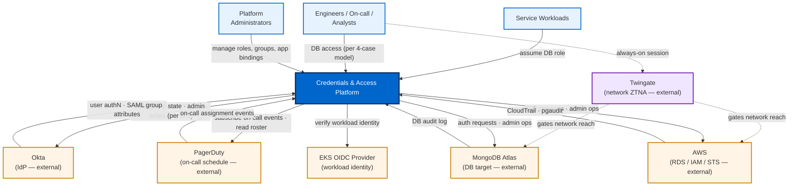
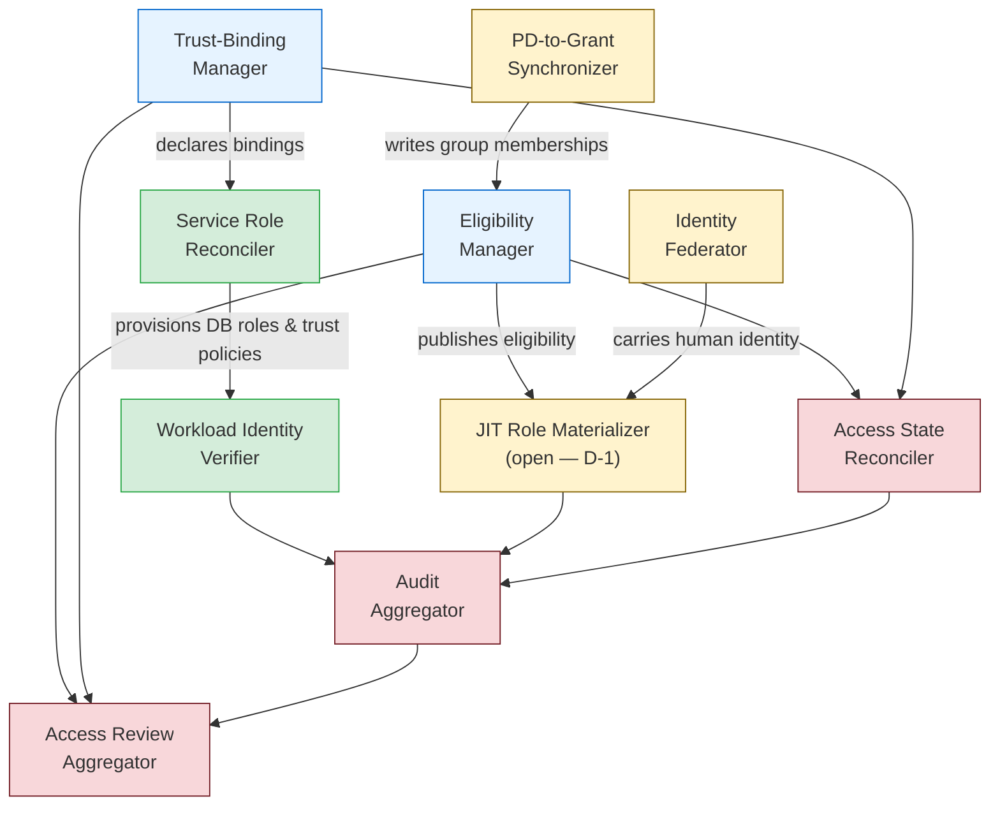
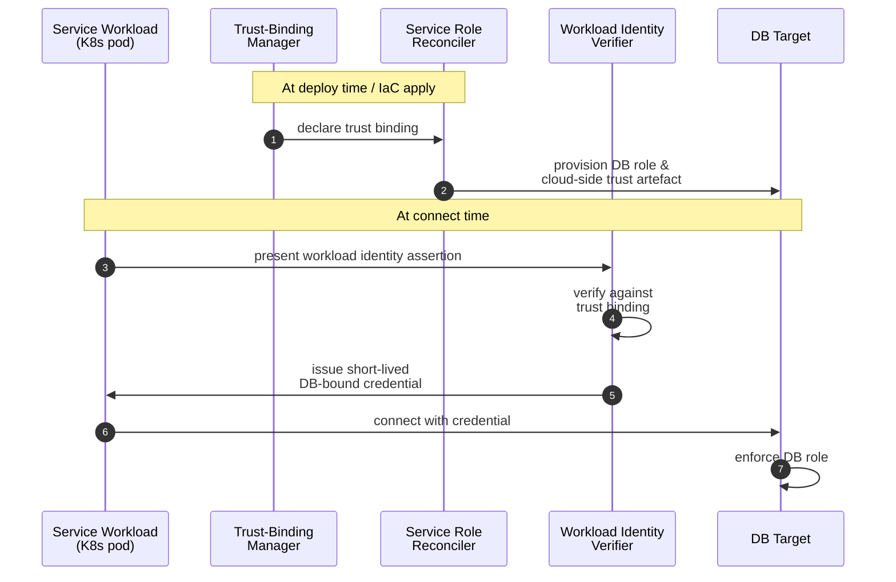
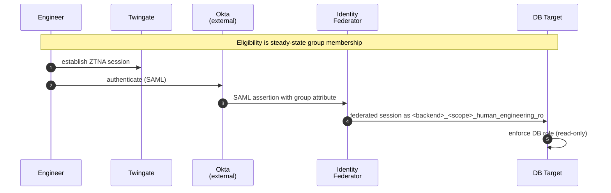
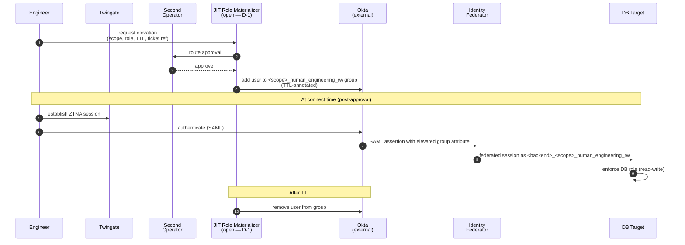
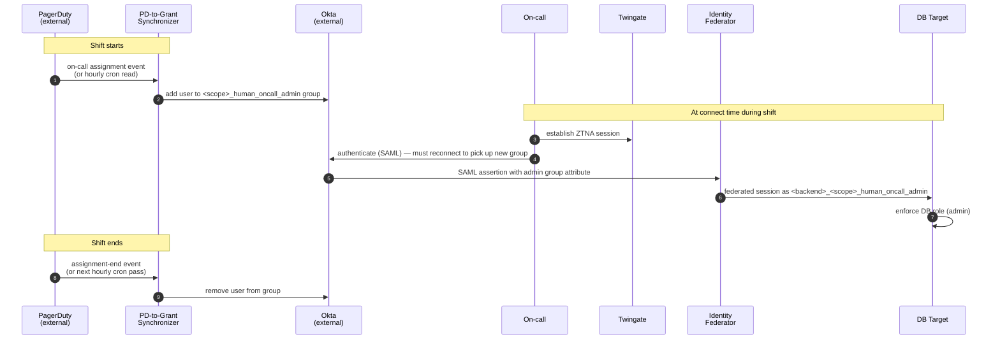
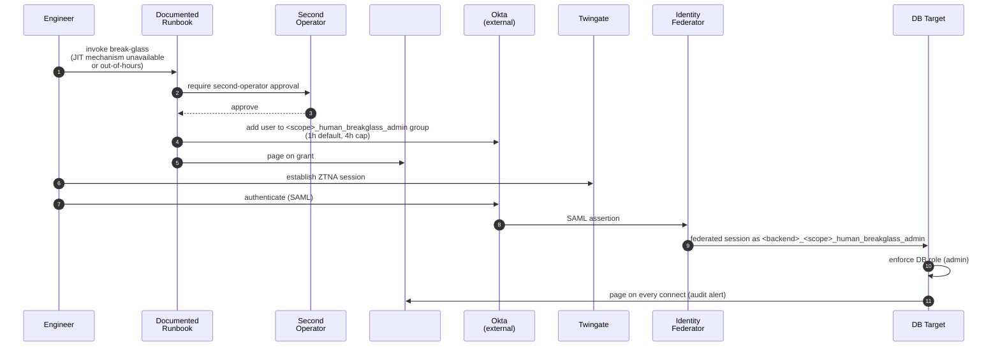
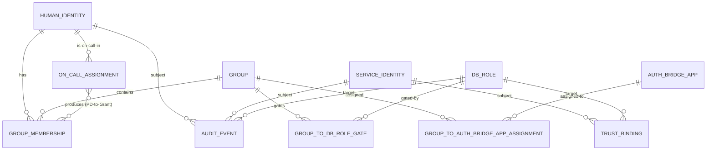
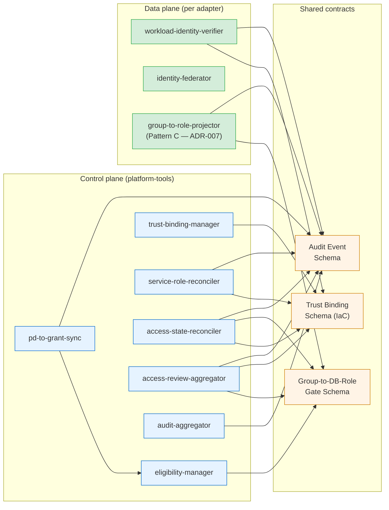

# Architecture Description: Credentials & Access Platform

**System**: Sentra Credentials & Access Platform
**Version**: 0.2 (target architecture — realigned to RFC 70385)
**Date**: 2026-06-08
**Authors**: Oren Sultan (collaborative with AI)
**Status**: Draft

> **Important**: This document describes the **target architecture**. It does **not** describe current Sentra production state. Verified current-state inventory lives in [`docs/rfc-70385/current-state.md`](https://github.com/sentraio/sentra-db-permissions/blob/docs/rfc-70385-additions/docs/rfc-70385/current-state.md) in the `sentra-db-permissions` repo. Verify against upstream APIs (Atlas Admin API, `aws` CLI, AWS Identity Store, `kubectl`) — **not** Crossplane / Atlas Operator CRDs, which are experimental at Sentra and reflect declared intent rather than actual state.

---

## 1. Document Information

### 1.1 Purpose and audience

This Architecture Description (AD) defines the target architecture for a platform that manages DB access at Sentra. It serves three audiences:

- **Engineering leadership** evaluating the design before implementation begins.
- **The platform team** implementing the system, using this AD as the source of structural truth.
- **Security and audit reviewers** verifying that the design satisfies the parent epic's Definition of Done.

### 1.2 Source artefacts

- **PRD**: [`.specify/drafts/prd.md`](.specify/drafts/prd.md)
- **ADRs**: [`.specify/memory/adr.md`](.specify/memory/adr.md) (canonical; ADR-001–006, ADR-008 Accepted; ADR-007 Proposed (Open — D-1 pending))
- **Live design RFC**: [`docs/rfc-70385/`](https://github.com/sentraio/sentra-db-permissions/pull/4) in `sentra-db-permissions` (story [70385](https://app.shortcut.com/sentra/story/70385)) — the authoritative implementation design. Open decisions D-1..D-6 are tracked there.
- **Historical dilemma doc**: [`.specify/drafts/dilemma_human_access_mechanism.md`](.specify/drafts/dilemma_human_access_mechanism.md) — background for ADR-007's earlier framings (preserved). The active option space is now RFC 70385 §3.4 (Path A / B / C).
- **Parent epic**: Shortcut [epic 70383 — Least-Privilege Access for MongoDB & RDS](https://app.shortcut.com/sentra/epic/70383)

### 1.3 Scope of this document

This AD covers the **5 core R&W viewpoints**: Context, Functional, Information, Development, Deployment. **Concurrency** and **Operational** viewpoints are deliberately deferred; both can be added in a later iteration. R&W perspectives applied inline within each view: **Security**, **Performance**. The Availability / Evolution / Regulation / Usability perspectives are **not** applied in this iteration (user input pending).

---

## 2. Architectural Goals and Constraints

### 2.1 Goals (from parent epic, ADRs, and PRD)

- **No service in prod uses a root-equivalent DB user** (except documented break-glass) — epic DoD.
- **All DB users/roles defined in IaC** — epic DoD.
- **Audit logs piped to SIEM/Datadog with alerts on privileged operations** — epic DoD; ADR for audit topology deferred.
- **Quarterly access-review runbook scheduled and first review completed** — epic DoD (story 70395).
- **Old over-privileged users disabled and deleted** — epic DoD.

### 2.2 Architectural principles (locked decisions)

| Principle | Source |
|---|---|
| Decompose by *audience* (services vs humans) rather than by DB technology | ADR-001 |
| Source of truth is *split per audience*: Okta for humans, IaC for services | ADR-002 |
| Services authenticate via **workload-native identity** (no stored passwords in steady state) | ADR-003 |
| Human access is structured as **four cases**: standing RO + JIT RW + JIT admin + break-glass | ADR-004 (rev. 2026-06-08) |
| **PagerDuty on-call assignment** is the primary JIT trigger (drives the JIT-admin case) | ADR-005 (rev. 2026-06-08) |
| "Okta apps" in scope = **SAML (active)** and **OIDC (forward-looking)** auth bridges to DB-accessible downstreams | ADR-006 (rev. 2026-06-08) |
| Three-layer IaC: Pulumi (Tier 1) + admin-baseline reconciliation in `platform-tools` (Tier 2a) + service self-service reconciliation per prod region (Tier 2b) | ADR-008 |
| **Twingate** is the always-on network-layer ZTNA gate underlying every human DB-access path | RFC 70385 §Conventions |
| Role-taxonomy grammar: `<backend>_<scope>_<audience>_<identity>_<level>` | RFC 70385 §role-taxonomy |

**Not locked** (Proposed / Open):

| Principle | Source |
|---|---|
| Human-access management path: Path A (Okta API build) vs Path B (3rd-party JIT vendor) vs Path C (hybrid) | ADR-007 — Proposed (Open — D-1 pending); RFC 70385 §3.4 |

### 2.3 Open architectural items

**ADR-007 (JIT mechanism) was reopened 2026-06-08 by RFC 70385 §3.4.** The earlier "Accepted — Pattern C" framing (2026-06-07) was found to describe target state rather than current state on the 2026-06-07 verification pass; the RFC reframed the realization as a path choice (A / B / C). The 8-option / 3-deployment-model dilemma history is preserved in [`./.specify/drafts/dilemma_human_access_mechanism.md`](./.specify/drafts/dilemma_human_access_mechanism.md).

**RFC 70385 open decisions** (load-bearing for this AD):

| ID | Decision | Affects this AD via |
|----|----------|--------------------|
| **D-1** | Human-access management path: Path A (Okta API build) vs Path B (3rd-party JIT vendor — Britive / ConductorOne / Apono / Opal) vs Path C (hybrid) | §3.2.4.2 Human Access flow; §3.6.2 JIT Role Materializer row; ADR-007 |
| D-2 | If Path B: vendor selection | §3.6.2; tech stack §6 |
| D-3 | Downgrade roster for the 11 non-SuperAdmin Atlas `ORG_OWNER`s | §3.6.4 Trust zones (Tier 3 break-glass) |
| D-4 | Rotation cadence for the remaining platform-team-owned passwords | §3.6.6 Secrets |
| D-5 | Multi-user vs single-user RDS PG SM rotation strategy per service | §3.6.6 Secrets |
| D-6 | Audit sink topology + retention (Shape A wire-existing-sinks vs Shape B normalisation-gateway; Datadog vs alternative SIEMs) | §3.2.1 Audit Aggregator; §3.6.2 |

**Other open items** (tracked in §7):

- Fallback-credentials policy for workloads that cannot speak workload-native auth (Debezium-class consumers).
- Migration strategy specifics (verifier source, decommission backstop, Phase 1 service ordering) — broadly covered by `docs/rfc-70385/migration-strategy.md`.
- R&W situational perspectives selection (Availability / Evolution / Regulation / Usability) — currently defaults only.

### 2.4 Constraints

- **Forward-extensibility**: the architecture must accommodate additional DB technologies in the future without redesigning the cross-DB invariants.
- **No customer-facing access**: the platform serves Sentra-internal services and humans only.
- **Multi-region prod + central admin cluster**: services run in two regional prod clusters — `prod-us` (us-east-1) and `prod-eu` (eu-central-1), both in the `prod` AWS account. The admin/management plane runs in the separate `platform-tools` cluster (eu-central-1) in the `platform-tools` AWS account. ADR-008 details the three-layer IaC topology spanning these clusters; consistent with the parent epic's story 70388 (Atlas Operator move to the platform account).
- **Target-state — Okta SAML on both paths**: human access will use SAML for both Atlas (Okta-Atlas SAML app — *not yet configured*; verified 2026-06-07: `GET /orgs/{org}/federationSettings` returns 401) and AWS (Okta-AWS SAML app → IAM Identity Center → RDS via IAM DB auth — *live for 13 of 16 RDS instances*). Atlas Workforce OIDC is licensing-blocked (Okta Org Authorization Server cannot emit a `groups` claim without a Custom Authorization Server / API Access Management license — POC #70489) and is deferred. SAML's native group-attribute handling provides the group context — no OIDC broker is required.
- **Twingate** is the always-on network-layer ZTNA gate underlying every human DB-access path. Already deployed at Sentra. Not replaced by any decision in this AD or RFC 70385.

---

## 3. Architectural Views

## 3.1 Context View

**Purpose**: Define the system's scope and external interactions as a single black box. No internal components appear here.

### 3.1.1 System scope

The platform manages **DB access** at Sentra. It owns three responsibilities:

1. **Manages roles and permissions** for human users across DBs, Okta groups, and the Okta SAML/OIDC auth-bridge applications that federate humans into DB-accessible downstream systems (ADR-006 scopes "apps" to those bridges only — SAML is the active protocol; OIDC is forward-looking).
2. **Enables services to self-provision DB roles** and use them via workload-native identity, without a central provisioning ticket (ADR-003).
3. **Projects Okta group membership into the 4-case human-access model** (ADR-004): standing read-only directly from group membership; JIT read-write (developer-requested); JIT admin (PagerDuty on-call triggered); break-glass (out-of-band). The JIT mechanism realization is open (D-1).

### 3.1.2 External entities

| Entity | Type | Interaction | Data exchanged | Control direction |
|---|---|---|---|---|
| Service workloads | Internal-Sentra (in scope as actors, not part of the system) | Read: assume DB role at connect time | Workload identity token; DB session | Workload → System (request); System verifies trust binding |
| Engineers / on-call / analysts | Human actors | Read: assume DB role at connect time via interactive client | OIDC/SAML assertion; DB session | Human → System (auth); System gates role |
| Platform administrators | Human actors | Write: manage Okta groups, group→SAML-app assignments, group→DB-role gates; manage service trust bindings (IaC) | Admin operations; IaC commits | Admin → System (configuration) |
| Okta (Identity Provider) | External SaaS | Authoritative for human access state (ADR-002); issues SAML assertions (active); emits group memberships via SAML attributes | User authN events; SAML group attributes | System ↔ Okta (read group state; admin writes for the JIT cases per D-1) |
| PagerDuty (on-call schedule) | External SaaS | Trigger for the JIT-admin case (ADR-005) | On-call-assignment events; current-roster API | PagerDuty → System (events); System reads roster |
| MongoDB Atlas (DB target) | External SaaS | DB role assumption target for the document-DB surface; Atlas Workforce SAML federation (target — not yet configured per 2026-06-07 verification) | Authentication assertions; DB audit log (currently disabled per 2026-06-07) | System → Atlas (auth + admin ops); Atlas → System (audit) |
| AWS (RDS, IAM, STS) | External cloud platform | DB role assumption target for the relational-DB surface; Okta SAML → IAM Identity Center → IAM DB auth (live for 13 of 16 RDS instances) | IAM tokens; CloudTrail; pgaudit (currently disabled per 2026-06-07) | System → AWS (auth + admin ops); AWS → System (audit) |
| EKS cluster OIDC provider | Internal-Sentra (external to this system) | Issues workload identity tokens for services (ADR-003 service auth path) | Workload identity assertions | EKS → System trust path |
| **Twingate** (network ZTNA gate) | External SaaS | Always-on network-layer prerequisite for reaching any prod DB endpoint from a human edge | Session establishment | Human → Twingate → DB target |

### 3.1.3 Context diagram

### 3.1.4 External dependencies

| Dependency | Criticality | Failure mode |
|---|---|---|
| Okta | Hard for human access; not on service path | Human access fails to bootstrap; existing JIT sessions persist until TTL |
| PagerDuty | Hard for the JIT-admin case; soft for the standing-RO and JIT-RW cases; not on service path | New on-call elevations fail; other human cases + service access unaffected |
| MongoDB Atlas | Hard for Mongo target | Mongo access unavailable |
| AWS (RDS / IAM / STS) | Hard for RDS target and service IAM-token issuance | RDS access fails; service tokens fail to issue |
| EKS OIDC provider | Hard for service authN | Services cannot issue new identity assertions |
| Twingate | Hard for the human edge — every human DB-access path is gated by it | All human DB access fails at the network layer; service access (in-VPC) unaffected |

### 3.1.5 Out of scope

- Okta applications that are not auth bridges (SAML or OIDC) to DB-accessible downstream systems (ADR-006).
- DB-internal authorization beyond role definitions (e.g. row-level policy, query rewriting).
- Customer-facing access — this platform serves Sentra-internal services and humans only.
- Twingate configuration and lifecycle — Twingate is consumed as an existing always-on gate, not managed by this platform.

---

## 3.2 Functional View

**Purpose**: Describe the internal functional elements, their responsibilities, and how they collaborate.

**Naming discipline**: Elements are named by **responsibility**, not by product. Product mapping appears in §3.6 (Deployment view).

**Operator note**: The Sentra platform team operates all elements shown. The platform team is *not* a participant in the audience flows; it is the operator behind every element.

### 3.2.1 Functional elements

| Element | Responsibility |
|---|---|
| **Eligibility Manager** | Translates administrator intent into authoritative state: maintains Okta groups in scope, group↔SAML-app assignments, and group→DB-role gating rules (the *humans* side of ADR-002's split source-of-truth). |
| **Trust-Binding Manager** | Translates administrator intent into authoritative state for services: maintains workload-identity-to-DB-role bindings expressed as IaC (the *services* side of ADR-002's split source-of-truth). |
| **Service Role Reconciler** | Watches Trust-Binding Manager's declared state and produces the corresponding DB-side and cloud-IAM-side artefacts. Per-DB-technology implementations differ; the contract is uniform. |
| **Workload Identity Verifier** | At service connect-time, verifies the workload's identity assertion and decides whether to issue a DB-bound credential. Implements ADR-003 on each DB-technology path. |
| **Identity Federator** | At human connect-time, carries the user's Okta-side identity into the downstream DB authentication path. Active protocol is **SAML** on both paths: Okta-Atlas Workforce SAML for Mongo (target; not yet configured per 2026-06-07 verification); Okta SAML → AWS IAM Identity Center → IAM DB auth for RDS (live for 13 of 16 RDS instances). OIDC remains forward-looking per ADR-006. |
| **JIT Role Materializer** *(open — D-1 per ADR-007)* | For the three JIT cases (RW, admin, break-glass), converts Okta group eligibility + a request/schedule trigger into a time-bound Okta group membership; downstream federation projects the resulting group attribute onto a scoped DB role. **Realization is open** per RFC 70385 §3.4 (Path A: Okta API build with custom triggers · Path B: 3rd-party JIT vendor · Path C: hybrid). The earlier "Pattern C from sentra-infrastructure ADR-001" framing (hourly GHA cron) is one trigger sub-variant inside Path A; other Path A sub-variants include PD webhook → Lambda, GHA `workflow_dispatch` with approver, Slack slash command. The standing-RO case does **not** transit this element — group membership projects directly via SAML. |
| **PD-to-Grant Synchronizer** | For the JIT-admin case, reconciles current PagerDuty on-call state into the appropriate Okta group membership. Latency profile is **trigger-dependent**: hourly under the GHA-cron sub-variant; seconds under PD-webhook or Slack-command sub-variants. The implementation collapses into the chosen path of the JIT Role Materializer (under Path A it's a thin trigger-specific component; under Path B it is the vendor's PD integration). |
| **Access State Reconciler** | Continuously verifies that observable DB-side and downstream-side state matches authoritative state. Surfaces drift. |
| **Audit Aggregator** | Collects access-relevant events from both authoritative sources and from the DB targets; produces a normalized audit stream. Topology is open (deferred to a later ADR). |
| **Access Review Aggregator** | Periodically renders a unified report joining human and service access state, for quarterly access review (epic DoD). |

### 3.2.2 Element interactions

**Legend**: admin/control-plane (blue) · Service Access flow (green) · Human Access flow (yellow) · cross-cutting (red).

### 3.2.3 Functional boundaries

**What the system does:**
- Translates admin intent into authoritative access state (per ADR-002).
- Provisions DB-side role/grant artefacts to match authoritative state.
- Verifies workload identity at service connect-time and issues DB-bound credentials with no stored passwords.
- Carries human identity from Okta into DB authentication via SAML (active; OIDC forward-looking per ADR-006).
- Projects Okta group membership onto DB roles per the 4-case human-access model (ADR-004): standing RO directly; JIT RW + JIT admin + break-glass via the mechanism selected by D-1 (ADR-007).
- Reflects PagerDuty on-call assignments into time-bound elevation grants for the JIT-admin case. Latency profile depends on the chosen Path A trigger sub-variant (hourly under GHA cron; seconds under webhook / Slack-command) or on the vendor's PD integration under Path B.
- Detects drift between authoritative and observable state.
- Aggregates audit events into one normalized stream and renders periodic access reviews.

**What the system does NOT do:**
- Manage Okta apps that don't bridge to DB-accessible downstreams (ADR-006).
- Issue customer-facing access.
- Authorize at sub-role granularity (e.g. row-level / column-level policy).
- Replace DB-native authentication mechanisms.

### 3.2.4 Audience flow sub-views

Per R&W Rule 4 (audience-centric sub-views are allowed when audiences differ meaningfully). Shared elements appear in both flows; their responsibility is defined once in §3.2.1.

#### 3.2.4.1 Service Access flow

> A K8s pod (service workload) connecting to a DB target using workload-native identity (ADR-003).

**Elements participating**: Trust-Binding Manager · Service Role Reconciler · Workload Identity Verifier. Plus Audit Aggregator (observes all stages).

**Key invariants:**
- No stored DB passwords for services in steady state (ADR-003).
- The trust path is uniform at the contract level; per-DB-technology mechanics live in the adapters.
- Okta is **not** in this flow (ADR-002 split source-of-truth).

#### 3.2.4.2 Human Access flow

> A human user connecting to a DB target via an interactive client. Per ADR-004 the flow is structured as **four cases** with distinct triggers, role names, and TTLs. Twingate gates the network layer underneath every case.

##### Case A — Standing read-only (no JIT)

**Elements**: Identity Federator. **No** JIT Role Materializer, **no** PD-to-Grant Synchronizer.

##### Case B — JIT read-write (developer-requested)

**Elements**: JIT Role Materializer · Identity Federator. Under Path B the JIT Role Materializer is the vendor; under Path A it is custom (GHA `workflow_dispatch` / Slack command + Okta admin API).

##### Case C — JIT admin (PagerDuty on-call)

**Elements**: PD-to-Grant Synchronizer · Identity Federator. **Latency depends on the trigger sub-variant** under D-1: hourly under sentra-infrastructure Pattern C (GHA cron); seconds under PD webhook → Lambda. Either way, the user must reconnect to the DB to pick up the new group attribute.

##### Case D — Break-glass (out-of-band)

**Elements**: Documented runbook (out-of-band) · Identity Federator · Audit Aggregator (pages on grant + on every connect). Under the 3-tier break-glass model (RFC 70385 §break-glass-procedure): Tier 1 = the chosen JIT mechanism's normal request flow; Tier 2 = the same mechanism's "emergency" toggle; Tier 3 = SuperAdmin standing fallback (used only when Tiers 1+2 are unreachable; D-3 prerequisite: downgrade the 11 non-SuperAdmin Atlas `ORG_OWNER`s).

##### Key invariants (across all four cases)

- **Twingate** establishes the network session first; without it, no DB endpoint is reachable from the human edge.
- For Cases B / C / D, Okta group membership is **transient** — added by the JIT Role Materializer / PD-to-Grant Synchronizer / runbook respectively, removed at TTL end.
- For Case A, Okta group membership is **steady-state** — projects directly onto `_engineering_ro` without a JIT step.
- Workload-native auth (the service flow's mechanism) is **not** part of this flow; the audiences do not share an auth path.
- DB-layer audit (Atlas database audit log + RDS pgaudit) is the source of truth for "what actually happened" — currently disabled per 2026-06-07 verification; enabling it is a prerequisite for every case.

---

## 3.3 Information View

**Purpose**: Describe the entities the system reasons over, their lifecycle, and the integrity invariants they obey.

### 3.3.1 Entities

| Entity | Held in (authoritative source) | Description |
|---|---|---|
| **Human Identity** | Okta | A person who may be assigned access. Sentra-internal only. |
| **Service Identity** | Workload-identity binding (IaC) | A K8s ServiceAccount projected as a workload-identity assertion. |
| **Group** | Okta | A named cohort of Human Identities. The vehicle of human eligibility. |
| **Group Membership** | Okta | An edge between a Human Identity and a Group. **Steady-state** for the standing-RO case (admin-managed); **transient** for JIT-RW (developer-requested, TTL-bound), JIT-admin (PD-driven), and break-glass (runbook-driven). |
| **DB Role** | Authoritative in IaC for the *intent*; materialized in the DB target | A scoped permission set against a DB target. Named per the role-taxonomy grammar `<backend>_<scope>_<audience>_<identity>_<level>`. |
| **Group-to-DB-Role Gate** | Okta | A rule: members of group G are eligible for DB role R via mechanism M (where M for the standing-RO case is direct SAML group-attribute projection; for the JIT cases M is ADR-007's open D-1 dependency). |
| **Auth-bridge App** | Okta | An Okta application object whose only platform-relevant purpose is bridging humans into a DB-accessible downstream system (ADR-006). **SAML** for the active Atlas + AWS paths; **OIDC** is forward-looking. |
| **Group-to-Auth-bridge-App Assignment** | Okta | An edge: members of group G may use auth-bridge app S. |
| **Trust Binding** | IaC (Git) | A rule: service identity X may assume DB role R via authentication path P. Authoritative for services per ADR-002. |
| **On-Call Assignment** | PagerDuty (external) | A time-bounded edge: human H is on-call from T1 to T2. The platform reads it; not authoritative for it. |
| **Audit Event** | Audit Aggregator's stream | Normalized record of an access-relevant occurrence. Append-only. |

### 3.3.2 Entity relationships

### 3.3.3 Permission overlay (who can do what)

| Actor | Reads | Writes |
|---|---|---|
| Platform administrators | All entities | Group, Group Membership (steady-state — for standing-RO case), Group-to-DB-Role Gate, Group-to-Auth-bridge-App Assignment, Auth-bridge App, Trust Binding (via IaC PR) |
| PD-to-Grant Synchronizer | On-Call Assignment, Group | Group Membership (transient — elevation only) |
| Service Role Reconciler | Trust Binding | DB Role (materialization in DB target) |
| Workload Identity Verifier | Trust Binding | Audit Event |
| Identity Federator + JIT Role Materializer | Group Membership, Group-to-DB-Role Gate | Audit Event |
| Access State Reconciler | All authoritative + derived state | Audit Event (drift records) |
| Access Review Aggregator | All authoritative state, Audit Event | (output report; no entity writes) |

### 3.3.4 Entity lifecycle (Born / Changes / Dies)

| Entity | Born | Changes | Dies |
|---|---|---|---|
| Human Identity | Provisioned in Okta (HR onboarding, out of platform scope) | Group memberships change | Deprovisioned in Okta (HR offboarding) |
| Service Identity | Workload's IaC declares it | Trust bindings change | Workload's IaC is removed |
| Group | Admin creates | Membership & gating edges change | Admin deletes (must have no in-scope edges) |
| Group Membership (steady-state) | Admin assigns | — | Admin removes |
| Group Membership (transient) | PD-to-Grant on assignment event | — | PD-to-Grant on assignment end |
| DB Role | Declared in IaC / Gate; materialized by reconciler | Grants change with IaC | Removed from IaC; reconciler revokes |
| Group-to-DB-Role Gate | Admin creates | Mechanism-specific updates (ADR-007) | Admin removes |
| Auth-bridge App | Admin creates (in-scope per ADR-006 — SAML active, OIDC forward-looking) | Attribute mappings change | Admin removes |
| Group-to-Auth-bridge-App Assignment | Admin assigns | — | Admin removes |
| Trust Binding | IaC declares | IaC PR | IaC removes |
| On-Call Assignment | PD schedule rolls forward | — | PD schedule rolls forward |
| Audit Event | Generated by responsible element | **Never modified** | Per retention policy (deferred) |

### 3.3.5 Integrity invariants

- **Uniqueness**: Group name unique within Okta tenant. DB Role name unique within its DB target. Trust Binding unique on `(Service Identity, DB Role, auth path)`.
- **Never stored**: No DB passwords for service identities in steady state (ADR-003). No standing **read-write or admin** DB-role membership for humans — standing **read-only** is permitted for the standing-RO case per ADR-004 (rev. 2026-06-08).
- **Propagation**: A change to a Group-to-DB-Role Gate must reflect in the realizing mechanism (direct SAML projection for standing RO; ADR-007 / D-1 mechanism for the JIT cases). A change to a Trust Binding must materialize before next service connect or it fails closed.
- **Append-only**: Audit Event records are append-only; corrections produce new events referencing the prior, never in-place edits.
- **Naming**: DB Roles named for purpose-and-scope; exact convention (per-service vs per-purpose primary axis) is deferred.

### 3.3.6 Cross-cutting integrity (enforced by Access State Reconciler)

1. Every materialized DB Role traces to either a Group-to-DB-Role Gate (humans) or a Trust Binding (services). Otherwise — orphan; flagged.
2. Every Trust Binding has a materialized DB Role and cloud-side trust artefact. Otherwise — partial provisioning; flagged.
3. No human has a transient Group Membership without an active On-Call Assignment. Otherwise — stale elevation; revoked.

---

## 3.5 Development View

**Purpose**: How the code is organized and built. **Target-state** (no code yet).

### 3.5.1 Module organization

| Module (intended) | Owns Functional element(s) | Runtime | Distribution |
|---|---|---|---|
| `eligibility-manager` | Eligibility Manager | Operator pattern | Container; platform-tools cluster |
| `trust-binding-manager` | Trust-Binding Manager | IaC + reconciler | Git repo + reconciler image |
| `service-role-reconciler` | Service Role Reconciler | Operator pattern; per DB adapter | Container(s); platform-tools cluster |
| `workload-identity-verifier` | Workload Identity Verifier | Library / sidecar | Per workload pod |
| `identity-federator` | Identity Federator | Mostly declarative (config in Okta + downstream) | No long-running process |
| `jit-role-materializer` | JIT Role Materializer | **Open per D-1**. Path A: small Lambda(s) + GHA workflows + optional Slack bot writing Okta group membership via the Okta admin API; the sentra-infrastructure Pattern C hourly cron (`on_callers.yaml` + `okta_assign_db_admins.py`) is one trigger sub-variant. Path B: 3rd-party JIT vendor's connectors (no in-house code). Path C: a mix of both. Federation underneath (Atlas SAML app + AWS IAM IC permission set) is path-independent. | Per chosen path — GHA / Lambda + Okta tenant config + Atlas SAML + AWS IAM IC; or vendor SaaS + same Atlas/AWS config |
| `pd-to-grant-sync` | PD-to-Grant Synchronizer | Event listener + reconciler | Container; platform-tools cluster |
| `access-state-reconciler` | Access State Reconciler | Operator pattern | Container; platform-tools cluster |
| `audit-aggregator` | Audit Aggregator | Pipeline (topology open) | Deferred |
| `access-review-aggregator` | Access Review Aggregator | Batch / scheduled | Container; platform-tools cluster |

### 3.5.2 Module dependency direction

**Invariants**: Modules depend on *contracts* (schemas), not on each other directly. No circular dependencies. The data plane depends on contracts only; the control plane writes to contracts only.

### 3.5.3 Repository strategy

Monorepo vs polyrepo is undecided. Either works; the choice will be made when code begins.

### 3.5.4 Build, CI/CD, testing

- Container images for control-plane modules; IaC repo is its own build target with schema+policy validation gates.
- CI gates per module: static analysis, contract validation against published schemas, unit + integration tests against a stub DB-target harness, signed image publication.
- E2E tests cover both flows; the human-flow E2E exercises whichever mechanism ADR-007 selects.
- Validation pattern from the existing Sentra Okta-Atlas federation experience (local PKCE listener for token inspection, `mongosh connectionStatus`, positive + negative role tests).

---

## 3.6 Deployment View

**Purpose**: Physical environment, network topology, and the **Functional-element → product** mapping.

### 3.6.1 Runtime environments

| Environment | Purpose | Cluster / region / account |
|---|---|---|
| **`platform-tools` cluster** | **Admin** management plane — Eligibility Manager, PD-to-Grant Synchronizer, audit components, access-review aggregator, and the **admin-baseline** Crossplane + Atlas Operator instances (ADR-008 Tier 2a). | EKS in `platform-tools` AWS account (eu-central-1) |
| **`prod-us` cluster** | Service workloads (US region) + Workload Identity Verifier per workload + **service-self-service** Crossplane + Atlas Operator instances (ADR-008 Tier 2b) | EKS in `prod` AWS account (us-east-1) |
| **`prod-eu` cluster** | Service workloads (EU region) + Workload Identity Verifier per workload + **service-self-service** Crossplane + Atlas Operator instances (ADR-008 Tier 2b) | EKS in `prod` AWS account (eu-central-1) |
| `staging` cluster | Same shape as prod-* but pre-prod; first home of IAM-DB-auth migration (story 70390) | EKS in `staging` AWS account |
| External SaaS | Identity (Okta), scheduling (PagerDuty), DB targets (Atlas, AWS RDS) | Respective tenants |

**Clusters in scope (4 total)**: `prod-us`, `prod-eu`, `platform-tools`, `staging`. The AWS account hosting the `platform-tools` cluster is also called `platform-tools` (same name). `demo` and `research` clusters exist at Sentra but are out of scope for this platform's RFC.

### 3.6.2 Functional element → product mapping

**This is the only place product names appear in this AD.**

| Functional element | Realized by | Where it runs |
|---|---|---|
| Eligibility Manager | Okta tenant (authoritative store) + control-plane operator that mutates it | Okta SaaS + platform-tools cluster |
| Trust-Binding Manager | IaC repository (Git) + reconciler controllers per DB-technology adapter | Git provider + platform-tools cluster |
| Service Role Reconciler — RDS path | **Three-layer IaC (ADR-008 refined)**: (Tier 1, static) Pulumi provisions Crossplane's IAM permissions in each cluster — these are the "per-service Pulumi roles" of story 70390. (Tier 2a, admin-baseline) Crossplane in `platform-tools` reconciles admin-defined CRDs (centrally-managed roles, shared infrastructure). (Tier 2b, service self-service) Crossplane in each prod-region cluster (`prod-us`, `prod-eu`) reconciles per-service CRDs that service teams author locally, provisioning per-service IAM roles with OIDC trust to the local EKS OIDC provider so service workloads can assume them via IRSA / Pod Identity. | Pulumi state in AWS; Crossplane in `platform-tools` (Tier 2a) and in each prod-region cluster (Tier 2b) |
| Service Role Reconciler — Atlas path | **Three-layer IaC (ADR-008 refined)**: (Tier 1, static) Pulumi provisions the Atlas Operator's operating credentials in each cluster. (Tier 2a, admin-baseline) Atlas Operator in `platform-tools` reconciles admin-defined CRDs. (Tier 2b, service self-service) Atlas Operator in each prod-region cluster reconciles per-service `AtlasProject` / `AtlasDatabaseUser` CRDs authored by service teams locally. | Pulumi state in AWS; Atlas Operator in `platform-tools` (Tier 2a) and in each prod-region cluster (Tier 2b); per story 70388 for the platform-tools move |
| Workload Identity Verifier — RDS path | AWS IAM DB auth (15-min token); EKS Pod Identity / IRSA | per-workload pod in prod cluster; AWS IAM/STS |
| Workload Identity Verifier — Atlas path | Atlas Workload OIDC (K8s ServiceAccount token → Atlas identity) | per-workload pod in prod cluster; Atlas |
| Identity Federator — Atlas path | **Target**: Okta-Atlas Workforce SAML app (group attribute carries through the assertion; Atlas projects onto `$external` DB user). **Not yet configured** per 2026-06-07 verification (`GET /orgs/{org}/federationSettings` → 401). Atlas Workforce OIDC was explored (POC #70489) but is licensing-blocked (Okta Org Authorization Server cannot emit a `groups` claim without a Custom Authorization Server / API Access Management license). | Okta + Atlas |
| Identity Federator — RDS path | Authentication: Okta SAML app identifies the user. Authorization: AWS IAM Identity Center consumes the SAML assertion and decides which IAM role the user may assume. The user then uses that role's `rds-db:connect` permission for IAM DB auth at connect time. **Live for 13 of 16 RDS instances** today (the 3 with IAM-DB-auth off — `labelstudio`, `metabase`, `grafana` — fall back to SM-stored master passwords until flipped on). | Okta + AWS |
| JIT Role Materializer *(open — D-1)* | **Open per RFC 70385 §3.4.** Three candidate realizations: **Path A** (Okta API build) — custom triggers (PD webhook → Lambda, GHA `workflow_dispatch` with approver, Slack slash command) write Okta group membership via Okta admin API. **Path B** (3rd-party JIT vendor — Britive / ConductorOne / Apono / Opal) — vendor runs the access-request workflow + approval routing + time-bound grants + connectors to Okta/IAM IC/Atlas. **Path C** (hybrid). Federation downstream is the same: Atlas Workforce SAML for Mongo, AWS IAM IC for RDS. The sentra-infrastructure Pattern C (hourly GHA cron + `okta_assign_db_admins.py`, Story 70394) is one trigger sub-variant inside Path A. Audit prerequisite under every path: Atlas audit + pgaudit + CloudTrail to Datadog (currently off — D-6 pending). | Per chosen path — GHA runner + Lambda + Okta SaaS + Atlas SAML + AWS IAM IC, OR vendor SaaS + same federation underneath |
| PD-to-Grant Synchronizer | Custom controller subscribing to PagerDuty webhooks; reconciles Okta group membership | platform-tools cluster |
| Access State Reconciler | Custom controller polling Okta, IaC, and DB-target observed state | platform-tools cluster |
| Audit Aggregator | **Topology open** — candidate sinks: Datadog, groundcover (existing Sentra observability) | platform-tools cluster + external sinks |
| Access Review Aggregator | Scheduled batch job emitting the quarterly review (story 70395) | platform-tools cluster |

**Tier-2 operational unit — "permissions + roles units"**: Both adapters' dynamic reconciliation (per ADR-008) is structured as discrete **"permissions + roles units"** — paired manifests authored against the corresponding controller's CRD surface that bundle a role definition together with the permissions it grants. For Crossplane (RDS path), a unit is a Composition combining an IAM role with its attached policy/permissions. For the MongoDB Atlas Operator, a unit is an `AtlasDatabaseUser` paired with the associated custom role definition. This is the operational unit-of-change for both platform administrators (writing Trust Bindings into IaC) and the reconcilers (translating those into DB-side state). Service onboarding = author one unit. Service offboarding = remove the unit.

### 3.6.3 Network topology

```mermaid
graph TD
    subgraph internet["Public internet"]
        Engineer["Engineer's workstation<br/>(mongosh / psql / Compass)"]
        Twingate["Twingate ZTNA<br/>(always-on gate)"]
        OktaSaaS["Okta SaaS"]
        PDSaaS["PagerDuty SaaS"]
        AtlasSaaS["MongoDB Atlas SaaS"]
    end

    subgraph aws_pt["AWS account: platform-tools"]
        subgraph eks_pp["EKS cluster: platform-tools (eu-central-1)"]
            EM["eligibility-manager"]
            SRR_Atlas_admin["Atlas Operator<br/>(Tier 2a admin baseline)"]
            SRR_RDS_admin["Crossplane<br/>(Tier 2a admin baseline)"]
            PDS["pd-to-grant-sync"]
            ASR["access-state-reconciler"]
            ARA["access-review-aggregator"]
            AUD["audit-aggregator"]
        end
    end

    subgraph aws_prod["AWS account: prod"]
        subgraph eks_us["EKS cluster: prod-us (us-east-1)"]
            WL_us["Service workload pod"]
            SRR_us_X["Crossplane + Atlas Operator<br/>(Tier 2b service self-service)"]
        end
        subgraph eks_eu["EKS cluster: prod-eu (eu-central-1)"]
            WL_eu["Service workload pod"]
            SRR_eu_X["Crossplane + Atlas Operator<br/>(Tier 2b service self-service)"]
        end
        RDS["AWS RDS<br/>(PostgreSQL)"]
        IAMSTS["AWS IAM / STS"]
        EKSOidc_us["EKS OIDC Provider<br/>(prod-us)"]
        EKSOidc_eu["EKS OIDC Provider<br/>(prod-eu)"]
    end

    Engineer -- "SAML auth" --> OktaSaaS
    Engineer -- "establish session" --> Twingate
    Engineer -. "DB traffic (gated by Twingate)" .-> AtlasSaaS
    Engineer -. "DB traffic (gated by Twingate)" .-> RDS
    Twingate -. "ZTNA-gated reach" .-> AtlasSaaS
    Twingate -. "ZTNA-gated reach" .-> RDS

    EM -- "admin API" --> OktaSaaS
    SRR_Atlas_admin -- "manage projects, baseline roles" --> AtlasSaaS
    SRR_RDS_admin -- "manage admin IAM" --> IAMSTS
    PDS -- "subscribe / read roster (trigger sub-variant per D-1)" --> PDSaaS
    PDS -- "elevation group writes (D-1 mechanism)" --> OktaSaaS
    ASR -- "observe state" --> OktaSaaS
    ASR -- "observe state" --> AtlasSaaS
    ASR -- "observe state" --> RDS
    AUD -- "ingest DB audit" --> AtlasSaaS
    AUD -- "ingest pgaudit / CloudTrail" --> RDS

    SRR_us_X -- "per-service Atlas + IAM" --> AtlasSaaS
    SRR_us_X -- "per-service IAM" --> IAMSTS
    SRR_eu_X -- "per-service Atlas + IAM" --> AtlasSaaS
    SRR_eu_X -- "per-service IAM" --> IAMSTS

    WL_us -- "Workload OIDC" --> AtlasSaaS
    WL_us -- "IRSA / Pod Identity" --> IAMSTS
    IAMSTS -- "verify via OIDC" --> EKSOidc_us
    WL_us -- "IAM DB auth connect" --> RDS

    WL_eu -- "Workload OIDC" --> AtlasSaaS
    WL_eu -- "IRSA / Pod Identity" --> IAMSTS
    IAMSTS -- "verify via OIDC" --> EKSOidc_eu
    WL_eu -- "IAM DB auth connect" --> RDS

    classDef saas fill:#fff4e6,stroke:#cc7a00
    classDef ctrl fill:#e6f3ff,stroke:#0066cc
    classDef data fill:#d4edda,stroke:#28a745
    classDef external fill:#f0f0f0,stroke:#666
    classDef regional fill:#e8f5e9,stroke:#1b5e20
    classDef gate fill:#f0e6ff,stroke:#6a0dad,stroke-width:2px

    class OktaSaaS,PDSaaS,AtlasSaaS saas
    class EM,SRR_Atlas_admin,SRR_RDS_admin,PDS,ASR,ARA,AUD ctrl
    class SRR_us_X,SRR_eu_X regional
    class WL_us,WL_eu,RDS,IAMSTS,EKSOidc_us,EKSOidc_eu data
    class Engineer external
    class Twingate gate
```

**Legend additions**: green-bordered "regional" boxes are the **Tier 2b self-service controllers** running inside each prod region (one Crossplane + Atlas Operator per cluster). Each prod cluster's controllers use a **region-scoped** Pulumi-provisioned IAM identity — `prod-us` controllers cannot reconcile resources in `prod-eu` and vice versa.

### 3.6.4 Trust zones

| Zone | Members | Trust to |
|---|---|---|
| `platform-tools` admin plane | Eligibility Manager, PD-sync, audit components, Tier 2a admin-baseline reconcilers | Okta admin, Atlas admin, AWS IAM admin (admin-baseline scope) |
| `prod-us` regional plane | Service workloads (US), local EKS OIDC provider, Tier 2b self-service reconcilers (US scope) | Atlas Workload OIDC; AWS IAM via IRSA; the **Tier 2b controllers' IAM permissions are scoped to `prod-us`-resident resources only** (region-bounded blast radius) |
| `prod-eu` regional plane | Service workloads (EU), local EKS OIDC provider, Tier 2b self-service reconcilers (EU scope) | Same as `prod-us` but scoped to `prod-eu`-resident resources only |
| Human edge | Engineer workstations | Okta (SSO + MFA); downstream DBs via federated paths |

**Cross-region trust**: `prod-us` controllers do **not** trust `prod-eu` and vice versa. A compromise in one prod region cannot directly affect the other. The `platform-tools` admin plane has cross-region admin-baseline reach by design — its compromise affects both regions, so its protection is the strictest.

### 3.6.5 HA / DR posture

The `platform-tools` admin plane is **not** on the runtime data path for service access. A `platform-tools` outage:

- **Does not** affect existing service DB connections in either prod region.
- **Does not** affect Tier 2b self-service reconciliation — each prod region's local controllers continue to operate.
- **Does** affect new admin-baseline operations, PD-driven elevation transitions, drift detection, and audit aggregation during the window.

Each prod region's Tier 2b reconcilers are an independent control plane for that region's service self-service. A `prod-us` Tier 2b outage:

- **Does not** affect `prod-eu` services or their reconcilers.
- **Does** affect new per-service role provisioning in `prod-us` during the window.
- **Does not** affect already-provisioned `prod-us` services' connections (existing IAM trust artefacts continue to work).

Region-level isolation is therefore a first-class property of this topology: blast radius of a Tier 2b incident is one prod region. Native Atlas/RDS HA across regions is delegated to the SaaS / managed-service providers.

### 3.6.6 Secrets and credentials

| Class | Storage | Lifetime |
|---|---|---|
| Service-to-DB credentials | **None in steady state** (ADR-003) | n/a |
| Service-to-DB credentials (fallback list) | Secret store on platform-tools (specific store TBD) | Rotated per documented cadence |
| Reconciler-to-external-API credentials | Per-reconciler, scoped to its mutation surface | Rotated per documented cadence |
| Audit-sink credentials | Per-sink connector | Rotated per documented cadence |

The fallback-credentials policy is an open clarification.

---

## 4. Architectural Perspectives

> Perspectives are applied **inline within each view** above. This section summarizes the cross-cutting picture.

### 4.1 Security Perspective

**Threat model summary** (drawing from each view's Security Considerations):

| Threat | Attack surface | Primary mitigation |
|---|---|---|
| Compromised service workload | Service workload identity | Bounded to one Trust Binding; no stored passwords means no per-DB password leak (ADR-003) |
| Compromised human Okta credential | Standing access (Case A standing-RO is the only standing path); JIT cases bounded by TTL | Standing-RO blast radius is read-only (ADR-004 rev. 2026-06-08). JIT-RW / JIT-admin / break-glass cases bounded by their TTL. Twingate provides an additional network-layer gate; Okta MFA is required. |
| Compromised PD-to-Grant Synchronizer (or vendor under Path B) | Writes Okta elevation group → grants any admin role to any user | Operating identity tightly scoped; secret rotation; audit-trail on every group write. **Under Path B**: vendor must be SOC2-audited; vendor's Okta token scoped to the elevation groups only. |
| Group attribute tampering in SAML assertion | Human auth path | Okta-side SAML signing; Atlas / AWS IAM IC verify signature; the group attribute is sourced from authoritative Okta group state (which the JIT mechanism is the only writer of, under the path selected by D-1). |
| Audit-stream corruption | Audit Aggregator + sinks | Append-only invariant; sink topology open |
| Control-plane compromise | platform-tools cluster | Per-reconciler scoped identities; cross-account trust via explicit `sts:AssumeRole`; admin actions emit Audit Events |
| Workload identity spoofing | EKS OIDC → AWS/Atlas trust | OIDC provider signs assertions; AWS STS / Atlas verify; Trust Bindings are the authoritative gate |

### 4.2 Performance & Scalability Perspective

| Concern | Architectural location | Notes |
|---|---|---|
| On-call elevation latency | PD-to-Grant Synchronizer | Trigger-dependent under D-1 — see "Human elevation latency" row below. |
| Service connect-time token issuance | Workload Identity Verifier | 15-min IAM DB auth tokens; Atlas Workload OIDC TTL |
| Human connect-time auth latency | Identity Federator (SAML federation hop) | Dominated by Okta SAML federation + AWS IAM Identity Center role assumption + IAM DB auth token mint (RDS) / Atlas session establishment (Mongo). No in-path broker. Twingate adds an always-on ZTNA session establishment but no per-connect latency once the session is up. |
| Human elevation latency (JIT-admin case) | JIT Role Materializer | **Path-dependent (D-1)**. Path A hourly-GHA-cron sub-variant: up to ~1h + Okta session TTL. Path A webhook / Slack-command sub-variants: seconds. Path B: per vendor's PD integration. Latency floor for "immediate-feeling" UX has not been pinned across all variants — clarification owed once D-1 lands. |
| Reconciler cadence | Access State Reconciler | Cadence not pinned |
| Audit-event throughput | Audit Aggregator | Topology-dependent — deferred to future Audit ADR |
| Cross-region latency | Deployment §3.6.3 | Region affinity between workloads and DB targets |

### 4.3 Perspectives explicitly NOT applied in this iteration

User input on situational perspectives was not provided. These remain available to add in a future iteration of `/architect.clarify` + `/architect.implement`:

| Perspective | Why it would matter | Status |
|---|---|---|
| Availability | Critical-path dependency on Okta + PD | Not applied (defaults only) |
| Evolution | "More DBs in the future" constraint | Not applied (defaults only) |
| Regulation | Sentra is a security-product company (SOC2, customer DPAs) | Not applied (defaults only) |
| Usability | Engineer DX with mongosh/psql/Compass | Not applied (defaults only) |

---

## 5. Architecture Decision Records Summary

Canonical ADR file: [`.specify/memory/adr.md`](.specify/memory/adr.md).

| ID | Sub-System | Decision | Status |
|---|---|---|---|
| [ADR-001](.specify/memory/adr.md#adr-001-audience-stratified-sub-system-decomposition) | System | Audience-stratified sub-system decomposition | Accepted |
| [ADR-002](.specify/memory/adr.md#adr-002-source-of-truth-split-per-audience) | System | Source-of-truth split per audience | Accepted |
| [ADR-003](.specify/memory/adr.md#adr-003-workload-native-authentication-oidc--pod-identity) | Service Access | Workload-native authentication (OIDC / Pod Identity) | Accepted |
| [ADR-004](.specify/memory/adr.md#adr-004-human-access--4-case-model-standing-ro--jit-rw--jit-admin--break-glass) | Human Access | Human access — 4-case model (standing RO + JIT RW + JIT admin + break-glass) | Accepted (rev. 2026-06-08) |
| [ADR-005](.specify/memory/adr.md#adr-005-pagerduty-on-call-assignment-as-primary-jit-trigger) | Human Access | PagerDuty on-call assignment as primary JIT trigger (drives the JIT-admin case) | Accepted (rev. 2026-06-08) |
| [ADR-006](.specify/memory/adr.md#adr-006-okta-apps-scope--saml-and-oidc-auth-bridges-to-db-accessible-downstreams) | Human Access | "Okta apps" scope = SAML (active) + OIDC (forward-looking) auth bridges | Accepted (rev. 2026-06-08) |
| [ADR-007](.specify/memory/adr.md#adr-007-jit-mechanism-for-human-access--realization-path) | Human Access | JIT mechanism for human access — realization path (Path A / B / C) | **Proposed (Open — D-1 pending)** — reopened 2026-06-08 by RFC 70385 |
| [ADR-008](.specify/memory/adr.md#adr-008-three-layer-iac--pulumi-bootstrap-tier-1--admin-baseline-reconciliation-in-platform-tools-tier-2a--service-self-service-reconciliation-per-prod-region-tier-2b) | System | Three-layer IaC — Pulumi bootstrap (Tier 1) + admin-baseline reconciliation in `platform-tools` (Tier 2a) + service self-service reconciliation per prod region (Tier 2b) | Accepted |

**Open**: ADR-007 is Proposed (Open — D-1 pending). RFC 70385 open decisions D-1..D-6 are tracked in §2.3 and in [`docs/rfc-70385/README.md`](https://github.com/sentraio/sentra-db-permissions/blob/docs/rfc-70385-additions/docs/rfc-70385/README.md).

---

## 6. Tech Stack Summary

Drawn from §3.6.2 (Functional element → product mapping). Product names appear here and in §3.6.2 only; everywhere else uses responsibility names.

| Layer | Component |
|---|---|
| Identity Provider | Okta (Workforce) |
| On-call scheduling | PagerDuty |
| DB targets | MongoDB Atlas, AWS RDS (PostgreSQL) |
| Cloud platform | AWS (accounts: `prod`, `staging`, `platform-tools`, `demo`) |
| Workload runtime | EKS (Kubernetes) |
| IaC (Tier 1, static bootstrap) | Pulumi — provisions operator IAM roles + AWS-side infrastructure dependencies for the in-cluster controllers |
| Cloud-IAM reconciliation (Tier 2, dynamic) | Crossplane (in-EKS controller; uses Pulumi-provisioned IAM permissions) |
| Atlas reconciliation (Tier 2, dynamic) | MongoDB Atlas Kubernetes Operator (in-EKS controller; uses Pulumi-provisioned credentials) |
| Workload identity | EKS Pod Identity / IRSA (AWS path); Atlas Workload OIDC (Atlas path) |
| Observability (audit-sink candidates) | Datadog, groundcover (D-6 picks topology + retention) |
| Network gate (always-on) | Twingate (ZTNA) — underlies every human DB-access path |
| IaC | TBD repository strategy; Trust Bindings expressed as IaC in Git |
| Human-side group-attribute transmission | **Atlas Workforce SAML** (Mongo target — not yet configured per 2026-06-07) + **AWS IAM Identity Center** via Okta SAML (RDS — live for 13 of 16 instances). Atlas Workforce OIDC deferred (licensing-blocked per POC #70489). |
| Human-side JIT mechanism | **Open per D-1** — Path A (Okta API build) / Path B (3rd-party JIT vendor: Britive / ConductorOne / Apono / Opal) / Path C (hybrid) |
| Role-taxonomy grammar | `<backend>_<scope>_<audience>_<identity>_<level>` per RFC 70385 §role-taxonomy |

---

## 7. Open issues and next steps

| ID | Description | Resolution path |
|---|---|---|
| **D-1** | **REOPENED 2026-06-08.** Human-access management path: Path A (Okta API build) vs Path B (3rd-party JIT vendor) vs Path C (hybrid). Earlier "closed by Pattern C" framing was target-state only per 2026-06-07 verification. | RFC 70385 §3.4; ADR-007 |
| D-2 | If Path B: vendor selection (Britive / ConductorOne / Apono / Opal / other) | RFC 70385 `human-access.md` §3.5 |
| D-3 | Downgrade roster for the 11 non-SuperAdmin Atlas `ORG_OWNER`s (prerequisite for Tier 3 break-glass) | RFC 70385 `break-glass-procedure.md` §3 |
| D-4 | Rotation cadence for the remaining platform-team-owned passwords | RFC 70385 `credential-storage-and-rotation.md` §3.2 |
| D-5 | Multi-user vs single-user RDS PG SM rotation strategy per service | RFC 70385 `credential-storage-and-rotation.md` §3.6 |
| D-6 | Audit sink topology + retention (Datadog vs alternative SIEMs; Shape A wire-existing-sinks vs Shape B normalisation-gateway) | RFC 70385 `auditing-and-alerting.md` |
| O-3 | Fallback-credentials policy (Service Access) | New ADR; specify secret store, rotation cadence, exception lifecycle |
| O-4 | PD-to-Grant Synchronizer's operating identity scope (collapses into D-1 once path is picked) | RFC 70385 + new ADR |
| O-7 | R&W perspectives selection (Availability, Evolution, Regulation, Usability) | `/architect.clarify` Phase 3.5 |
| O-8 | Migration strategy (existing services → workload-native auth; existing humans → standing-RO + JIT cases) | Broadly covered by RFC 70385 `migration-strategy.md`; per-service ordering open |
| O-9 | Repository strategy (monorepo vs polyrepo) | New ADR when code begins |
| O-10 | Forward-extensibility approach (adapter pattern vs federated when adding 3rd DB) | New ADR (likely deferred until a 3rd DB technology is on the roadmap) |

---

## 8. Document control

- **Source**: ADRs and PRD in this project's `.specify/` directory; live design RFC at `sentra-db-permissions/docs/rfc-70385/` (PR #4).
- **Generated**: 2026-06-05 via `/architect.implement`. Realigned 2026-06-08 to RFC 70385 via direct edits (PRD + ADR-004/006/007 + AD.md).
- **Inputs at time of last realignment**: 7 Accepted ADRs (ADR-001–006, ADR-008), 1 Proposed-Open ADR (ADR-007 — D-1 pending), 1 dilemma doc, 1 PRD, RFC 70385 (8 sections, 6 open decisions D-1..D-6).
- **Perspectives applied**: Security, Performance (defaults; situational perspectives deferred).
- **Next recommended action**: resolve D-1 in RFC 70385 §3.4 (DevOps lead + Security review). Once D-1 lands, re-promote ADR-007 to Accepted with the chosen realization and run `/architect.implement --update human-access` to refresh §3.2.4.2 and §3.6.2 against the concrete path.
