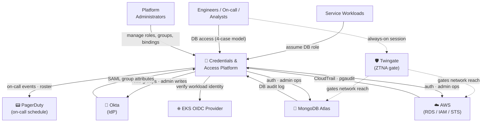
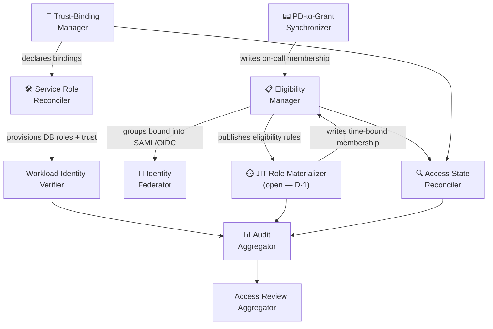
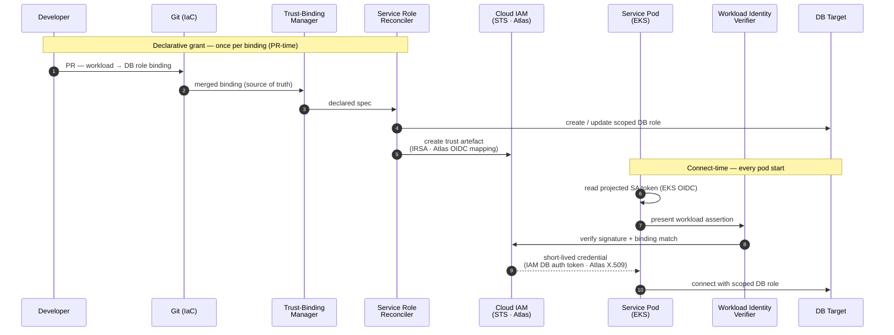
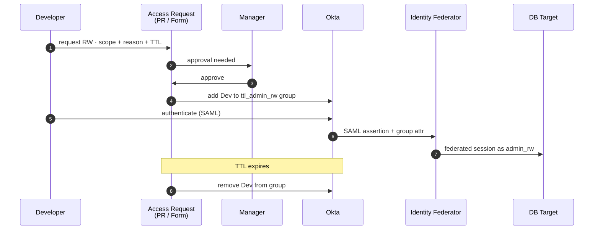
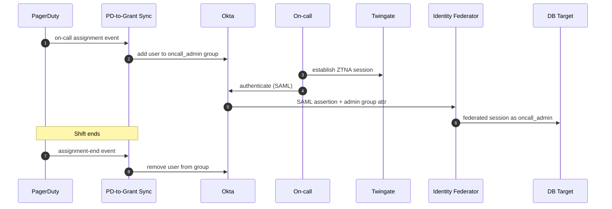
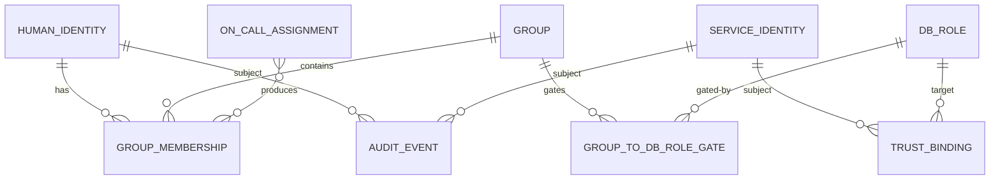
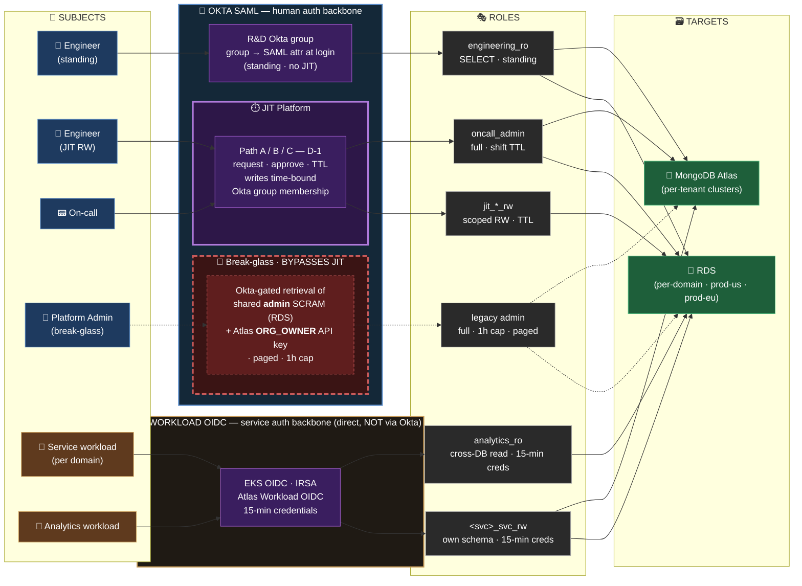
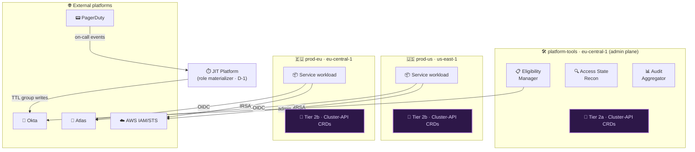
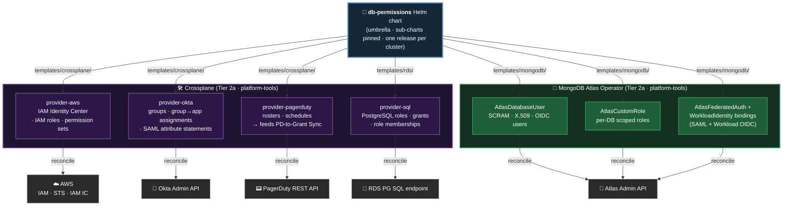
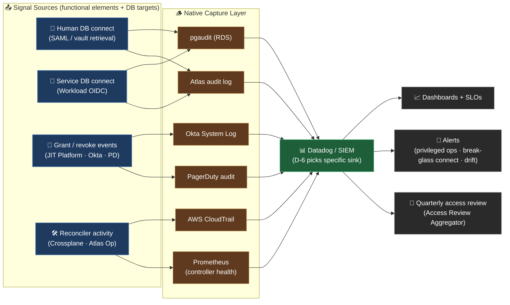

# Credentials &
# Access Platform

**Oren Sultan** | Senior DevOps & Platform Engineer | Tikal | 2026

<FloatingIcon icon="🔐" />

<!--

פתיחה. הדק הולך מהבעיה דרך הארכיטקטורה אל ההחלטות הפתוחות. קהל: פלטפורמה,
אבטחה, SRE. יעד היישור — מודל ארבעת המקרים לבני אדם, Workload OIDC לשירותים,
ושלוש שכבות IaC (ADR-008). ~25 דק' + שאלות.

-->

---
layout: default
transition: fade-out
---

## 🚨 Current State Is Not Acceptable

<GlassCard>

- **One shared SCRAM secret** for every workload **and** every human — across 3× RDS + 1× MongoDB (mid-split) in `prod-us`
- **27 K8s Secrets · ages 87–291 days · no rotation in practice** — RDS Secrets Manager Lambda exists, but downstream `kubectl` roll is manual ⇒ never done
- **No rotation-compatible path** — rotating the shared secret = coordinated **restart across 27 workloads + every human session** · zero-downtime rotation is impossible by design
- **16 Atlas `ORG_OWNER`s + 9 `ORG_OWNER` API keys + 18 dormant accounts ≥12 months** — verified 2026-06-07
- **G-4 audit attribution gap** — `pasha_boss` at 03:17 unanswerable · 3 of 16 RDS still without IAM DB auth
- **About to multiply** — `prod-eu` going live · MongoDB splitting per-tenant · more RDS incoming → debt compounds per **region × database**

</GlassCard>

> Compromised on-call laptop + one stale K8s Secret = **persistent full-org write on all customer data** — and we are weeks from shipping this same model into a second region. *Below: the 🔒 **non-negotiable** principles that constrain every fix.*

<!--

לפתוח עם דחיפות. סוד SCRAM משותף לכל workload ולכל אדם הוא הסיכון המוביל —
לפטופ on-call שנפרץ + סוד K8s ישן = כתיבה מתמשכת על כל הדאטה. מספרים להזכיר:
27 K8s Secrets בגילאים 87–291 ימים, 16 ORG_OWNERs באטלס, 18 חשבונות לא
פעילים מעל 12 חודש. הוק: "עומד להכפיל את עצמו" — prod-eu עולה והחוב גדל
לפי region × DB.

-->

---
layout: default
transition: fade-out
---

## ⚓ Locked Architectural Principles

<GlassCard>

- **Decompose by audience** — services vs humans, *not* by DB technology 
- **Split source-of-truth** — Okta authoritative for humans · IaC authoritative for services 
- **Workload-native identity** — no stored DB passwords for services in steady state 
- **4-case human model** — standing RO · JIT RW · JIT admin · break-glass 
- **Three-layer IaC** — Pulumi bootstrap · admin-baseline (Tier 2a) · per-region self-service (Tier 2b)

</GlassCard>

---
layout: default
transition: fade
class: slide-context-combined
---

## 🌐 Context View — Black Box & External Dependencies

- **Dependencies (human path only · services bypass all three):** 🪪 Okta · 📟 PagerDuty · 🛡️ Twingate · 📊 SIEM / Datadog *(D-6)*
- **🐘 RDS PostgreSQL** — 16 instances · 5 AWS accounts · 13 IAM-DB-auth on / 3 off
- **🍃 MongoDB Atlas** — 3 projects · 4 clusters · 23 DB users
- **🌍 Regions** — `prod-us` · `prod-eu` · `platform-tools`

> **Key boundary:** platform owns the credential lifecycle — humans never type a DB password, services never store one. Dependencies serve the **human path only**; services authenticate via Workload OIDC.

---
layout: section
transition: fade
---

# ⚙️ Functional

## View

---
layout: default
transition: fade
class: slide-functional-combined
---

## ⚙️ Functional Elements & Interactions

**🧩 Core Elements**

- **📋 Eligibility Manager** — Okta groups + group→DB-role gating (humans side of SoT)
- **🔗 Trust-Binding Manager** — workload-identity → DB-role bindings as IaC (services side of SoT)
- **🛠️ Service Role Reconciler** — produces DB roles + cloud-IAM trust artefacts
- **🪪 Workload Identity Verifier** — verifies workload assertion at connect-time → short-lived DB cred
- **🌉 Identity Federator** — carries Okta identity into DB auth path (SAML now · OIDC future)
- **⏱️ JIT Role Materializer** — Okta eligibility + trigger → time-bound membership *(open — D-1)*

> **Naming discipline:** elements are responsibilities, not products. Product mapping shows up only in the Deployment view.

---
layout: default
transition: zoom-out
---

## 🧩 Core Functional Elements

<CardGrid :cols="3">

<Card3D title="📋 Eligibility Manager">

Maintains Okta groups + group→DB-role gating rules (humans side of split source-of-truth)

</Card3D>

<Card3D title="🔗 Trust-Binding Manager">

Maintains workload-identity → DB-role bindings as IaC (services side of split source-of-truth)

</Card3D>

<Card3D title="🛠️ Service Role Reconciler">

Watches declared bindings → produces DB-side roles + cloud-IAM trust artefacts

</Card3D>

<Card3D title="🪪 Workload Identity Verifier">

Verifies workload assertion at connect-time → issues short-lived DB-bound credential

</Card3D>

<Card3D title="🌉 Identity Federator">

Carries Okta identity into the downstream DB auth path via SAML (active) / OIDC (future)

</Card3D>

<Card3D title="⏱️ JIT Role Materializer">

Converts Okta eligibility + trigger into time-bound group membership (mechanism open — D-1)

</Card3D>

</CardGrid>

---
layout: default
transition: zoom-out
---

## 🔬 Functional View — Three Stakeholder Questions

<CardGrid :cols="3">

<Card3D title="🔒 Security — Blast radius?">

- Only **two trust gates** (Workload Identity Verifier · Twingate)
- Compromise bounded to **one binding** — no shared secret
- No element holds **both audiences'** credentials
- **Coding agents** inherit only their owner's permissions
- Audit Aggregator = single attribution point

</Card3D>

<Card3D title="🔮 Evolution — New DB next year?">

- Element graph **unchanged** — same 10 responsibilities
- One new **adapter** inside the Service Role Reconciler
- **D-1** lives below this layer — decide later
- Region split (`prod-us` → `prod-eu`) doesn't change the model

</Card3D>

<Card3D title="🧑‍💻 Usability — Who learns what?">

- **Engineers** — standing RO for daily reads · JIT only when needed
- **Security Officers** — IaC PRs · `git log` is the audit
- **On-call** — PagerDuty drives admin grants · no extra workflow
- **Permission expansion** — dev + approver only · no platform team
- **Auditors** — one Audit Aggregator covers everything

</Card3D>

</CardGrid>

> 🔍 **Observability hook:** Audit Aggregator is the spine · every element emits to it.

---
layout: two-cols-header
transition: slide-left
---

# 🔀 Two Audiences, Two Paths

::left::

### 🤖 Service Access Flow
- Trust binding declared in **IaC** (Git)
- **EKS OIDC** at connect-time · short-lived DB-bound credential
- **Okta not in this path** · no stored passwords

::right::

### 👤 Human Access Flow
- Eligibility lives in **Okta groups** · **SAML** carries group attribute
- **4-Case Model** (ADR-004):
  - **A · Standing RO** — direct group → `_engineering_ro` · no JIT · audit-friendly default
  - **B · JIT RW** — peer-approved · TTL-bound · ticket reference
  - **C · JIT admin** — **PagerDuty** drives it · shift starts → grant · ends → revoke
  - **D · Break-glass** — runbook · 1h default / 4h cap · pages `#sec-ops` every connect
- All four emit **Audit Events** · gated by Twingate at the network layer

---
layout: default
transition: fade
---

## 🤖 Service Access — Workload Identity Flow

> **No stored passwords.** Identity flows K8s SA → EKS OIDC → cloud IAM trust → DB · TTL 15 min · auto-refresh on the pod side · no human, no Okta, no Twingate.

---
layout: default
transition: fade
---

## 🙋 Case B — Developer-Requested JIT RW

> **Manager-approved, TTL-bound.** No platform team in the loop — developer + manager only. Grant + revoke both audited.

---
layout: default
transition: fade
---

## 📟 Case C — JIT Admin (PagerDuty-Triggered)

> **Latency depends on D-1.** Hourly under GHA-cron sub-variant · seconds under PD-webhook sub-variant.

---
layout: section
transition: slide-up
---

# 📦 Information

## View

---
layout: default
transition: fade
class: slide-dense
---

## 📦 Entities & Integrity Invariants

<CardGrid :cols="2">

<Card3D title="🔒 Security lens">

**Four invariants:**
- No **standing** RW/admin for humans
- No **stored** DB passwords for services → **no rotation, no service restart**
- Audit Events **append-only**
- Every materialized DB Role traces to a **Gate** or **Binding**

**Sensitive entities — guard tight:**
- **Trust Binding** — write access *is* effectively granting access
- **Audit Event** — points to **who did what**
- **Group Membership** — **continuous reconciliation** avoids permission drift

</Card3D>

<Card3D title="🔍 Observability hook">

- All **role + permission associations** managed by code — **single source of truth**
- Every change captured in **git commits** + **Audit Events**
- `Audit Event` is the **observability carrier** · **append-only** (no Update / no Delete)
- **Retention:** 18 months target
- **Read access** limited to `Auditor` + `Security Reviewer` roles

</Card3D>

</CardGrid>

---
layout: default
transition: fade
class: slide-access-topology
---

## 🔑 Access Topology — Who Reaches What, How, With Which Role

**Two auth backbones · three human flavors · one service path:**

- **Humans** always transit 🪪 **Okta SAML** — three flavors:
  - *Standing R&D group* → SAML attr (RO only)
  - *JIT Platform* — TTL + approval
  - *Break-glass* — bypasses JIT · paged
- **Services** never touch Okta — direct **Workload OIDC**:
  - EKS IRSA → RDS
  - Atlas Workload OIDC → Mongo

---
layout: section
transition: zoom-out
---

# 🚢 Deployment

## View

---
layout: default
transition: slide-left
---

## 🔬 Deployment View — R&W Perspectives

<CardGrid :cols="3">

<Card3D title="🛡️ Security & Resilience">

*Confinement of damage — malicious or accidental*

- **One hardened admin plane** in `platform-tools` — strictest controls
- **Trust zones don't cross regions** — US can't touch EU, EU can't touch US
- **Admin plane outage** → running services unaffected
- **Region plane outage** → only *new* provisioning paused

</Card3D>

<Card3D title="⚡ Performance">

*Latency & operational friction at runtime*

- **Region-local auth** — no cross-region SAML or DB hops
- **One Twingate session** per human · zero per-connect cost
- **15-min IAM tokens** auto-refresh · no manual rotation
- **Services skip Okta entirely** — connect-time OIDC only

</Card3D>

<Card3D title="⚖️ Regulation">

*Compliance & auditability surface*

- **`git log` is the access-change audit trail** — every grant ties to a PR
- **Data residency** — EU data in `eu-central-1`, US in `us-east-1`
- **No implicit cross-region reach** — controllers region-scoped
- **Tier 2a pinned** for SOC2 evidence · retention target D-6

</Card3D>

</CardGrid>

---
layout: default
transition: fade
class: slide-multi-region
---

## 🚢 Multi-Region Topology

**🧩 Tier 2a — baseline** *(platform-tools · cross-region)*

- **Crossplane** providers — AWS · Kubernetes
- **MongoDB Atlas Operator** — DB users · org roles
- **PagerDuty** provider — on-call schedule sync

**🧩 Tier 2b — per-region** *(self-service · bounded blast radius)*

- **Crossplane** regional AWS provider (US-only / EU-only)
- **Per-service** Role + RoleBinding CRDs
- **Atlas Database** CRDs scoped to the region's cluster

> **Blast radius:** `prod-us` controllers cannot reach `prod-eu` resources · region-bounded by design.

---
layout: section
transition: fade
---

# 🛠️ Development

## View

---
layout: default
transition: slide-left
---

## 🔬 Development View — R&W Perspectives

<CardGrid :cols="3">

<Card3D title="🔮 Evolution">

*Ability to absorb change without restructure*

- Templates folder mirrors **external systems**, not services
- Adding a 3rd DB technology = one new `templates/{tech}/` folder
- **No chart restructure** required
- Sub-chart routing is the abstraction line

</Card3D>

<Card3D title="⚖️ Regulation">

*Compliance & auditability of access changes*

- All access changes flow through **Git PRs** — auditable · reviewable · signed
- Sub-chart **versions pinned** (crossplane 1.18 · atlas-operator 2.5)
- `access-matrix.md` is the **human-readable audit joint**
- **CI lints** block out-of-band grants (e.g. `psql GRANT` outside `templates/`)

</Card3D>

<Card3D title="🧑‍💻 Usability">

*Ease of adoption for service teams*

- `examples/*.yaml` are **runnable snippets** per use-case
- First PR copies **one file**, not the whole chart
- **Onboarding measured in minutes**
- Teams **own their workload permissions** — no platform-team dependency (velocity win)
- **CODEOWNERS** gates access-PR review — clear ownership

</Card3D>

</CardGrid>

> 🔍 **Observability hook:** `git log` of the chart **is** the human-readable change-audit timeline · `access-matrix.md` is the queryable summary.

---
layout: default
transition: slide-left
class: slide-tools-selection
---

## 🛠️ Tools Selection — Crossplane (Tier Structure) vs Pulumi

| Aspect | 🟧 **Pulumi** *(existing)* | 🟦 **Crossplane** *(tier structure)* | Score *(/5)* |
|---|---|---|:---:|
| **👤 Human access** | Shared SCRAM · no JIT · no per-user audit | Okta + SAML · 4-case JIT · per-user audit | 🟧 **1** · 🟦 **5** |
| **🤖 Workload access** | Shared password stored in env/Secret · manual rotation | OIDC + IRSA · 15-min creds · no stored secret | 🟧 **1** · 🟦 **5** |
| **💾 State management** | External state file (S3) · auditable history · manual `pulumi refresh` | K8s etcd · live state · controllers heal drift automatically | 🟧 **4** · 🟦 **4** |
| **🧑‍🔧 Platform-team involvement** | **HIGH** — gatekeeps every change · centralized stack ownership | **LOW** — owns providers; service teams self-serve via CRDs | 🟧 **2** · 🟦 **5** |
| **⏱️ Effort per change** | Code change · CI run · `plan` + `apply` · stack-secret rotation | `kubectl apply` (or PR merge) · controller reconciles | 🟧 **2** · 🟦 **5** |
| **🔄 Infra ↔ code alignment** | **Two PRs** in separate repos · order-sensitive deploy · risk of drift between role + consumer | **Single PR** — Role/Binding CRD ships with the service manifest · atomic helm release | 🟧 **2** · 🟦 **5** |
| **🔐 Authority of permissions** | Stack-level — hard to delegate safely | K8s RBAC per-CRD · CODEOWNERS · narrow grants | 🟧 **2** · 🟦 **5** |
| **⚡ Performance & stability** | Run-based · cold-start each CI · drift surfaces on next plan | Continuous reconciliation · auto-heal · backoff retries | 🟧 **3** · 🟦 **5** |

**🎯 Conclusion** — Total: 🟧 **Pulumi 17 / 40** · 🟦 **Crossplane 39 / 40**

- **State management** is the only tie — Pulumi's explicit history vs Crossplane's live etcd
- **🟧 Tier 1 bootstrap** stays with Pulumi — VPCs · AWS accounts · EKS · pre-cluster
- **🟦 Tier 2a onward** goes to Crossplane — continuous reconciliation, per-team self-service, narrow per-CRD grants
- **Net effect** — platform-team bottleneck removed · cross-repo coordination eliminated · per-team velocity multiplied

---
layout: default
transition: fade-out
---

## 📁 `sentra-db-permissions` — Chart Tree

<GlassCard>

- **Umbrella chart** · `Chart.yaml` + pinned sub-charts (crossplane 1.18 · atlas-operator 2.5)
- **`templates/`** · 6 folders, one per target system (crossplane · iam-ic · mongodb · rds · okta · observe)
- **`values/`** · environment overlays (`staging.yaml`, `prod.yaml`) + `access-matrix.md`
- **`examples/`** · runnable onboarding snippets per use-case

</GlassCard>

> **One chart, six target-system folders, one access-matrix.** The whole platform fits in one Helm release per cluster.

---
layout: default
transition: fade
---

## 🛠️ Controller Plane — Backends Behind `db-permissions`

> **One Helm chart, two reconciliation backends.** **Crossplane** owns everything that lands in AWS / Okta / PagerDuty / PostgreSQL (4 providers, 4 upstream APIs). **MongoDB Atlas Operator** owns everything that lands in Atlas (3 CRDs, 1 upstream API). The chart routes each `templates/{system}/` folder to its matching backend — *one PR adds a role across all five upstream systems consistently*.

---
layout: default
transition: fade
class: slide-observability-fit
---

## 🔍 Observability — Closing the G-4 Attribution Gap

> **Closes G-4 (today's question: *"who was `pasha_boss` at 03:17?"* — unanswerable).** Every connection now carries the federated identity that authorized it · pgaudit + Atlas audit record the principal · SIEM correlates across the full chain. **Open: D-6 picks the sink (Datadog vs alternative SIEM) + retention period.**

**SLOs — three axes, one table:**

| Signal | SLO target | Why it matters |
|---|---|---|
| **JIT grant latency** (request → SAML attribute live) | **< 60s P95** | On-call usability — Case C automatic grant must beat the page |
| **Audit egress lag** (DB connect → in SIEM) | **< 5 min P99** | Forensics + alerting need near-real-time |
| **Drift reconcile cadence** (Git vs reality) | **every 5 min** | Detect out-of-band grants before they age |
| **Break-glass connect → `#sec-ops` page** | **< 30s** | If `admin` SCRAM is in use, security must know now |
| **Identity attribution coverage** | **100%** of DB connects | Closes G-4 — no `pasha_boss` mystery left |
| **Audit retention** | **18 months** (target) | SOC2 minimum + intra-year incident lookback |

---
layout: section
transition: slide-up
---

# 📑 Decisions

## & What's Open

---
layout: default
transition: zoom-out
class: slide-dense
---

## 📑 Decisions — Locked + Open

<CardGrid :cols="3">

<Card3D title="🎯 Locked">

**Group → Role** — Okta group → scoped IAM + Atlas roles · *rejected:* per-user grants

**Break-Glass** — `admin` + `ORG_OWNER` → 2–3 humans · 1h cap · *rejected:* status quo

**Okta + JIT = SoT** — standing via Okta · time-bound via JIT · *rejected:* DB-as-truth

</Card3D>

<Card3D title="🔮 D-1 — JIT Path">

**🅰️ Path A** — Okta API build · Lambda + GHA + Slack · needs Lifecycle Mgmt uplift

**🅲 Path C** — Self-managed OIDC broker · Keycloak / Dex · sidesteps Okta uplift

**🅱️ Path B** — Vendor (Britive / BeyondTrust / Snyk) · SOC2 · 4 integrations required

</Card3D>

<Card3D title="🛠️ D-2 — IaC Tool">

**Scope 1** — `db-permission-module` · Pulumi (typed) vs Crossplane (drift)

**Scope 2** — Workload bindings · Pulumi (per-team) vs Crossplane (K8s-native)

**Sub-Q** — Workload-auth migration timing *(ADR-003 locked OIDC; pace open)*

</Card3D>

</CardGrid>

---
layout: cover
transition: fade
background: /thanks-hero.jpg
class: thanks-slide
---

# Thank You
## Questions?

**Oren Sultan** · Senior DevOps & Platform Engineer · Tikal
[app.sultano.blog](https://app.sultano.blog) · [linkedin.com/in/oren-sultan-0527bab6](https://www.linkedin.com/in/oren-sultan-0527bab6/) · [github.com/orenoren1](https://github.com/orenoren1)

<!--

סיכום. שלוש בקשות מהקהל: פידבק על מודל ארבעת המקרים (הליבה הרעיונית),
העדפה ל-Path A / B / C עבור D-1 (ההחלטה הפתוחה), וכל תרחיש blast-radius
שפספסתי בניתוח אזורי האמון. פרטי קשר על המסך — Slack, LinkedIn, GitHub.

-->
