# Credentials &
# Access Platform

<div style="margin-top: 1.2em; font-size: 0.85em; opacity: 0.9;">

**Oren Sultan** | Senior DevOps & Platform Engineer | Tikal | 2026

</div>

<FloatingIcon icon="🔐" />

<!--
<div dir="rtl">

פתיחה. הדק הולך מהבעיה דרך הארכיטקטורה אל ההחלטות הפתוחות. קהל: פלטפורמה,
אבטחה, SRE. יעד היישור — מודל ארבעת המקרים לבני אדם, Workload OIDC לשירותים,
ושלוש שכבות IaC (ADR-008). ~25 דק' + שאלות.

</div>
-->

---
layout: default
transition: fade-out
---

## 🚨 Critical Problems in Current State

<CardGrid :cols="2">

<Card3D title="📋 What we have today">

- **1** shared SCRAM secret
- **27** K8s Secrets
- **16** Atlas `ORG_OWNER`s + **9** API keys
- **5 / 16** RDS still on password auth

</Card3D>

<Card3D title="⚠️ Why it's not acceptable">

- **Rotation is a project, not a task** — 27 workloads + every human session in lockstep
- **DB creds on dev laptops** — shared via Slack · live in `.env` files
- **No DB-access standard** — every DB onboarded ad-hoc · same trap for the next one
- **`prod-eu` expands the debt** — 2nd region · per-tenant Mongo + more SaaS incoming
- **Platform = executors only** — no governance policy · no security gate · just runs the request
- **No per-user audit trail** — prod actions attribute to the shared secret, not the human

</Card3D>

</CardGrid>

> Compromised on-call laptop + one stale K8s Secret = **persistent full-org write on all customer data** — and we are weeks from shipping this same model into a second region. *Below: the 🔒 **non-negotiable** principles that constrain every fix.*

<div style="position:absolute;right:1.5rem;bottom:1.5rem;width:120px;opacity:0.95;pointer-events:none;z-index:5;"></div>

<!--
<div dir="rtl">

לפתוח עם דחיפות. סוד SCRAM משותף לכל workload ולכל אדם הוא הסיכון המוביל —
לפטופ on-call שנפרץ + סוד K8s ישן = כתיבה מתמשכת על כל הדאטה. מספרים להזכיר:
27 K8s Secrets בגילאים 87–291 ימים, 16 ORG_OWNERs באטלס, 18 חשבונות לא
פעילים מעל 12 חודש. הוק: "עומד להכפיל את עצמו" — prod-eu עולה והחוב גדל
לפי region × DB.

</div>
-->

---
layout: default
transition: fade-out
---

## ⚓ Locked Architectural Principles

<GlassCard>

- **Decompose by audience** — services vs humans, *not* by DB technology 
- **Split source-of-truth** — Okta authoritative for humans · IaC authoritative for services 
- **Workload-native identity** — no stored DB passwords for services in steady state 
- **4-case human model** — standing RO · JIT RW · JIT admin · break-glass 
- **Three-layer IaC** — Pulumi bootstrap · admin-baseline (Tier 2a) · per-region self-service (Tier 2b)

</GlassCard>

<div style="position:absolute;right:1.5rem;bottom:1.5rem;width:120px;opacity:0.95;pointer-events:none;z-index:5;"></div>

<!--
<div dir="rtl">

חמישה עקרונות נעולים — להציג כקווי שופט, לא העדפות. לעצור על "split
source-of-truth" — Okta הוא הסמכות לבני אדם, IaC הוא הסמכות לשירותים. זו
ההפנמה הקשה ביותר. "Three-layer IaC" זה ADR-008: Pulumi לאתחול (Tier 1)
+ Crossplane בסיס מנהל ב-platform-tools (Tier 2a) + Crossplane self-service
לכל אזור (Tier 2b).

</div>
-->

---
layout: default
transition: fade
class: slide-context-combined
---

## 🌐 Context View — Black Box & External Dependencies

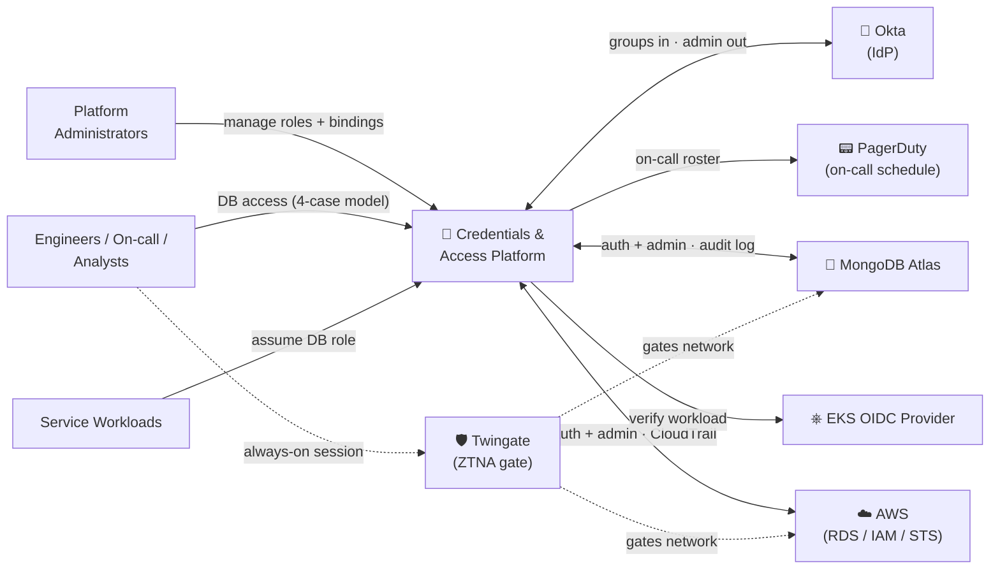

<div class="ctx-foot">

- **Dependencies (human path only · services bypass all three):** 🪪 Okta · 📟 PagerDuty · 🛡️ Twingate · 📊 SIEM / Datadog *(D-6)*
- **🐘 RDS PostgreSQL** — 16 instances · 4 AWS accounts · 11 IAM-DB-auth on / 5 off
- **🍃 MongoDB Atlas** — 3 projects · 4 clusters · 23 DB users
- **🌍 Regions** — `prod-us` · `prod-eu` · `platform-tools`

</div>

> **Key boundary:** platform owns the credential lifecycle — humans never type a DB password, services never store one. Dependencies serve the **human path only**; services authenticate via Workload OIDC.

<div style="position:absolute;right:1.5rem;bottom:1.5rem;width:120px;opacity:0.95;pointer-events:none;z-index:5;"></div>

<!--
<div dir="rtl">

הפלטפורמה היא קופסה שחורה — כל מה שמסביב הוא או actor (שירותים / מהנדסים
/ מנהלים) או תלות קשה (Okta, PagerDuty, Twingate, ה-DBs). הגבול המרכזי —
בני אדם לעולם לא מקלידים סיסמת DB, שירותים לעולם לא שומרים סיסמה. לחזק:
התלויות משרתות רק את מסלול בני האדם — שירותים עוקפים את Okta / PD /
Twingate לחלוטין דרך Workload OIDC.

</div>
-->

---
layout: section
transition: fade
---

# ⚙️ Functional

## <span class="neon">View</span>

<div style="position:absolute;right:3rem;bottom:4rem;width:180px;opacity:0.95;pointer-events:none;z-index:5;"></div>

<!--
<div dir="rtl">

מעבר view. ה-Functional view עונה על "מה המערכת עושה" — אחריות, לא מוצרים.
~10 שניות; השקף הבא הוא העיקרון.

</div>
-->

---
layout: default
transition: fade
class: slide-functional-combined
---

## ⚙️ Functional Elements & Interactions

<div class="fn-grid">
<div class="fn-diagram">

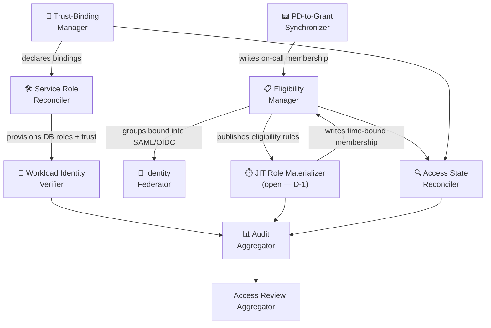

</div>
<div class="fn-side">

**🧩 Core Elements**

- **📋 Eligibility Manager** — Okta groups + group→DB-role gating (humans side of SoT)
- **🔗 Trust-Binding Manager** — workload-identity → DB-role bindings as IaC (services side of SoT)
- **🛠️ Service Role Reconciler** — produces DB roles + cloud-IAM trust artefacts
- **🪪 Workload Identity Verifier** — verifies workload assertion at connect-time → short-lived DB cred
- **🌉 Identity Federator** — carries Okta identity into DB auth path (SAML now · OIDC validated POC #70489, deferred by choice)
- **⏱️ JIT Role Materializer** — Okta eligibility + trigger → time-bound membership *(open — D-1)*

</div>
</div>

> **Naming discipline:** elements are responsibilities, not products. Product mapping shows up only in the Deployment view.

<div style="position:absolute;right:1.5rem;bottom:1.5rem;width:120px;opacity:0.95;pointer-events:none;z-index:5;"></div>

<!--
<div dir="rtl">

עשרה אלמנטים, כל אחד אחריות. הזוג Eligibility Manager + Trust-Binding
Manager הוא מימוש ה-split-SoT. Service Role Reconciler + Workload
Identity Verifier מטפלים במסלול השירותים. Identity Federator + JIT Role
Materializer נושאים את מסלול בני האדם — מנגנון ה-JIT עדיין פתוח (D-1).
Audit Aggregator → Access Review Aggregator סוגרים את לולאת הביקורת.

</div>
-->

---
layout: default
transition: zoom-out
---

## 🧩 Core Functional Elements

<CardGrid :cols="3">

<Card3D title="📋 Eligibility Manager">

Maintains Okta groups + group→DB-role gating rules (humans side of split source-of-truth)

</Card3D>

<Card3D title="🔗 Trust-Binding Manager">

Maintains workload-identity → DB-role bindings as IaC (services side of split source-of-truth)

</Card3D>

<Card3D title="🛠️ Service Role Reconciler">

Watches declared bindings → produces DB-side roles + cloud-IAM trust artefacts

</Card3D>

<Card3D title="🪪 Workload Identity Verifier">

Verifies workload assertion at connect-time → issues short-lived DB-bound credential

</Card3D>

<Card3D title="🌉 Identity Federator">

Carries Okta identity into the downstream DB auth path via SAML (active) / OIDC (validated POC #70489, deferred by choice)

</Card3D>

<Card3D title="⏱️ JIT Role Materializer">

Converts Okta eligibility + trigger into time-bound group membership (mechanism open — D-1)

</Card3D>

</CardGrid>

<div style="position:absolute;right:1.5rem;bottom:1.5rem;width:120px;opacity:0.95;pointer-events:none;z-index:5;"></div>

<!--
<div dir="rtl">

שישה כרטיסים — האחריות שתמיד פעילה. האלמנט "open per D-1" הוא JIT Role
Materializer; המימוש שלו (Path A: בנייה מעל Okta API · Path B: ספק חיצוני
· Path C: היברידי) הוא החתיכה הארכיטקטונית היחידה שעוד לא הוחלטה ב-ADR-007.

</div>
-->

---
layout: default
transition: zoom-out
---

## 🔬 Functional View — Three Stakeholder Questions

<CardGrid :cols="3">

<Card3D title="🔒 Security — Blast radius?">

- Only **two trust gates** (Workload Identity Verifier · Twingate)
- Compromise bounded to **one binding** — no shared secret
- No element holds **both audiences'** credentials
- **Coding agents** inherit only their owner's permissions
- Audit Aggregator = single attribution point

</Card3D>

<Card3D title="🔮 Evolution — New DB next year?">

- Element graph **unchanged** — same 10 responsibilities
- One new **adapter** inside the Service Role Reconciler
- **D-1** lives below this layer — decide later
- Region split (`prod-us` → `prod-eu`) doesn't change the model

</Card3D>

<Card3D title="🧑‍💻 Usability — Who learns what?">

- **Engineers** — standing RO for daily reads · JIT only when needed
- **Security Officers** — IaC PRs · `git log` is the audit
- **On-call** — PagerDuty drives admin grants · no extra workflow
- **Permission expansion** — dev + approver only · no platform team
- **Auditors** — one Audit Aggregator covers everything

</Card3D>

</CardGrid>

> 🔍 **Observability hook:** Audit Aggregator is the spine · every element emits to it.

<div style="position:absolute;right:1.5rem;bottom:1.5rem;width:120px;opacity:0.95;pointer-events:none;z-index:5;"></div>

<!--
<div dir="rtl">

תבנית R&W ל-Functional view — להציג את שלוש הפרספקטיבות שחשובות לבעלי
עניין שונים. אבטחה שואלת על blast radius. אבולוציה שואלת על עלות שינוי
כשנכנס DB חדש. שימושיות שואלת מי-לומד-מה. להשאיר את השקף הזה דחוס; הוא
מכין את ה-views שיבואו.

</div>
-->

---
layout: two-cols-header
transition: slide-left
---

# 🔀 Two Audiences, Two Paths

::left::

<div class="highlight-box">

### 🤖 Service Access Flow
- Trust binding declared in **IaC** (Git)
- **EKS OIDC** at connect-time · short-lived DB-bound credential
- **Okta not in this path** · no stored passwords

</div>

::right::

<div class="highlight-box">

### 👤 Human Access Flow
- Eligibility lives in **Okta groups** · **SAML** carries group attribute
- **4-Case Model** (ADR-004):
  - **A · Standing RO** — direct group → `_engineering_ro` · no JIT · audit-friendly default
  - **B · JIT RW** — peer-approved · TTL-bound · ticket reference
  - **C · JIT admin** — **PagerDuty** drives it · shift starts → grant · ends → revoke
  - **D · Break-glass** — runbook · 1h default / 4h cap · pages `#sec-ops` every connect
- All four emit **Audit Events** · gated by Twingate at the network layer

</div>

<div style="position:absolute;right:1.5rem;bottom:1.5rem;width:120px;opacity:0.95;pointer-events:none;z-index:5;"></div>

<!--
<div dir="rtl">

המסגור החשוב ביותר בדק כולו. שני מסלולי זהות נפרדים: בני אדם דרך SAML
backbone של Okta (3 וריאציות — standing RO מ-group attr · JIT Platform
ל-RW + on-call admin · break-glass ל-admin / ORG_OWNER ישירות) ושירותים
דרך Workload OIDC (אין סוד משותף, אין Okta, אין Twingate). לחזק: שירותים
לעולם לא נוגעים ב-Okta.

</div>
-->

---
layout: default
transition: fade
---

## 🤖 Service Access — Workload Identity Flow

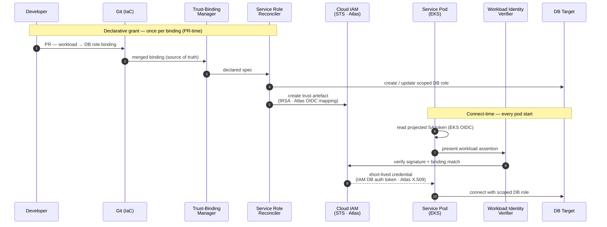

> **No stored passwords.** Identity flows K8s SA → EKS OIDC → cloud IAM trust → DB · TTL 15 min · auto-refresh on the pod side · no human, no Okta, no Twingate.

<div style="position:absolute;right:1.5rem;bottom:1.5rem;width:120px;opacity:0.95;pointer-events:none;z-index:5;"></div>

<!--
<div dir="rtl">

לעבור על הרצף: K8s ServiceAccount → EKS OIDC → AWS IAM trust → DB. TTL
של 15 דקות, חידוש אוטומטי בצד ה-pod. אין אדם, אין Okta, אין Twingate
במסלול החם. RDS משתמש ב-IRSA + IAM DB auth; Atlas משתמש ב-Workload OIDC
ישירות. זה מחזור החיים של ה-credential ב-steady state עבור שירותים.

</div>
-->

---
layout: default
transition: fade
---

## 🙋 Case B — Developer-Requested JIT RW

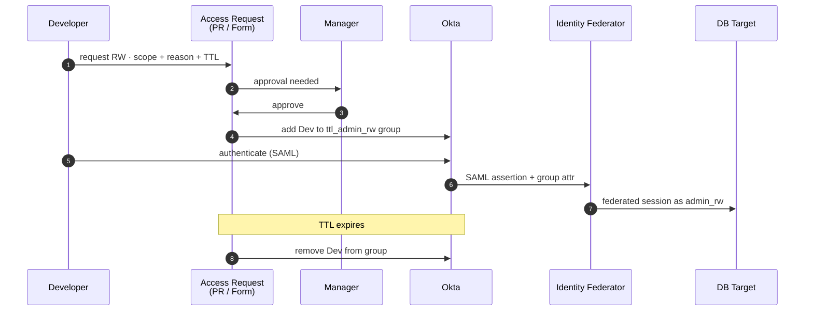

> **Manager-approved, TTL-bound.** No platform team in the loop — developer + manager only. Grant + revoke both audited.

<div style="position:absolute;right:1.5rem;bottom:1.5rem;width:120px;opacity:0.95;pointer-events:none;z-index:5;"></div>

<!--
<div dir="rtl">

המקרה היחיד עם שער אישור אנושי. מפתח מבקש דרך הפלטפורמה (פקודת Slack /
טופס web), מאשר (עמית או ראש צוות) מאשר, חברות זמנית ב-Okta group נכתבת
ל-TTL חסום, federation מטמיע את ה-role החדש. תתי-וריאציות תלויות ב-D-1
(טיימר Path A, ספק וכו').

</div>
-->

---
layout: default
transition: fade
---

## 📟 Case C — JIT Admin (PagerDuty-Triggered)

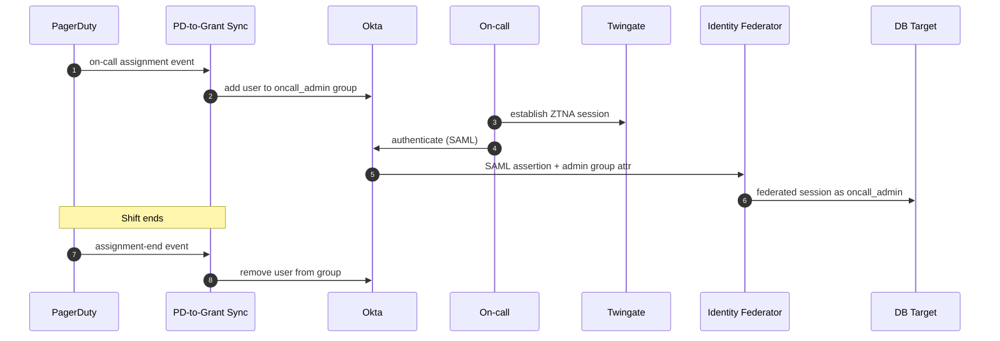

> **Latency depends on D-1.** Hourly under GHA-cron sub-variant · seconds under PD-webhook sub-variant.

<div style="position:absolute;right:1.5rem;bottom:1.5rem;width:120px;opacity:0.95;pointer-events:none;z-index:5;"></div>

<!--
<div dir="rtl">

ה-on-call מקבל הרשאת admin אוטומטית — בלי כרטיס, בלי מאשר. מנוי PagerDuty
דוחף את חברות ה-Okta group הזמנית. ה-latency תלוי-טריגר: שעתית בתת-וריאציה
של GHA-cron; שניות בתת-וריאציה של PD webhook → Lambda או Slack command.
המשתמש חייב להתחבר מחדש ל-DB כדי לקלוט את group attribute החדש.

</div>
-->

---
layout: section
transition: slide-up
---

# 📦 Information

## <span class="neon">View</span>

<div style="position:absolute;right:3rem;bottom:4rem;width:180px;opacity:0.95;pointer-events:none;z-index:5;"></div>

<!--
<div dir="rtl">

מעבר view. Information view = ישויות והכללים שמגנים עליהן. השקף הבא הוא
מודל הישויות + invariants.

</div>
-->

---
layout: default
transition: fade
class: slide-dense
---

## 📦 Entities & Integrity Invariants

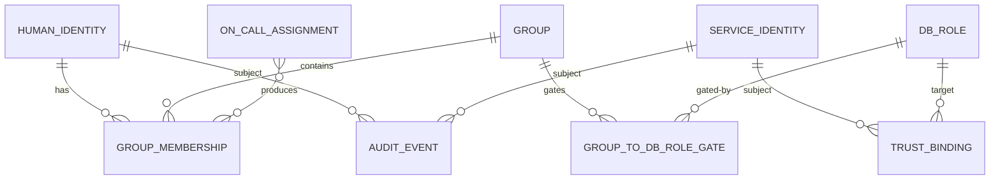

<CardGrid :cols="2">

<Card3D title="🔒 Security lens">

**Four invariants**
- No standing RW/admin for humans
- No stored DB passwords — no rotation, no restart
- Audit Events are append-only
- Every DB Role traces to a Gate or Binding

**Guard tight**
- Trust Binding — write access *is* granting access
- Audit Event — who did what
- Group Membership — reconciled continuously

</Card3D>

<Card3D title="🔍 Observability hook">

- Role + permission associations live in code — single source of truth
- Every change → git commit + Audit Event
- 18-month retention
- Audit Events append-only
- Read access scoped to Auditor + Security Reviewer

</Card3D>

</CardGrid>

<div style="position:absolute;right:1.5rem;bottom:1.5rem;width:120px;opacity:0.95;pointer-events:none;z-index:5;"></div>

<!--
<div dir="rtl">

ארבע ישויות ליבה. להדגיש את ארבעת ה-invariants — אין standing RW/admin
לבני אדם (הכל חסום בזמן), אין סיסמאות DB שמורות לשירותים, כל DB role
מגושם נובע מ-Gate או Binding (מקור), Trust Binding write = grant
(עוגן ביקורת). שמירת ביקורת 18 חודשים; Audit Event הוא append-only.

</div>
-->

---
layout: default
transition: fade
class: slide-dense
---

## 🔬 Workforce OIDC — POC #70489 validated

<GlassCard>

**Assumption** — Atlas Workforce OIDC needs Okta's paid Custom Auth Server (Org Auth Server can't put `groups[]` in access tokens). **Reality** — one flag flips it: `mongosh` sends the **ID token**, not the access token.

```bash
mongosh --oidcIdTokenAsAccessToken "mongodb+srv://<cluster>/?authMechanism=MONGODB-OIDC"
```

| Token sent             | `aud`                 | `groups[]` | Atlas | | | Finding | Evidence |
|------------------------|-----------------------|------------|-------|---|---|---|---|
| access token (default) | `<org-auth-server>`   | ❌         | ❌    | | ① | **OIDC chain valid** | ID token resolves `<idp>/<group>` → custom roles |
| **ID token** (w/ flag) | `<client_id>`         | ✅         | ✅    | | ② | **1 app → N identities** | 1 token · 2 groups · 2 fed users · 2 roles |
|                        |                       |            |       | | ③ | **Per-group differentiation** | Delete fed user → role gone · recreate → returns |
|                        |                       |            |       | | ④ | **Per-action enforcement** | `insert` ✅ · `drop` ❌ (not in role) |

✅ Free Org Auth Server — no paid SKU.  &nbsp;&nbsp; ⚠️ Federated-user changes are **eventually-consistent** (~min) — revoke SLAs must account.

</GlassCard>

<!--
<div dir="rtl">

ההוכחה הטכנית הצרה — חלק מ-Information View כי זו דרך לבטא איך
זהות חיצונית (Okta group) הופכת לזהות פנימית (DB role). ההנחה
שרווחת בתעשייה: כדי להפעיל Atlas Workforce OIDC עם מיפוי קבוצות
צריך Custom Authorization Server של Okta, שדורש רישיון בתשלום
של API Access Management. ה-POC הוכיח שזה שגוי.

ה-flag `--oidcIdTokenAsAccessToken` גורם ל-mongosh לשלוח את ה-ID
token במקום ה-access token. ה-ID token: (א) audience שלו הוא
ה-client_id של אפליקציית ה-OIDC ב-Okta; (ב) הוא נושא `groups[]`
דרך Token Claim expression של Okta Identity Engine. השרשרת
עובדת קצה לקצה ב-Org Auth Server החינמי.

הוכח אמפירית ב-staging ב-2026-06-10: Atlas IdP מזהה
`6a0c477886c8942fe3e99d6d`, audience של אפליקציית OIDC
`0oa136bic0ys7y6bh698`. הקבוצות `poc-mdb-staging-readonly`
ו-`poc-mdb-staging-rw-org1` קושרו ל-custom DB roles
`poc_readonly_org` ו-`poc_rw_org1`. גם positive וגם negative
tests עברו — קבוצת readonly לא יכלה לכתוב, קבוצת rw לא יכלה
לחרוג מ-org1 שלה.

ארבעה ממצאים אמפיריים — לעבור עליהם בסליידr:

(1) השרשרת תקפה — ID token עובר, federated user מתרזולב, custom role נקשר.

(2) **app אחד → N זהויות**. token יחיד הפעיל בו-זמנית את `poc-mdb-staging-readonly`
ו-`poc-mdb-staging-rw-org1`. ב-connectionStatus רואים 2× federated users + 2×
custom roles. *אין צורך באפליקציית Okta נפרדת לכל זהות.* זה הממצא הכי
משמעותי לעיצוב — את הניתוק בין tiers (dev/prod/breakglass) אפשר להשיג
ב-app אחד עם N קבוצות, או ב-N apps לבידוד audience. לבחור.

(3) **differentiation לפי קבוצה**. מחקנו את ה-federated user של group-B
(בלי לגעת בחברוּת בקבוצה ב-Okta) — ה-role נעלם מ-connectionStatus. שיחזרנו
— ה-role חזר. אותו token, אותן קבוצות ב-payload. אז ה-gating האמיתי הוא
ברשומת ה-federated user, לא בחברוּת ב-Okta. חברוּת = תנאי הכרחי, רשומה
ב-Atlas = תנאי מספיק.

(4) **per-action enforcement**. ה-role `poc_rw_org1` מתיר insert/update/remove/find
אבל *לא* dropCollection. אימתנו: insert עבר, deleteMany עבר, drop נחסם
עם Unauthorized. Atlas אוכף ברמת ה-action הבודד, לא רק ברמת ה-role.

(5) **caveat תפעולי** — שינויים ב-federated users הם eventually-consistent.
תצפינו על pause של ~דקות בין הקריאה ל-API לבין כניסה לתוקף בחיבורים
חדשים. ה-SLA של revoke חייב להכיל את זה.

הסליידr הבא: ה-flow המלא צעד-צעד.

</div>
-->

---
layout: default
transition: fade
---

## 🛂 End-to-end auth flow (Atlas OIDC)

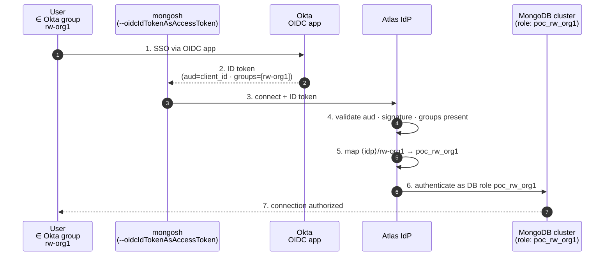

> **Group membership → ID-token claim → federated-user mapping → DB role.** No personal user objects; no static credentials in mongosh config.

<!--
<div dir="rtl">

זרימת ה-auth מקצה לקצה — איך זהות חיצונית הופכת לתפקיד פנימי
(זה למה השקופית כאן ב-Information View, ליד Access Topology):

(1) המשתמש ניגש לאפליקציית ה-OIDC ב-Okta — SSO רגיל. (2) Okta
מנפיק ID token שה-audience שלו הוא client_id של האפליקציה והוא
נושא את ה-claim `groups[]` עם הקבוצות שהמשתמש שייך אליהן. (3)
mongosh, עם ה-flag `--oidcIdTokenAsAccessToken`, מצמיד את ה-ID
token לחיבור ל-Atlas. (4) Atlas מאמת audience, חתימה, ושה-groups
קיימים ב-claim. (5) Atlas מבצע lookup של federated user בפורמט
`<idp>/<group>` — זה ה-**join key** בין הזהות החיצונית לתפקיד
הפנימי. (6) המיפוי מחזיר custom DB role, ו-Atlas מאמת את המשתמש
ככזה. (7) החיבור מאושר עם הרשאות התפקיד.

הנקודות החשובות מבחינת Information View: אין user objects
אישיים ב-Atlas — רק federated bindings; אין credentials סטטיים
ב-mongosh — ה-token לטווח קצר; כל החיבור ניתן ל-audit דרך
ה-`sub` של ה-token + ה-federated user.

</div>
-->

---
layout: default
transition: fade
---

## 🔭 Atlas OIDC mirrors AWS-IC — same group → role pattern

<GlassCard>

| Property             | **AWS** (IAM IC · SAML)        | **Atlas** (OIDC · validated)                  |
|----------------------|--------------------------------|-----------------------------------------------|
| Role lives on        | AWS account · Permission Set   | Atlas cluster · custom DB role                |
| Okta-app model       | 1 app : N groups : N roles     | **1 app per identity** (or 1 app : N groups)  |
| Group → role binding | inside AWS IAM IC              | inside Atlas IdP (`<idp>/<group>`)            |
| Token carrier        | SAML assertion (`groups[]`)    | OIDC ID token (`groups[]`)                    |
| User assumes via     | Okta group membership          | Okta group membership                         |
| User experience      | "assume role X in account Y"   | "connect as role X on cluster Y"              |

**Still SAML today — operational only:** driver tax + protocol homogeneity with RDS. **Reopen if** driver-level browser SSO becomes a hard requirement.

</GlassCard>

<!--
<div dir="rtl">

המודל — לא על ה-flag, על הסימטריה. לאף אחד אין חשבון אישי בענן.
כל זהות היא **תפקיד** מחובר לאפליקציית Okta, ומשתמש "מתכנס"
לתוך התפקיד דרך חברות ב-Okta group. זה בדיוק האופן שבו AWS
IAM Identity Center עובד אצלנו היום (group → Permission Set →
assume role בחשבון). ה-POC הוכיח ש-Atlas OIDC מתיישב על אותו
המודל בדיוק.

ב-Information View ההבחנה הזו חשובה כי היא משפיעה על אבחנת
הישויות: לא "משתמש Atlas" כישות, אלא "תפקיד" כישות + מיפוי
חיצוני. הטבלה מציגה את ההתאמה צד-בצד.

אותו מודל, שני carriers שונים: SAML assertion מול OIDC ID token,
שניהם נושאים `groups[]`. למה עדיין SAML היום? **לא** סיבה
ארכיטקטונית — סיבות תפעוליות בלבד:
(1) **מס דרייברים** — כל קליינט Mongo בחברה חייב להפעיל את ה-flag
(mongosh, Compass, pymongo, Node), ניהול fleet-wide זה מטרד;
(2) **הומוגניות פרוטוקול** — Atlas console ו-RDS שניהם SAML,
מנגנון ביקורת ו-break-glass יחיד. אם בעתיד SSO ברמת הדרייבר
יהפוך לדרישה קשה — הראיה האמפירית מוכנה, צריך רק ADR חדש;
המודל זהה, רק ה-protocol מתחלף.

</div>
-->

---
layout: default
transition: fade
class: slide-access-topology
---

## 🔑 Access Topology — Who Reaches What, How, With Which Role

<div class="topo-grid">
<div class="topo-side">

**Two auth backbones · three human flavors · one service path:**

- **Humans** always transit 🪪 **Okta SAML** — three flavors:
  - *Standing R&D group* → SAML attr (RO only)
  - *JIT Platform* — TTL + approval
  - *Break-glass* — bypasses JIT · paged
- **Services** never touch Okta — direct **Workload OIDC**:
  - EKS IRSA → RDS
  - Atlas Workload OIDC → Mongo

</div>
<div class="topo-diagram">

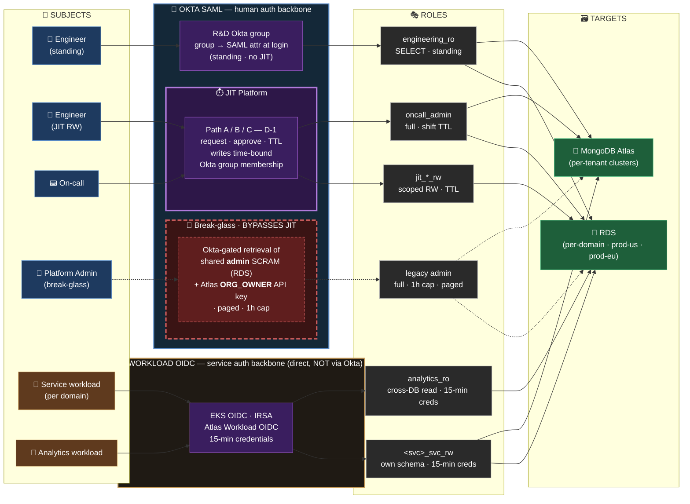

</div>
</div>

<div style="position:absolute;right:1.5rem;bottom:1.5rem;width:120px;opacity:0.95;pointer-events:none;z-index:5;"></div>

<!--
<div dir="rtl">

ה-mermaid עוקב אחר כל מסלול גישה. שני backbones לאימות, שלוש וריאציות
לבני אדם, מסלול אחד לשירותים. "R&D group → SAML attr" זה standing-RO
(אין JIT). JIT Platform מודגש — שם יושבים ה-TTL והאישור. Break-glass
גם מודגש — עוקף JIT ומפעיל page בכל שימוש.

</div>
-->

---
layout: default
transition: fade
---

## ⚖️ JIT Build vs Buy — Britive · BeyondTrust *(Entitle)* · Self-hosted

<div style="font-size: 0.72em; line-height: 1.35;">

| Perspective       | **Britive**                            | **BT** *(Entitle)*                                  | **Self-hosted** *(this deck)*       |
|-------------------|----------------------------------------|-----------------------------------------------------|-------------------------------------|
| Integrations      | PD ✓ Okta ✓ Slack ✓ AWS ✓ Atlas ✓       | PD ✓ Okta ✓ AWS ✓ Atlas ✓ · **Slack ⚠**             | PD ✓ Okta ✓ AWS ✓ Atlas ✓ · **Slack ❓** |
| UI                | Modern SaaS portal                     | Modern SaaS portal *(Entitle)*                      | None — DIY (open)                   |
| How user asks     | Slack app · Web portal · CLI           | Web portal · *(Slack = target only 🚩)*             | **Open question** — Slack / UI / PR |
| Okta integration  | **Duplicates** users + groups → Britive<br/>Britive UI = user focal point | **Reads Okta directly** — no duplication<br/>UI for configurable approver chains | **Okta = direct IdP** — no duplication<br/>Group → role in Crossplane chart |
| Maintenance       | **Changes:** UI clicks *(one-time)*<br/>**Role-change:** Britive sync interval ⚠ | **Changes:** UI workflow *(one-time)*<br/>**Role-change:** live — reads Okta | **Changes:** PR to chart *(one-time, code)*<br/>**Role-change:** PR merge → ~minutes |
| Prerequisites     | **Tool identity:** Okta + Atlas + AWS-IC admin *(Britive holds)*<br/>**Grant:** on-demand API provisioning | **Tool identity:** Okta + Atlas + AWS-IC admin *(Entitle holds)*<br/>**Grant:** on-demand API provisioning | **Tool identity: none — Okta federates directly**<br/>**Grant:** declarative — no API call at grant-time |
| Pricing           | Per-user SaaS                          | Per-user SaaS · *quote pending (300-500 users)*     | **License-free**                    |
| GTM effort        | Weeks                                  | Weeks — *trial kickoff next Wed*                    | Days–weeks *(arch ready)*           |

</div>

<div style="font-size: 0.5em; opacity: 0.65; margin-top: 0.4rem;">BT/Entitle docs verified 2026-06-11 — <a href="https://docs.beyondtrust.com/entitle/docs/entitle-integration-pagerduty">PagerDuty</a> · <a href="https://docs.beyondtrust.com/entitle/docs/okta-directory-connection">Okta IdP</a> · <a href="https://docs.beyondtrust.com/entitle/docs/entitle-integration-slack">Slack</a>. 🚩 sales rep framed Slack as "ChatOps" but docs describe Slack as a target resource only. · PD = PagerDuty.</div>

<!--
<div dir="rtl">

השוואת build-vs-buy אחרי דמואים של אתמול + אימייל summary
מ-Jonathan (BT). הבהרה חשובה: מוצר BT שדמואו אינו Password
Safe/PRA הישן — אלא **Entitle** (מוצר ה-JIT הענני שלהם, רכישה),
שדומה במודל ל-Britive (SaaS, cloud-native, integrations ענניים).

(1) **Integrations** — חמשת השמות שחשובים לנו: PagerDuty, Okta,
Slack, AWS, Atlas. **Britive**: כל החמישה native. **BT/Entitle**:
PagerDuty ✓ (משיכת on-call schedule כל 30 דק, הענקת גישה
אוטומטית — חזק!), Okta ✓ (IdP + directory source), AWS ✓,
Atlas ✓ (docs פנימיים מאמתים). **Slack** ⚠ — כאן יש פער חמור:
האימייל מציג את Slack כ-"chat ops", אבל ה-docs מבהירים שזה
**ניהול Slack כ-target resource** (channels, user-groups, workspaces),
**לא** ChatOps לבקשת הרשאות. שווה לעמת את Jonathan בטריאל.
**Self-hosted**: PagerDuty ✓ (Case C), Okta ✓, AWS ✓ (IAM IC),
Atlas ✓ (POC) — Slack פתוח.

(2) **UI** — Britive ו-Entitle שניהם portal SaaS מודרני (שינוי
מהדמיון שלי הקודם של BT כ-PAM ישן). Self-hosted אין UI היום.

(3) **How user asks for permission** — חוויית הבקשה בפועל
מצד המשתמש הסופי: **Britive** מציע **שלושה ערוצים** —
אפליקציית Slack native (request → approve → notify), web portal,
ו-CLI. **Entitle**: web portal הוא הערוץ המרכזי; ה-Slack integration
שלהם מנהל את Slack כיעד הרשאות, לא כתעלת בקשה (🚩 בשקופית —
הסוכן Jonathan כינה זאת "ChatOps" באימייל אבל ה-docs מבהירים
שזה לא ChatOps). **Self-hosted**: שאלה פתוחה — Slack bot
ייעודי, UI portal, או PR ישיר. ההכרעה הזו תיקבע לפי
ה-Usability — Human Path (שקופית 24).

**(3.5) Okta integration — איך הכלי משתמש ב-Okta כ-IdP**
(הבחנה ארכיטקטונית חדה בין שלושת הפתרונות):

- **Britive**: **משכפל** את המשתמשים והקבוצות מ-Okta אל הפלטפורמה
שלו (SCIM-based provisioning). זה אומר שיש state כפול:
ב-Okta וב-Britive. ה-Britive UI הופך ל-focal point של המשתמש
(שם הוא מבקש profiles ומקבל אישורים), אבל בדמו לא היה ברור
איך עובד ה-sync בפועל ואם משתמש יכול להחזיק profile שיעניק
הרשאות SaaS צד-שלישי on-demand. ⚠ נקודה לאמת בטריאל הבא.

- **Entitle**: **קורא ישירות מ-Okta** — לא מחזיק עותק. כשמשתמש
מבקש access, Entitle ניגש ל-Okta בזמן אמת לאמת חברות בקבוצה,
ואז משתמש בזהות ה-bot שלו כדי לבצע assume role במערכת היעד
(Atlas, AWS, וכו'). יש UI לניהול **workflow** של בקשות
ומאשרים (configurable approval chains), ויש integration
מתועד עם Slack (גם אם הוא בעיקר לניהול הרשאות בתוך Slack
ולא כ-ChatOps לבקשות — ראה הערה 🚩).

- **Self-hosted**: Okta הוא ה-IdP הישיר וה-**source of truth**
היחיד. אין שכפול, אין state כפול, אין UI ניהול נפרד.
המיפוי group → DB-role מוצהר ב-Crossplane chart (GitOps),
ובקשת approval = code review של ה-PR. כל שינוי בקבוצה
ב-Okta משפיע מיידית — אין race condition בין שתי מערכות.

ההשלכה: ה"state explosion" של מודל Britive (Okta + Britive)
מול ה"single source of truth" של Entitle ושל self-hosted —
זה מהווה שיקול drift / consistency שכדאי לבחון בטריאל.

(4) **Auth method** — שלושתם תומכים ב-Okta. Britive: SAML/OIDC + SCIM.
Entitle: Okta כ-IdP + directory source. Self-hosted: Okta OIDC/SAML
ישיר ל-Atlas + AWS-IC. אין הבדל מהותי.

(5) **Maintenance — code vs UI, ו-role-change propagation**:

חשוב להבדיל בין **שינויים חד-פעמיים** (setup ראשוני) לבין
**propagation time** של שינויי תפקידים שוטפים:

- **Britive**: שינויים נעשים ב-UI (point-and-click ב-profiles
ו-policies). זה one-time effort בעיקרון, אבל יש לזכור שכל
שינוי חי ב-state של Britive, לא ב-Okta. **Propagation:**
תלוי ב-sync interval של Britive עם Okta — אם משתמש מוסר מקבוצה
ב-Okta, ייתכן delay עד שזה משתקף ב-Britive ולא ייתן לו checkout
profile. ⚠ נקודה לבחון בטריאל.

- **Entitle**: שינויים נעשים ב-UI עם **workflow editor** מובנה
(approval chains, conditions). גם זה one-time setup. **Propagation:**
מיידי — Entitle קורא Okta בזמן בקשה, אז כל שינוי בקבוצה ב-Okta
תקף ב-request הבא.

- **Self-hosted**: שינויים נעשים **ב-code** (PR ל-Crossplane
chart). זה דורש code-review וכלי-עזר Git, אבל הוא **versioned,
auditable, reproducible**. גם one-time setup. **Propagation:**
PR merge → Crossplane reconciler מתעדכן → IdP config מתעדכן →
ה-request הבא של המשתמש כבר רואה את השינוי. כ-2-5 דקות
בפועל בהינתן reconciliation rate סטנדרטי.

**Trade-off**: UI = מהיר ל-onboarding מהיר של אדמין לא-מפתח,
אבל פחות auditable; Code = יותר מסורבל בתחילה אבל
ה-source-of-truth ב-git נותן history מלאה, blast-radius
תחום, ו-rollback פשוט.

(6) **Pricing** — Britive: per-user SaaS. Entitle: per-user SaaS,
quote pending ל-300-500 users (לפי האימייל). Self-hosted: ללא
רישיון.

(7) **GTM effort** — Britive ו-Entitle שניהם שבועות. Entitle:
trial kickoff נקבע לרביעי הבא. Self-hosted: ימים-שבועות (הארכיטקטורה
כבר פרושה).

(8) **Prerequisites — trust primitives** (השורה החשובה ביותר
ארכיטקטונית): לכל פתרון, שלוש שאלות:

**(א) Tool identity — איפה הכלי "חי" במערכות היעד?**
- Britive ו-Entitle: שניהם צריכים **שלושה bot identities**:
(1) ב-**Okta** — SCIM provisioning / Okta API token לסנכרון
משתמשים, קבוצות, ומנהלים; (2) ב-**Atlas** — Project Owner-level
API key; (3) ב-**AWS IAM Identity Center** — admin permission set
או IAM user עם sts:AssumeRole רחב. ה-SaaS מחזיק את שלושת
ה-API keys האלה, מה שהופך אותם לזהויות high-value: הם יכולים
להנפיק כל credential בענן + לשנות חברויות בקבוצות Okta.
- Self-hosted: **אין זהות של כלי במערכות היעד**. Okta הוא ה-IdP
הישיר; AWS סומך עליו דרך IAM-IC SAML, ו-Atlas סומך עליו דרך
OIDC. אין bot account לרשום, לרוטט, או להגן עליו.

**(ב) Group → DB-role mapping — איפה מגדירים אותו?**
- Britive/Entitle: בדרך כלל **ב-UI של הכלי** (יש למצב הזה
flow ייעודי לגדר מי מקבל איזה role). אופציה חלופית: לסנכרן
את ההגדרות **ממערכות צד-שלישי** (IAM-IC permission sets,
Atlas custom DB roles) — הכלי מייבא אותן ומאפשר לקשר
ל-Okta groups בתוכו.
- Self-hosted: ה-mapping מוצהר **ב-Crossplane chart** —
GitOps source of truth, כל שינוי הוא PR, היסטוריה מלאה
ב-git. אין UI ניהול נפרד; ה-templates folder הוא הזירה.

**(ג) Grant mechanism — איך בפועל המשתמש מקבל גישה?**
- Britive/Entitle: **on-demand provisioning דרך API**.
המשתמש מבקש profile/policy → הכלי משתמש בזהות שלו כדי
ליצור/לקשור federated user ב-Atlas + לקשר ל-Permission
Set ב-IAM-IC. כל grant הוא קריאת API חיה.
- Self-hosted: **declarative — ללא קריאת API בזמן ריצה**.
הקישור Okta group → role כבר קיים ב-IdP config. כשהמשתמש
מבקש, הוא פשוט מתחבר עם ID token, ו-Atlas/AWS עושים
lookup. ה-control plane נפרד מ-data path.

ההשלכה: ה-blast radius במודל SaaS מתרכז ב-API key של
הכלי. במודל self-hosted אין נקודת ריכוז כזו — ה-trust
chain ישיר.

🎯 נקודות לטריאל של Entitle (רביעי הבא):
- ללחוץ את Jonathan על Slack ChatOps — האם זה fr באמת או רק מילה?
- לאמת PagerDuty on-call → DB role flow — האם זה Atlas-native?
- pricing concrete ל-300-500 users
- האם ה-policy design באמת "Medium complexity" או יותר?

📹 Walkthrough recording (Gong, 7 דקות): https://us-17350.app.gong.io/e/c-share/?tkn=fa4n77kiee0k1u566dntrwtfc

</div>
-->

---
layout: section
transition: zoom-out
---

# 🚢 Deployment

## <span class="neon">View</span>

<div style="position:absolute;right:3rem;bottom:4rem;width:180px;opacity:0.95;pointer-events:none;z-index:5;"></div>

<!--
<div dir="rtl">

מעבר view. Deployment view = איפה האלמנטים רצים בפועל. הבא: פרספקטיבות
R&W על ה-deployment, ואז המפה הרב-אזורית.

</div>
-->

---
layout: default
transition: slide-left
---

## 🔬 Deployment View — R&W Perspectives

<CardGrid :cols="3">

<Card3D title="🛡️ Security & Resilience">

*Confinement of damage — malicious or accidental*

- **One hardened admin plane** in `platform-tools` — strictest controls
- **Trust zones don't cross regions** — US can't touch EU, EU can't touch US
- **Admin plane outage** → running services unaffected
- **Region plane outage** → only *new* provisioning paused

</Card3D>

<Card3D title="⚡ Performance">

*Latency & operational friction at runtime*

- **Region-local auth** — no cross-region SAML or DB hops
- **One Twingate session** per human · zero per-connect cost
- **15-min IAM tokens** auto-refresh · no manual rotation
- **Services skip Okta entirely** — connect-time OIDC only

</Card3D>

<Card3D title="⚖️ Regulation">

*Compliance & auditability surface*

- **`git log` is the access-change audit trail** — every grant ties to a PR
- **Data residency** — EU data in `eu-central-1`, US in `us-east-1`
- **No implicit cross-region reach** — controllers region-scoped
- **Tier 2a pinned** for SOC2 evidence · retention target D-6

</Card3D>

</CardGrid>

<div style="position:absolute;right:1.5rem;bottom:1.5rem;width:120px;opacity:0.95;pointer-events:none;z-index:5;"></div>

<!--
<div dir="rtl">

שלוש פרספקטיבות בעלי עניין על ה-deployment. SRE / on-call: איפה זה רץ,
מי מקבל page. אבטחה: גבולות אמון בין clusters (בעיקר בידוד prod-us מול
prod-eu). פלטפורמה: בעלות תפעולית על מישור המנהל מול המישורים האזוריים.

</div>
-->

---
layout: default
transition: fade
class: slide-multi-region
---

## 🚢 Multi-Region Topology

<div class="multi-region-diagram">

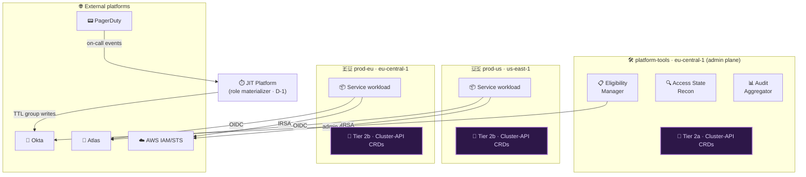

</div>

<div class="tier-explainer">

<div class="tier-card tier-2a">

**🧩 Tier 2a — baseline** *(platform-tools · cross-region)*

- **Crossplane** providers — AWS · Kubernetes
- **MongoDB Atlas Operator** — DB users · org roles
- **PagerDuty** provider — on-call schedule sync

</div>

<div class="tier-card tier-2b">

**🧩 Tier 2b — per-region** *(self-service · bounded blast radius)*

- **Crossplane** regional AWS provider (US-only / EU-only)
- **Per-service** Role + RoleBinding CRDs
- **Atlas Database** CRDs scoped to the region's cluster

</div>

</div>

> **Blast radius:** `prod-us` controllers cannot reach `prod-eu` resources · region-bounded by design.

<div style="position:absolute;right:1.5rem;bottom:1.5rem;width:120px;opacity:0.95;pointer-events:none;z-index:5;"></div>

<!--
<div dir="rtl">

מפת ה-deployment. cluster platform-tools (eu-central-1) מחזיק את מישור
המנהל — Eligibility Manager, PD-Sync, Audit Aggregator, וגם בקרי Tier
2a (בסיס מנהל חוצה-אזורים). prod-us ו-prod-eu מחזיקים בקרי Tier 2b
משלהם (self-service מוגבל-אזור). Blast radius: בקרי prod-us לא יכולים
להגיע ל-prod-eu — region-bounded בעיצוב. כל hop של אדם ל-DB עובר
דרך Twingate.

</div>
-->

---
layout: section
transition: fade
---

# 🛠️ Development

## <span class="neon">View</span>

<div style="position:absolute;right:3rem;bottom:4rem;width:180px;opacity:0.95;pointer-events:none;z-index:5;"></div>

<!--
<div dir="rtl">

מעבר view. Development view = איך ה-IaC + הבקרים מאורגנים בקוד. הבא:
פרספקטיבות R&W, ואז ההשוואה המנוקדת בין Pulumi ל-Crossplane.

</div>
-->

---
layout: default
transition: slide-left
---

## 🔬 Development View — R&W Perspectives

<CardGrid :cols="3">

<Card3D title="🔮 Evolution">

*Ability to absorb change without restructure*

- Templates folder mirrors **external systems**, not services
- Adding a 3rd DB technology = one new `templates/{tech}/` folder
- **No chart restructure** required
- Sub-chart routing is the abstraction line
- **Every new SaaS = one API key** to provision into the controller

</Card3D>

<Card3D title="🙋 Usability — Human Path">

*Developer experience for JIT access (Case B / Case C)*

- **Request channel — open question:** UI portal vs Slack bot vs raw PR?
- **Self-service JIT** — no platform-team in the hot path
- **Visible state** — where does the dev see *requested · approved · active · expired*?

</Card3D>

<Card3D title="🤖 Usability — Service Path">

*Onboarding experience for service teams (Case A)*

- `examples/*.yaml` are **runnable snippets** per use-case
- First PR copies **one file**, not the whole chart
- Teams **own their workload permissions** — no platform-team dependency (velocity win)
- **CODEOWNERS** gates access-PR review — clear ownership

</Card3D>

</CardGrid>

> 🔍 **Observability hook:** `git log` of the chart **is** the human-readable change-audit timeline · `access-matrix.md` is the queryable summary.

<div style="position:absolute;right:1.5rem;bottom:1.5rem;width:120px;opacity:0.95;pointer-events:none;z-index:5;"></div>

<!--
<div dir="rtl">

שלוש פרספקטיבות: Evolution, ו-Usability מפוצלת לשני מסלולים — Human ו-Service.
Evolution: templates ממפה מערכות upstream ולא שירותים, ולכן הוספת טכנולוגיית
DB שלישית היא תיקייה אחת חדשה, בלי restructure. Usability Human (Cases B/C):
השאלה הפתוחה היא ערוץ הבקשה — UI ייעודי, בוט Slack, או PR ישיר? סביב
זה צריך גם נראות סטטוס (requested/approved/active/expired) וזמן עד גישה
שנמדד בדקות. Usability Service (Case A): צוותי שירות לא רואים בוט ולא UI —
הם עורכים YAML מתוך examples runnable, PR ראשון בקובץ אחד, ו-CODEOWNERS
שומר על שער הביקורת. הפיצול חשוב כי חוויית-המשתמש של Case A שונה לחלוטין
מ-B ו-C, ובאיחוד אחד היא נראית סותרת. (פרספקטיבת Regulation הוסרה —
הביקורתיות מכוסה ב-Git history וב-access-matrix.md.)

</div>
-->

---
layout: default
transition: slide-left
class: slide-tools-selection
---

## 🛠️ Tools Selection — Crossplane (Tier Structure) vs Pulumi

<div class="tools-table">

| Aspect | 🟧 **Pulumi** *(existing)* | 🟦 **Crossplane** *(tier structure)* | Score *(/5)* |
|---|---|---|:---:|
| **👤 Human access** | Shared SCRAM · no JIT · no per-user audit | Okta + SAML · 4-case JIT · per-user audit | 🟧 **1** · 🟦 **5** |
| **🤖 Workload access** | Shared password stored in env/Secret · manual rotation | OIDC + IRSA · 15-min creds · no stored secret | 🟧 **1** · 🟦 **5** |
| **💾 State management** | External state file (S3) · auditable history · manual `pulumi refresh` | K8s etcd · live state · controllers heal drift automatically | 🟧 **4** · 🟦 **4** |
| **🧑‍🔧 Platform-team involvement** | **HIGH** — gatekeeps every change · centralized stack ownership | **LOW** — owns providers; service teams self-serve via CRDs | 🟧 **2** · 🟦 **5** |
| **⏱️ Effort per change** | Code change · CI run · `plan` + `apply` · stack-secret rotation | `kubectl apply` (or PR merge) · controller reconciles | 🟧 **2** · 🟦 **5** |
| **🔄 Infra ↔ code alignment** | **Two PRs** in separate repos · order-sensitive deploy · risk of drift between role + consumer | **Single PR** — Role/Binding CRD ships with the service manifest · atomic helm release | 🟧 **2** · 🟦 **5** |
| **🔐 Authority of permissions** | Stack-level — hard to delegate safely | K8s RBAC per-CRD · CODEOWNERS · narrow grants | 🟧 **2** · 🟦 **5** |
| **⚡ Performance & stability** | Run-based · cold-start each CI · drift surfaces on next plan | Continuous reconciliation · auto-heal · backoff retries | 🟧 **3** · 🟦 **5** |

</div>

<div class="tools-conclusion">

**🎯 Conclusion** — Total: 🟧 **Pulumi 17 / 40** · 🟦 **Crossplane 39 / 40**

- **State management** is the only tie — Pulumi's explicit history vs Crossplane's live etcd
- **🟧 Tier 1 bootstrap** stays with Pulumi — VPCs · AWS accounts · EKS · pre-cluster
- **🟦 Tier 2a onward** goes to Crossplane — continuous reconciliation, per-team self-service, narrow per-CRD grants
- **Net effect** — platform-team bottleneck removed · cross-repo coordination eliminated · per-team velocity multiplied

</div>

<div style="position:absolute;right:1.5rem;bottom:1.5rem;width:120px;opacity:0.95;pointer-events:none;z-index:5;"></div>

<!--
<div dir="rtl">

ההשוואה המנוקדת — Pulumi 17/40, Crossplane 39/40. השוויון היחיד הוא
ב-State management (היסטוריה מפורשת של Pulumi מול etcd חי של Crossplane).
שורה קריטית: Infra↔code alignment — Pulumi צריך שני PRs במאגרים נפרדים
ופריסה תלוית-סדר; Crossplane שולח role + binding CRD אטומית עם helm
release של השירות. Pulumi נשאר ל-Tier 1 (VPCs, EKS, חשבונות AWS);
Crossplane בבעלות מ-Tier 2 והלאה.

</div>
-->

---
layout: default
transition: fade-out
---

## 📁 `sentra-db-permissions` — Chart Tree

<GlassCard>

- **Umbrella chart** · `Chart.yaml` + pinned sub-charts (crossplane 1.18 · atlas-operator 2.5)
- **`templates/`** · 6 folders, one per target system (crossplane · iam-ic · mongodb · rds · okta · observe)
- **`values/`** · environment overlays (`staging.yaml`, `prod.yaml`) + `access-matrix.md`
- **`examples/`** · runnable onboarding snippets per use-case

</GlassCard>

> **One chart, six target-system folders, one access-matrix.** The whole platform fits in one Helm release per cluster.

<div style="position:absolute;right:1.5rem;bottom:1.5rem;width:120px;opacity:0.95;pointer-events:none;z-index:5;"></div>

<!--
<div dir="rtl">

helm chart מעטפת אחד, sub-charts מקובעים (Crossplane 1.18, Atlas Operator
2.5). שש תיקיות templates/, אחת לכל מערכת יעד — crossplane, iam-ic,
mongodb, rds, okta, observe. צוותי שירות תורמים דרך PR;
access-matrix.md הוא צומת הביקורת הקריא לאדם שמחבר את הכל.

</div>
-->

---
layout: default
transition: fade
---

## 🛠️ Controller Plane — Backends Behind `db-permissions`

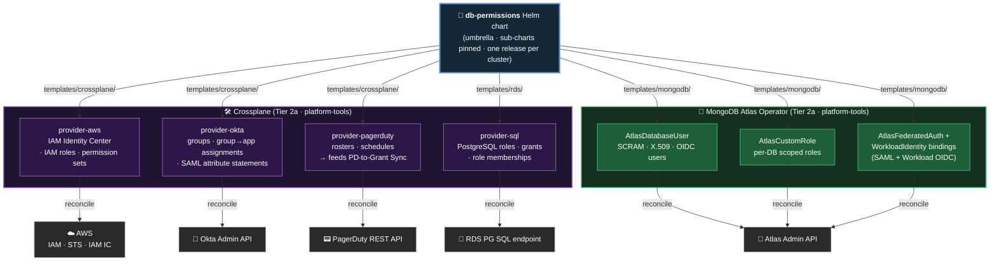

> **One Helm chart, two reconciliation backends.** **Crossplane** owns everything that lands in AWS / Okta / PagerDuty / PostgreSQL (4 providers, 4 upstream APIs). **MongoDB Atlas Operator** owns everything that lands in Atlas (3 CRDs, 1 upstream API). The chart routes each `templates/{system}/` folder to its matching backend — *one PR adds a role across all five upstream systems consistently*.

<div style="position:absolute;right:1.5rem;bottom:1.5rem;width:120px;opacity:0.95;pointer-events:none;z-index:5;"></div>

<!--
<div dir="rtl">

chart helm אחד, שני backends להתיישבות. Crossplane מטפל ב-AWS / Okta /
PagerDuty / PostgreSQL (4 providers, 4 APIs upstream). MongoDB Atlas
Operator מטפל ב-Atlas (3 CRDs, API upstream אחד). ה-chart מנתב כל תיקיית
templates/{system}/ ל-backend המתאים — PR אחד מוסיף role לרוחב כל 5
מערכות ה-upstream באופן עקבי.

</div>
-->

---
layout: default
transition: fade
class: slide-observability-fit
---

## 🔍 Observability — Closing the G-4 Attribution Gap

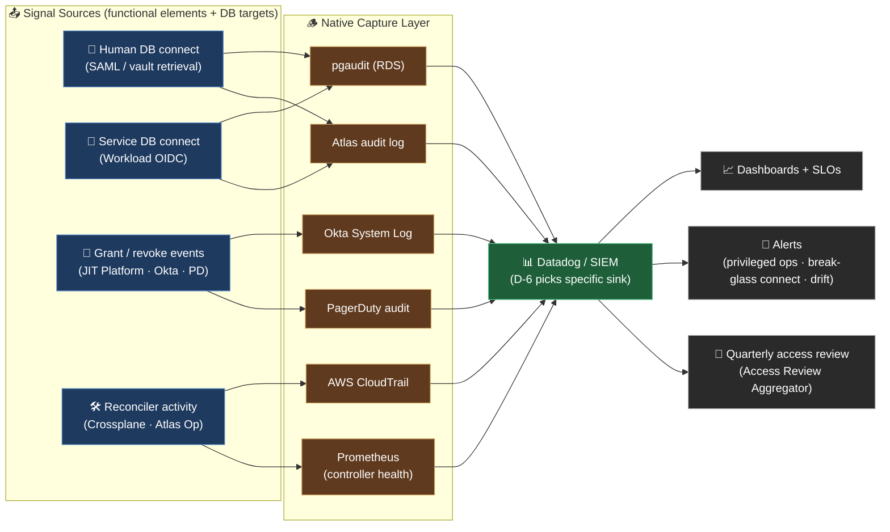

> **Closes G-4 (today's question: *"who was `pasha_boss` at 03:17?"* — unanswerable).** Every connection now carries the federated identity that authorized it · pgaudit + Atlas audit record the principal · SIEM correlates across the full chain. **Open: D-6 picks the sink (Datadog vs alternative SIEM) + retention period.**

**SLOs — three axes, one table:**

| Signal | SLO target | Why it matters |
|---|---|---|
| **JIT grant latency** (request → SAML attribute live) | **< 60s P95** | On-call usability — Case C automatic grant must beat the page |
| **Audit egress lag** (DB connect → in SIEM) | **< 5 min P99** | Forensics + alerting need near-real-time |
| **Drift reconcile cadence** (Git vs reality) | **every 5 min** | Detect out-of-band grants before they age |
| **Break-glass connect → `#sec-ops` page** | **< 30s** | If `admin` SCRAM is in use, security must know now |
| **Identity attribution coverage** | **100%** of DB connects | Closes G-4 — no `pasha_boss` mystery left |
| **Audit retention** | **18 months** (target) | SOC2 minimum + intra-year incident lookback |

<div style="position:absolute;right:1.5rem;bottom:1.5rem;width:120px;opacity:0.95;pointer-events:none;z-index:5;"></div>

<!--
<div dir="rtl">

G-4 זה פער ייחוס הביקורת — רגע ה-"pasha_boss ב-03:17" שלא ניתן לענות
עליו היום. Audit Event הוא הנושא; invariant של append-only. יעד שמירה
של 18 חודשים (מינימום SOC 2 + lookback לתקריות תוך-שנתיות). יעד כיסוי:
100% מחיבורי ה-DB ניתנים לייחוס זהותי. פעילות reconciler (Crossplane +
Atlas Op) מוזרמת לאותו צינור ביקורת.

</div>
-->

---
layout: section
transition: slide-up
---

# 📑 Decisions

## <span class="neon">& What's Open</span>

<div style="position:absolute;right:3rem;bottom:4rem;width:180px;opacity:0.95;pointer-events:none;z-index:5;"></div>

<!--
<div dir="rtl">

חלק סיום. החלטות = מה נעול ומה עוד פתוח. השקף הבא הוא תקציר ה-takeaway.

</div>
-->

---
layout: default
transition: zoom-out
class: slide-dense
---

## 📑 Decisions — Locked + Open

<CardGrid :cols="3">

<Card3D title="🎯 Locked">

**Group → Role** — Okta group → scoped IAM + Atlas roles · *rejected:* per-user grants

**Break-Glass** — `admin` + `ORG_OWNER` → 2–3 humans · 1h cap · *rejected:* status quo

**Okta + JIT = SoT** — standing via Okta · time-bound via JIT · *rejected:* DB-as-truth

</Card3D>

<Card3D title="🔮 D-1 — JIT Path">

**🅰️ Path A** — Okta API build · Lambda + GHA + Slack · needs Lifecycle Mgmt uplift

**🅲 Path C** — Self-managed OIDC broker · Keycloak / Dex · sidesteps Okta uplift

**🅱️ Path B** — Vendor (Britive / BeyondTrust / Snyk) · SOC2 · 4 integrations required

</Card3D>

<Card3D title="🛠️ D-2 — IaC Tool">

**Scope 1** — `db-permission-module` · Pulumi (typed) vs Crossplane (drift)

**Scope 2** — Workload bindings · Pulumi (per-team) vs Crossplane (K8s-native)

**Sub-Q** — Workload-auth migration timing *(ADR-003 locked OIDC; pace open)*

</Card3D>

</CardGrid>

<div style="position:absolute;right:1.5rem;bottom:1.5rem;width:120px;opacity:0.95;pointer-events:none;z-index:5;"></div>

<!--
<div dir="rtl">

שלוש עמודות. נעול — Group→Role (group של Okta → roles מוגבלים ב-IAM
ובאטלס, לא per-user) · Break-Glass (admin + ORG_OWNER → 2–3 אנשים,
תקרה של שעה) · Okta+JIT = SoT (standing דרך Okta, מוגבל-זמן דרך JIT,
לא DB-as-truth). פתוח — D-1 JIT Path (A בנייה מותאמת מעל Okta · B ספק
כמו Britive · C היברידי) — לבחור ב-ADR review הבא. D-2 Vendor — נכנס
לפעולה רק אם D-1 → Path B. IaC *לא* פתוח — ADR-008 נועל את מבנה השכבות
של Pulumi + Crossplane.

</div>
-->

---
layout: cover
transition: fade
background: /thanks-hero.jpg
class: thanks-slide
---

# Thank You
## Questions?

**Oren Sultan** · Senior DevOps & Platform Engineer · Tikal
[app.sultano.blog](https://app.sultano.blog) · [linkedin.com/in/oren-sultan-0527bab6](https://www.linkedin.com/in/oren-sultan-0527bab6/) · [github.com/orenoren1](https://github.com/orenoren1)

<!--
<div dir="rtl">

סיכום. שלוש בקשות מהקהל: פידבק על מודל ארבעת המקרים (הליבה הרעיונית),
העדפה ל-Path A / B / C עבור D-1 (ההחלטה הפתוחה), וכל תרחיש blast-radius
שפספסתי בניתוח אזורי האמון. פרטי קשר על המסך — Slack, LinkedIn, GitHub.

</div>
-->
