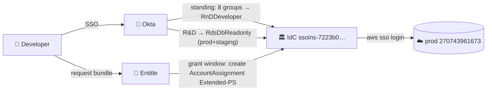

# Least-Privilege Access
# Deep Dive — As Implemented

**Oren Sultan** | Senior DevOps & Platform Engineer | Tikal | Platform Team · 2026

<FloatingIcon icon="🔐" />

<!--
This is the operator-level deck for the least-privilege solution — for the platform team that owns and maintains it, not for a leadership overview. Every slide is drawn from the live Pulumi program in sentra-infrastructure/least_privileges/__init__.py and the Pulumi.least-privileges.yaml stack config, current as of July 19. Structure: the system map, then each layer in detail — Okta groups, IAM Identity Center permission sets with their exact policy statements, Entitle bundles and workflows with their exact rules, the three auth chains, and the migration state plus operational gotchas. Everything named here is greppable in the repo.
-->

---
layout: default
transition: fade-out
---

## 🗺️ System Map

<GlassCard>

- **One Pulumi program** owns the whole control plane: `sentra-infrastructure/least_privileges/__init__.py`
- **Stack:** `sentraio/infra/least-privileges` · providers: entitle · aws ssoadmin · okta · mongodbatlas
- **Apply gate:** `LEAST_PRIVILEGES_APPLY_ENABLED` · every resource `protect=True`
- **Resource classes:** 5 Entitle integrations · 7 workflows · 6 bundles · 15 IdC PSes · Okta OAuth wiring · 9 Atlas role mappings
- **In flight:** module ships on PR **#3912** (pending merge) · Okta apps split to `okta_administration` on PR **#3917**

</GlassCard>

<!--
Orientation slide — where everything lives. The program declares five Entitle integrations (aws-sentra, mongodb-atlas-console, mongodb-temp-dbuser-prod, mongodb-temp-dbuser-prod-eu, okta), seven workflows (five per-team approvals, break-glass, data-ro auto-approve), six bundles (five team bundles plus prod-data-read-only), all fifteen Identity Center permission sets with inline policies, the OAuth service-app wiring that gives Entitle its Okta powers, and the Atlas federation config with nine org role mappings. The Entitle SSO SAML app itself moved to the okta_administration module on the platform-tools stack (PR #3917) — this stack no longer owns it. The pulumi-entitle provider SDK is consumed version-pinned from CodeArtifact, no longer vendored in-repo. Config values that change per environment or during testing — team roster, approver groups, break-glass groups, bundle durations — live in the stack YAML, not in code. Entitle lookups are name-based at runtime (group_id/user_id/role_id helpers), which is why Okta group names must stay unique — that's what forced the Product group rename.
-->

---
layout: default
transition: slide-left
---

## 👥 Groups — Full Inventory

| Group | Function in the system |
|---|---|
| `R&D-Application` · `R&D-Scout` · `Product` · `SE` · `cs` | Team identity: standing `RnDDeveloper` on prod + gates own `rnd-extended-*` bundle (5 teams) |
| `R&D-Platform` | Standing `RnDDeveloper` · **no team bundle** — write path is break-glass · notify target |
| `DevOps` · `DevOpsFreelancers` | Standing `RnDDeveloper`; break-glass auto-approve when on-call; *(temp)* extra requesters on all team bundles |
| `R&D` (umbrella) | Standing `RdsDbReadonly` on prod + staging · Atlas: staging RW, prod/prod-eu RO |
| `rnd-tlms` | **Shared** approver for all 6 team bundles (any member approves any team) |
| `Platform Team` | Break-glass approver + on-call auto-approve · integration maintainer |
| `SuperAdmins` | Break-glass auto-approve, no on-call needed, up to 7d · Atlas RW everywhere |
| `Entitle-DB-Approvers` | Designated approvers for highest-tier bundle — keep small |
| `R&D-Product` | Renamed from duplicate "Product" (2026-07-15) to fix Entitle name lookups |

<!--
All groups are Okta, all identity-only. Eight groups carry the standing RnDDeveloper account assignment on production (270743961673); five of them are also the in_groups filter on their own bundle workflow. R&D-Platform is the deliberate exception — the team that owns this solution has no team bundle; its prod write path is break-glass, where Platform Team membership plus an on-call schedule auto-approves. Note the rnd-tlms asymmetry: workflows are per-team on the requester side but the approver list is one shared group holding every team's lead — any single member can approve any team's request; own-lead-approves is convention, not enforcement. DevOps and DevOpsFreelancers currently also appear as extraRequesterGroups on all five team workflows — that is a marked-temporary e2e testing key in the stack YAML, to be deleted. The R&D-Product rename exists because Okta had two groups literally named Product and Entitle's name-based search requires exactly one match — the 2021 manual group was renamed, keeping its ID so app assignments survived. Entitle-DB-Approvers is deliberately tiny; its description in code says do NOT expand to broad populations.
-->

---
layout: default
transition: fade-out
---

## 🟢 Base PS — `RnDDeveloper`, Statement by Statement

| Sid | Grant |
|---|---|
| *(managed)* `ReadOnlyAccess` | Broad AWS reads, account-wide |
| `DiscoverRds` + `ConnectAsReadonly` | `rds:Describe*` + `rds-db:connect` as `db_readonly_*` dbusers only |
| `SecretsRead` | `secretsmanager:GetSecretValue` on prod/app paths |
| `KMSMinimal` | `kms:Decrypt` + `DescribeKey` |
| `AssumeSentraRoleCrossAccount` | `sts:AssumeRole` → `SentraRole*` only |
| `CodeArtifactRead` · `EcrPullAuth` | Package pulls + ECR auth token |
| **Deny** ×4 | `DenyBucketAdmin` · `DenySecretsModification` · `DenyPlatformSecrets` · `DenySensitiveS3` |

> Standing for all 8 groups on prod. No Entitle request needed. Zero write paths.

<!--
The one permission set everyone holds. Reads come from the AWS managed ReadOnlyAccess policy; the inline policy adds the safe steady-state extras and then locks the floor with four explicit denies. DenyPlatformSecrets blacklists the platform/infra secret families — platform*, rds*, crossplane*, datadog*, looker, observability, internet-facing and sentra internal paths — so even GetSecretValue inside the allowed statement can't touch them. DenySecretsModification blocks all secret writes regardless of path; DenyBucketAdmin blocks bucket-level admin (CreateBucket, DeleteBucket, PutBucketPolicy, PutBucketAcl, public-access-block changes); DenySensitiveS3 blocks the customer-data prefixes that S3-CustomersRO exists to grant deliberately. RDS connect is scoped to the db_readonly_* IAM-auth dbusers on both prod and staging account ARNs — remember rds-db:connect on a specific dbuser ARN is what actually grants login; Describe alone does nothing.
-->

---
layout: default
transition: slide-left
---

## 🟡 Extended PSes — Per-Team Write Surface

| Team PS | Beyond the common core* |
|---|---|
| `…Extended-Application` | CloudShell sessions · SQS create |
| `…Extended-Platform` | Glue table/partition writes · EMR-Serverless job runs · LakeFormation grant · EC2 tags — **PS exists, no bundle attaches it** |
| `…Extended-Scout` | EMR-Serverless lifecycle + Studio · `iam:PutRolePolicy` · CloudFront update · CodeArtifact writes · EC2 networking · CW dashboards · SQS · SSM command |
| `…Extended-CS` | **Widest:** EC2 lifecycle + instance-connect · ECR upload · CodeArtifact publish · IAM elevated · AutoScaling · Lambda AddPermission · SQS · SSM sessions — trim tracked in **#73617** |
| `…Extended-Product` | Glue table CRUD · S3 bucket create (lightest) |
| `…Extended-SE` | S3 bucket create only |

> *Common core (all 6): `AthenaWrites` · S3 object writes · `SecretsProdRW` + `DenyPlatformSecrets` + `DenySecretsForceDelete` · session `PT4H` · zero standing assignments

<!--
Each Extended PS is ReadOnlyAccess plus an inline policy derived from three months of CloudTrail action attribution via Athena — these are the writes each team actually exercised, not guesses. The common core across all six: Athena query writes, S3 object Put/Delete on team paths, and SecretsProdRW — create/put/tag/restore on prod/* and app secret paths with the platform families denied and ForceDeleteWithoutRecovery denied for everyone, so nobody can permanently destroy a secret even during a JIT window. CS is the deliberate outlier: its surface reflects observed usage by a group whose identity is still being clarified, and Shortcut #73617 tracks splitting it into safe/elevated variants. Extended-Platform is the other special case: the permission set exists with its CloudTrail-derived surface, but since Platform left the teams config no bundle attaches it — it's dormant until either a Platform bundle returns or it gets removed; a full-SSM-access addition to it was reverted. No Extended PS has any account assignment in code — the assignment API call is made by Entitle at grant time and reversed at expiry; that absence of standing assignments IS the JIT mechanism. Session duration PT4H means a console session opened from the grant outlives short tasks but the grant itself caps at six hours.
-->

---
layout: default
transition: slide-left
---

## 🔵 Data & Utility PSes

| PS | Surface |
|---|---|
| `AthenaAnalyst-RO` | Athena read + Glue metadata + results-bucket read + data-lake read |
| `AthenaAnalyst-RW` | + run/create queries, prepared statements, results write |
| `S3-RO` | All-bucket read **minus** sensitive prefixes (explicit deny) |
| `S3-RW` | Ops read-write: Put/Delete/multipart on ops buckets |
| `S3-CustomersRO` | The inverse of S3-RO's deny: read **into** customer-data prefixes |
| `RdsDbReadonly` | `rds-db:connect` as `db_readonly_*` dbusers (prod + staging) |
| `RdsDbMigration` / `RdsDbBreakglass` | `rds-db:connect` as migration / breakglass dbusers |

<!--
These are building blocks — composed into bundles, not requested individually. The S3 pair is complementary by design: S3-RO grants broad read with the customer-data prefixes denied, S3-CustomersRO grants exactly those prefixes; holding both gives full read, and the deny in the base RnDDeveloper PS (DenySensitiveS3) is what makes customer data invisible to someone with only standing access. The three RdsDb PSes differ only in which IAM-auth dbuser they may connect as — readonly for humans day-to-day, migration for schema deploys, breakglass for incidents; the PG-side privileges live on the dbuser role, the PS only controls who may authenticate as it. AthenaAnalyst-RO/RW mirror the same pattern for the data lake: RO is in the prod-data-read-only bundle for analysts, RW exists for JIT composition when someone needs to run heavy queries.
-->

---
layout: default
transition: zoom-out
---

## 📦 Bundle Anatomy — `rnd-extended-<team>` ×5

| Field | Value |
|---|---|
| Teams | Application · Scout · Product · SE · CS — **no Platform bundle** |
| Roles (4) | `RnDDeveloperExtended-<team>` on prod · `S3-CustomersRO` on prod · Atlas `Read Write Any Database` via **temp DB user** on **prod** + **prod-eu-central-1** |
| Durations | 1h / 3h / 6h |
| Requesters | `in_groups` = team's Okta group *(+ temp: DevOps, DevOpsFreelancers)* |
| Approver | `rnd-tlms` (shared, `operator: or` — one approval suffices) |
| Notify | `R&D-Platform` |
| Tags | `rnd-data-admin` · `team-<team>` · `secrets-rw` · `customer-secrets` |

> Mongo path after grant *(changed 2026-07-20)*: Entitle provisions a **temporary Atlas DB user** with `readWriteAnyDatabase` — connect with **mongosh / Compass** using Entitle-issued credentials.

<!--
One bundle per team, identical shape, differing only in which Extended PS it attaches and which group may request. The four roles cover the three things a developer doing prod work actually needs: their team's AWS write surface, read into customer S3 data, and write access to customer data in Mongo on both regions. The Mongo mechanism changed on July 20 (commit 4ed72b87, pending merge/apply on PR #3912): previously the bundle granted the console-only Project Data Access Admin role through the mongodb-atlas-console adapter; now it routes through the mongodb-temp-dbuser integrations — Entitle mints a temporary Atlas database user with readWriteAnyDatabase and hands the developer real credentials, so mongosh and Compass work for the grant window and the user is destroyed at expiry. Config keys changed with it: atlasProdResource/atlasProdEuResource plus sharedRoles.atlasRwRole replaced the old atlasAdminRole. Auto-reject outside the team group happens at the workflow level, so a Scout engineer literally cannot submit a request for the Application bundle. Tags drive Entitle reporting — secrets-rw and customer-secrets make these grants show up in access reviews.
-->

---
layout: default
transition: slide-left
---

## 🔍 The Other Two Request Paths

**`prod-data-read-only` bundle** — analysts & freelancers

| Field | Value |
|---|---|
| Roles (6) | `AthenaAnalyst-RO` · `S3-RO` · `S3-CustomersRO` · `ScoutFreelanceAccess` (AWS) + Atlas `Project Read Only` on prod + prod-eu |
| Workflow | `data-ro-auto-approved` — **no approver**, no group filter |
| Durations | 1h / 3h / 6h / 24h / **7d** |

**`mongodb-temp-dbuser-{prod,prod-eu}` integrations** — the team-bundle Mongo engine

- `allow_creating_accounts=True` — Entitle creates a **temporary Atlas DB user**, deletes on expiry
- Since 2026-07-20: **every `rnd-extended-*` grant routes through these** (`readWriteAnyDatabase`)
- Backed by per-project `ProjectApiKey` with `GROUP_OWNER` on its own project only
- `mongodb-atlas-console` adapter remains for **console** roles (`Project Read Only` in data bundle)

<!--
prod-data-read-only is the low-friction path: everything in it is read-only, so it auto-approves for anyone in Entitle with durations up to a week — this is what analysts and freelancers use instead of asking the platform team. Its Atlas roles are console roles (Project Read Only) granted through the mongodb-atlas-console adapter — read access stays UI-only. Role order in the bundle must match the Entitle API's order or the provider sees perpetual drift — that bit us during import. The temp-dbuser integrations were originally the emergency escape hatch; as of July 20 they are the standard Mongo mechanism for all five team bundles: Entitle mints a temporary Atlas database user with readWriteAnyDatabase via the project API key and destroys it at expiry — no standing DB users are ever created, and the developer gets a real mongosh/Compass-capable credential for the window. Each integration's key is scoped GROUP_OWNER on its own project only, so the prod key cannot touch prod-eu and vice versa. All integrations point at the break-glass workflow as a placeholder in code — the field is ignore_changes'd.
-->

---
layout: default
transition: fade-out
---

## 🚨 Break-Glass — `Break-glass - admin access`

Three rules, evaluated in order — first match wins:

| # | Who (`in_groups`) | Condition | Approval | Cap |
|---|---|---|---|---|
| 1 | `DevOps` · `DevOpsFreelancers` · `pagerduty-users` · `Platform Team` | **On a PagerDuty schedule** (`any_schedule`) | Automatic | 7d |
| 2 | `SuperAdmins` | None — no schedule required | Automatic | 7d |
| 3 | `DevOpsFreelancers` · `Product` · `R&D-Application` · `R&D-Scout` · `R&D-Platform` · `SE` · `cs` | — | `Platform Team` human | 6h |

Every rule notifies `R&D-Platform`. Also serves as the placeholder `workflow` for all 5 integrations.

<!--
The break-glass workflow is the only path to admin-tier access and it is deliberately rule-ordered. Rule 1 encodes "on-call gets in immediately": membership in an ops group AND presence on any PagerDuty schedule auto-approves up to seven days — the schedule check is Entitle-native via the PagerDuty integration, nobody maintains a cron. Rule 2 is the SuperAdmins bypass — automatic with no schedule requirement, also seven days; this is the smallest possible standing-trust population. Rule 3 is everyone else who can request at all: a human from Platform Team must approve and the grant caps at six hours. Beyond being a real workflow, it doubles as the placeholder workflow field on all five integrations — that field is ignore_changes'd in code because Entitle's API only accepts workflow assignment via PUT, one of the provider quirks on the gotchas slide.
-->

---
layout: default
transition: fade
---

## 🔗 Auth Chain 1 — AWS

> JIT = a **temporary IdC account assignment**. Expiry deletes it; next `aws sso login` simply lacks the role.

<!--
The AWS chain in operational terms. Standing: the eight groups' account assignments to RnDDeveloper and the R&D umbrella's to RdsDbReadonly are permanent IdC resources declared in Pulumi. JIT: when rnd-tlms approves a bundle request, Entitle calls the IdC API and creates an account assignment binding the requester to the team's Extended PS on the prod account; at expiry it deletes that assignment. Nothing else changes — no group edits, no policy edits — which is why the Extended PSes must never have assignments in code: Pulumi would fight Entitle over them. Developer experience: aws sso login, and the extended role appears in the account/role picker during the window and disappears after. Note allow_changing_account_permissions=True on the aws-sentra integration is what permits Entitle to manage assignments on PSes it didn't create.
-->

---
layout: default
transition: fade
---

## 🔗 Auth Chain 2 — Atlas Console (SAML Federation)

Org `63774b06…` · federation `65b7fe64…` · IdP `0oanen7nr9RhwRVzt297` · domain-restricted to `sentra.io` · post-auth grant `ORG_MEMBER`

| Okta group | staging | prod | prod-eu | org roles |
|---|---|---|---|---|
| `R&D` + 4 sub-teams + `R&D-Data` | **RW** | RO | RO | MEMBER |
| `SuperAdmins` | **RW** | **RW** | **RW** | MEMBER |
| `DevOps` · `Production` | **RW** | RO | RO | **OWNER** + billing + group-creator |
| `DevOpsFreelancers` | — | — | — | **OWNER** + billing |

**JIT on top:** `rnd-extended-*` bundle → Entitle mints a **temp DB user** (`readWriteAnyDatabase`, prod + prod-eu) → mongosh / Compass for the window.

<!--
Standing human Mongo access is console-only through the Atlas-Okta SAML federation — Workforce OIDC was removed July 14; RW/RO here are the GROUP_DATA_ACCESS roles, i.e. Browse Collections in the UI. The standing posture encodes the same two-tier idea as AWS: every R&D group gets read-write on staging but read-only on both prod projects. Prod write is JIT-only, and since July 20 it is a real database credential: the bundle grant makes Entitle provision a temporary Atlas DB user with readWriteAnyDatabase on both prod projects, usable from mongosh or Compass, destroyed at expiry — so the console federation covers standing browse access while the temp-dbuser path covers JIT write. DevOps and Production groups hold ORG_OWNER — that is Atlas org administration (settings, projects, billing), deliberately separate from data-plane write which they do NOT hold standing on prod. Domain restriction plus the sentra.io allow-list means no external identities can federate in, and post_auth_role_grants ORG_MEMBER means any sentra.io login lands as a plain member with no project access until a mapping applies. All nine role mappings are Pulumi resources — changing a team's standing Atlas posture is a one-line PR.
-->

---
layout: default
transition: fade-out
---

## 🔗 Auth Chain 3 — Entitle Plumbing

- **SSO in:** Okta SAML app `Entitle - SSO` (preconfigured `sentrasec_entitlesso_2`) → ACS `login.beyondtrust.io/saml2/25de9e87…` · attrs `email`/`firstName`/`lastName` — **moved to `okta_administration` module** (platform-tools stack, PR #3917)
- **Entitle → Okta:** OAuth service app `0oa14np1mvsrMiqZ3698` — scopes `okta.{apps,groups}.manage/read` + `okta.users.read`; admin roles `SUPER_ADMIN` + `GROUP_MEMBERSHIP_ADMIN` + `READ_ONLY_ADMIN`
- **Entitle → Atlas:** 2 `ProjectApiKey`s, each `GROUP_OWNER` on its own project only
- **Entitle → AWS/IdC:** `aws-sentra` integration, `allow_changing_account_permissions=True`
- ⚠️ The OAuth **app itself** is *not* IaC-managed — updates need `okta.policies.*` scopes the provider app lacks (403). Scopes + role assignments **are** managed.

<!--
The wiring that makes Entitle work, and the part most likely to page this team. Humans reach Entitle through the SAML app — attribute statements carry email, first and last name, and the subject is the Okta username; if the SAML handshake breaks, the known-good config is entirely in Pulumi so diff against reality first. Ownership note: the SAML app and its group assignments were imported into the okta_administration module on the platform-tools stack and state-deleted from least-privileges (July 19) — the Okta app itself is unchanged, but PRs against it now go to okta_administration. What least-privileges still owns on the Okta side: the two groups (Entitle-DB-Approvers, R&D-Product), the OAuth app's scope grants and admin-role assignments, and the UserAdminRoles resource. Entitle's own power comes from the OAuth service app: group-membership admin is how it adds people to Okta groups on grant, and the scopes list is exactly five — read users, read-manage apps and groups. The app resource itself is intentionally excluded from IaC: updating an OAuth app requires okta.policies read-manage which our provider's Crossplane OAuth app doesn't hold, so every update attempt 403s — same exclusion the Terraform module had; only its scope grants and role assignments are declared. One live gotcha worth knowing: Entitle downcases emails on SCIM ingest while its Slack bot does a case-sensitive match — anyone with mixed-case email in Slack gets an empty request modal; ticket open with BeyondTrust, nothing actionable on our side.
-->

---
layout: default
transition: slide-left
---

## 🚚 Migration State

| What | Status |
|---|---|
| Import TF → Pulumi | **88 resources, zero-diff** verified · ALL TF deleted in sentra-least-privileges#38 |
| Move in-repo | Code on **PR #3912** (`least_privileges/` + CI paths) — **open, pending merge** |
| Okta apps split | `Entitle - SSO` + platform-tool OIDC app → `okta_administration`, **PR #3917 open** |
| Atlas RW temp-dbuser switch | Commit `4ed72b87` on #3912 — **pending merge + apply** |
| Provider SDK | `pulumi-entitle` version-pinned from **CodeArtifact** (vendored copy dropped) |
| Secrets-scoping inline policies | ⚠️ **TF still active writer** until **sc-73920** — hands off in Pulumi |
| `RnDMember` PS · CS trim · e2e temp keys | Still assigned to `R&D` umbrella · **#73617** · delete `teamApproverUsers`/`extraRequesterGroups` after testing |

<!--
Where the migration actually stands, item by item. The import was done resource-by-resource with a zero-diff plan gate, so Pulumi state is an exact mirror — any diff you see now is real drift, not import noise. The module and its CI deployment paths ride PR #3912, which is still open — until it merges to develop, applies run from the branch, and the Atlas temp-dbuser bundle change (4ed72b87) is code-ahead-of-Entitle: the live bundles still grant the console role until that lands. The Okta administration split (PR #3917) moved the Entitle SSO SAML app and the new platform-tool OIDC app to their own module on the platform-tools stack — imported there, state-deleted from least-privileges, zero changes to the live Okta apps. The ownership seams to respect: the secrets-scoping inline policies on the PSes are still written by the old sentra-least-privileges Terraform until sc-73920 lands, so a Pulumi apply that touches them would create a two-writer fight. RnDMember, the old broad permission set, is still live on the R&D umbrella group; removing it is the last milestone of the two-tier model and should be treated as a comms event, not just a PR. The temp e2e keys put oren.sultan as approver and DevOps groups as extra requesters on all five team workflows — deleting both keys reverts to the clean per-team posture.
-->

---
layout: default
transition: fade-out
---

## ⚠️ Ops Gotchas — Learned the Hard Way

- **`connectionJson` is `ignore_changes`** on all 5 integrations — credentials live in Entitle, never in state
- **Integration `workflow` field** — API accepts assignment only via PUT; field is `ignore_changes`'d, set it in the Entitle UI/API
- **Bundle `roles` order must match API order** — else perpetual drift on every plan
- **Bundle `name` is ForceNew** — rename = destroy + recreate; clarity goes in description/tags instead
- **Entitle lookups are name-based** — duplicate Okta group names break `plan` (hence the Product→R&D-Product rename)
- **Okta `0oa…` client IDs are case-sensitive** — copy from URL bar, never from screenshots
- **Extended PSes must have zero assignments in code** — Pulumi would fight Entitle's JIT grants
- **Entitle email-case bug** — SCIM downcases, Slack bot matches case-sensitively → empty modal; BT ticket, no local fix

<!--
The institutional knowledge slide — each line has an incident or a wasted afternoon behind it. connectionJson: the provider would otherwise try to null the integration credentials on every apply. The workflow field on integrations can't be set at create time through the provider — assignment goes through a separate PUT, so we ignore_changes it and manage it out-of-band. Bundle role order: Entitle returns roles in its own order and the provider does list comparison, so declare them in API order or every plan shows a diff. Name-based lookups are the price of avoiding hardcoded UUIDs everywhere — the group_id/user_id/role_id helpers fail loudly on zero or multiple matches, which is the desired behavior: fix the name collision, don't work around it. The email-case bug is the one that generates user tickets — someone says the Entitle Slack bot shows them nothing while the web app works; that's the downcased-SCIM-email versus case-sensitive-Slack-match bug, known at BeyondTrust, nothing to fix on our side. Okta web SSO itself is unaffected because SAML matching is case-insensitive.
-->

---
layout: end
transition: fade
---

# Thank You
## Questions?

**Oren Sultan** · app.sultano.blog · linkedin.com/in/oren-sultan-0527bab6
