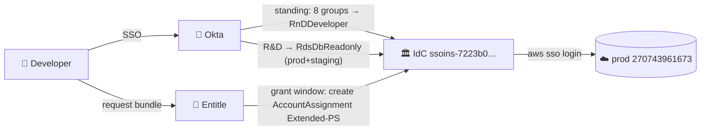

<!-- NOTE: this deck intentionally exceeds the standard density caps — it is an
     operator-level deep dive for the platform team that owns the solution.
     Detail slides use `.dense` tables; slides.md is the rendered source of truth. -->

<!-- SLIDE: title icon=🔐 -->
# Least-Privilege Access
# Deep Dive — As Implemented
**Oren Sultan** | Senior DevOps & Platform Engineer | Tikal | Platform Team · 2026

<!-- SLIDE: bullets title="🗺️ System Map" -->
## 🗺️ System Map
- One Pulumi program: `sentra-infrastructure/least_privileges/__init__.py`
- Stack `sentraio/infra/least-privileges` · config `Pulumi.least-privileges.yaml`
- Providers: entitle · aws ssoadmin · okta · mongodbatlas
- Apply gate `LEAST_PRIVILEGES_APPLY_ENABLED` · all `protect=True`
- 5 integrations · 8 workflows · 7 bundles · 15 PSes · 9 Atlas mappings

<!-- SLIDE: table title="👥 Groups — Full Inventory" -->
(see slides.md — full group table: 8 requester groups, rnd-tlms shared approver,
Platform Team, SuperAdmins, Entitle-DB-Approvers, R&D umbrella, R&D-Product rename)

<!-- SLIDE: table title="🟢 Base PS — RnDDeveloper" -->
(see slides.md — Sid-by-Sid table: ReadOnlyAccess, DiscoverRds/ConnectAsReadonly,
SecretsRead, KMSMinimal, AssumeSentraRoleCrossAccount, CodeArtifactRead, EcrPullAuth,
4 Deny statements)

<!-- SLIDE: table title="🟡 Extended PSes — Per-Team Write Surface" -->
(see slides.md — per-team delta table + common core: AthenaWrites, S3 writes,
SecretsProdRW, denies, PT4H, zero standing assignments)

<!-- SLIDE: table title="🔵 Data & Utility PSes" -->
(see slides.md — AthenaAnalyst-RO/RW, S3-RO/RW/CustomersRO, RdsDb{Readonly,Migration,Breakglass})

<!-- SLIDE: table title="📦 Bundle Anatomy — rnd-extended-<team>" -->
(see slides.md — 4 roles, 1/3/6h, in_groups, shared rnd-tlms approver, tags, Mongo console path)

<!-- SLIDE: table title="🔍 The Other Two Request Paths" -->
(see slides.md — prod-data-read-only auto-approved 7d + mongodb-temp-dbuser integrations)

<!-- SLIDE: table title="🚨 Break-Glass" -->
(see slides.md — 3 ordered rules: on-call auto 7d / SuperAdmins auto 7d / Platform-Team-approved 6h)

<!-- SLIDE: diagram type=deployment title="🔗 Auth Chain 1 — AWS" -->

> JIT = temporary IdC account assignment; expiry deletes it.

<!-- SLIDE: table title="🔗 Auth Chain 2 — Atlas Console" -->
(see slides.md — federation IDs, domain restriction, role-mapping matrix staging-RW/prod-RO,
SuperAdmins RW, DevOps/Production ORG_OWNER, JIT Data Access Admin overlay)

<!-- SLIDE: bullets title="🔗 Auth Chain 3 — Entitle Plumbing" -->
(see slides.md — SAML app to BeyondTrust ACS, OAuth service app scopes + admin roles,
ProjectApiKeys GROUP_OWNER, unmanaged-app 403 caveat)

<!-- SLIDE: table title="🚚 Migration State" -->
(see slides.md — 88 imported zero-diff, apply gate, TF secrets writer until sc-73920,
RnDMember retirement, CS trim #73617, e2e temp keys)

<!-- SLIDE: bullets title="⚠️ Ops Gotchas" -->
(see slides.md — connectionJson ignore, workflow PUT-only, bundle role order drift,
name-based lookups, 0oa case-sensitivity, zero-assignment rule, email-case bug)

<!-- SLIDE: thank-you -->
# Thank You
## Questions?
**Oren Sultan** · app.sultano.blog · linkedin.com/in/oren-sultan-0527bab6
