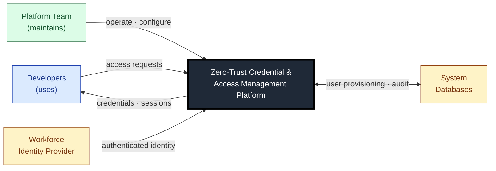
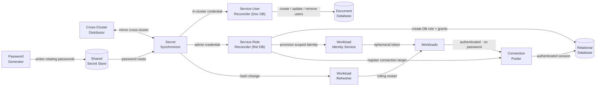
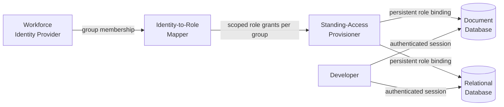
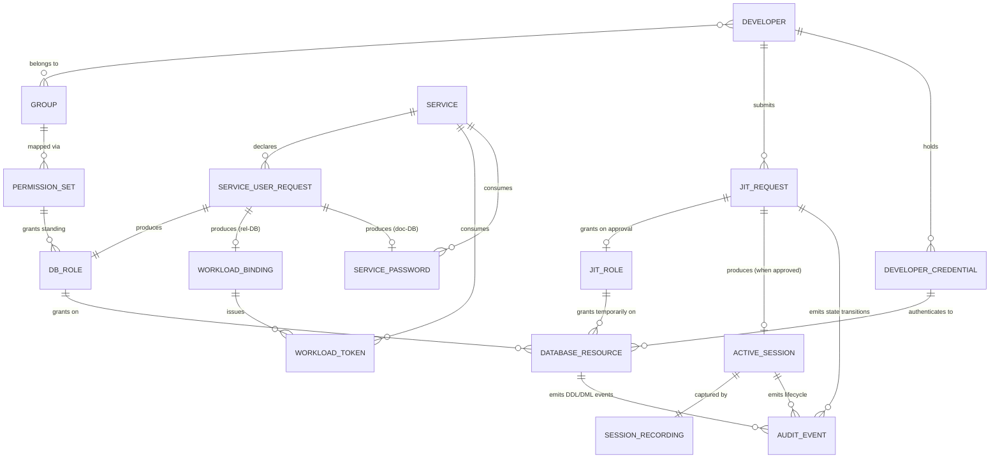
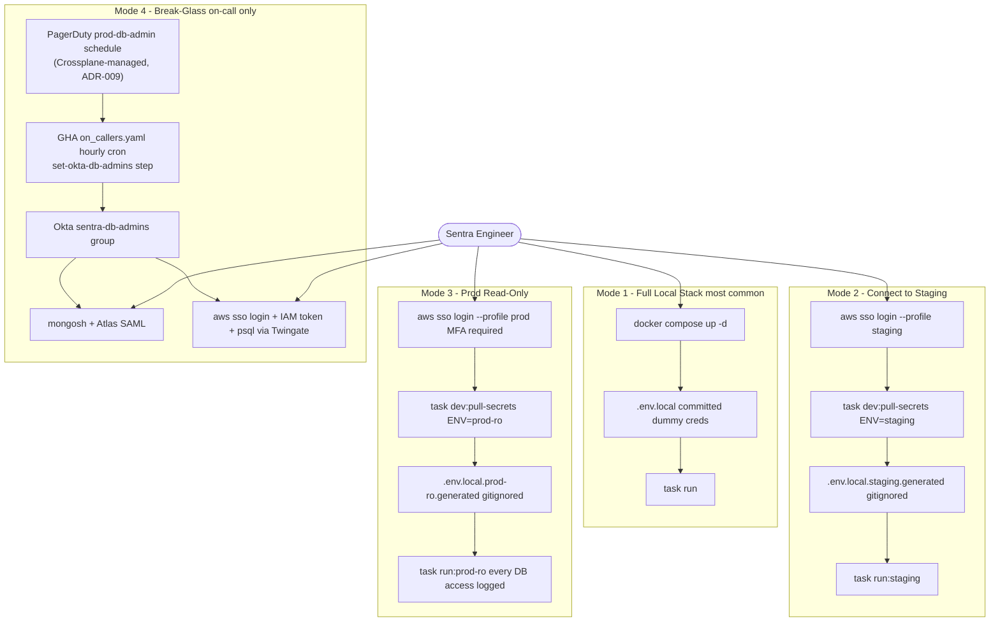
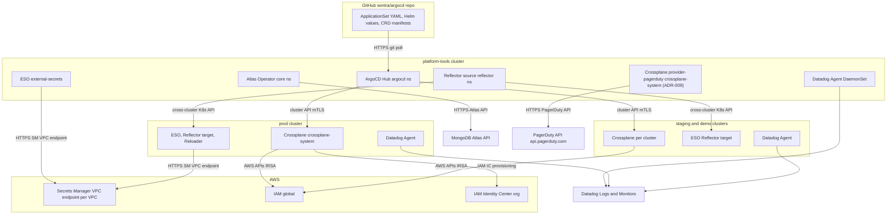

# Architecture Description: Sentra Zero-Trust Credential & Access Management Platform

**Version**: 1.1.0 (regenerated 2026-05-28)
**Date**: 2026-05-28
**Status**: Accepted
**ADRs**: ADR-001 (Foundation, §Pattern C reinstated) · ADR-001-Amendment-2026-05-25 (Crossplane v2) · ADR-002 (GitOps) · ADR-006 (Observability) · ADR-007 (IaC Governance, amended) · ADR-008 (Service Auth) · ADR-009 (PagerDuty Crossplane plane)
**Superseded ADRs**: ADR-003 (Teleport Break-Glass) — superseded 2026-05-28; reverted to ADR-001 §Pattern C (GHA cron + Okta `sentra-db-admins`). SOC2 CC6.6 session-replay is now an accepted gap; statement-level audit (Atlas audit + pgaudit) is the compensating control.

> **Read this first**: This document is the unified Architecture Description. Detailed view files live in `.specify/architect/views/` — each sub-system section references the view files for full depth.

---

## 1. Purpose and Scope

The Sentra Zero-Trust Credential & Access Management Platform does three things:

1. **Credential lifecycle for services** — provision, rotate, and deliver MongoDB Atlas and RDS PostgreSQL credentials to service pods automatically, with zero standing secrets on disk.
2. **Human access for engineers** — break-glass admin access for on-call engineers via the reinstated GHA + Okta model (≤60 min via hourly cron; <5 min via Taskfile override). Statement-level audit (Atlas audit log + pgaudit) replaces the session-replay capability that the previous Teleport design provided.
3. **Compliance evidence** — produce SOC2 CC6.x audit artifacts automatically: Okta System Log grant/revoke records, statement-level audit logs, declarative PD schedule git history (ADR-009), quarterly access reviews. CC6.6 session-replay is an accepted gap as of 2026-05-28.

### What the platform does NOT own

| Concern | Owner |
|---------|-------|
| Application-layer authorisation (row-level, feature flags) | Individual service teams |
| AWS account provisioning, VPC layout, subnet design | `sentra-infrastructure` Pulumi IaC |
| EKS cluster provisioning and node group management | `sentra-infrastructure` Pulumi IaC |
| Okta group management (beyond `prod-db-admin` PD schedule) | Security / Okta admin |
| Developer laptop security (endpoint management) | IT / Security |
| CI/CD pipelines for application code | Service teams |

---

## 2. System Context

The Context view establishes the platform's outer boundary. The platform itself is treated as an **opaque box** — its internal capabilities, components, and mechanisms are deliberately not shown here; they belong to the Functional, Information, and Deployment views.

This section identifies the external actors and systems the platform exchanges information with, the direction and content of those exchanges, the controls that apply at the boundary, and what is explicitly *outside* the platform's responsibility. For the high-level statement of what the platform offers the organisation, see §1 Purpose and Scope above.

> **Canonical source**: [.specify/architect/views/system-context.md](.specify/architect/views/system-context.md) — read for full External Entities table, diagram, Trust Perimeter, and SOC2 boundary coverage.

### External Entities

Four external entities sit outside the platform, grouped by their relationship to it: **who uses it**, **who maintains it**, and **what existed before** that it integrates with. Each label is a functional category — the concrete products that fulfil these roles are documented in the Deployment view. Services and the cloud infrastructure foundation are not listed: services are passive recipients of role attachments, and the IaC-provisioned foundation is a deployment-environment context rather than an active participant in the Context view.

| Entity | Role | What is exchanged |
|--------|------|-------------------|
| **Developers** | Uses the platform | Database access requests; receive scoped, time-bounded credentials |
| **Platform Team** | Maintains | Operates the platform through declarative change |
| **System Databases** | Existed before | Platform provisions users and roles; database audit flows back |
| **Workforce Identity Provider** | Existed before | Authenticates developers and asserts group membership |

### System Context Diagram



### Trust Perimeter

Four independent gates must be passed for any human or workload to reach a production database. Each gate is described by the *control* enforced — implementations live in the Deployment view.

| Gate | Control |
|------|---------|
| **Network** | All human traffic transits a zero-trust gateway (Twingate); the platform's database surfaces are not directly reachable from the internet |
| **Human identity** | Developers authenticate via the workforce identity provider (Okta); break-glass admin access is gated by group membership reconciled hourly against the on-call schedule (Crossplane-managed per ADR-009); every IAM-token-based connection carries a hard TTL |
| **Workload identity** | Services use ephemeral, scoped workload identities (IRSA for RDS; EKS OIDC for MongoDB v2); no static credentials |
| **Authorisation** | Database roles are scoped to named databases and operations; admin role revocation removes the corresponding identity-provider group membership, blocking further authentication |

### SOC2 Coverage at the System Boundary

| Control | How the platform satisfies it |
|---------|-------------------------------|
| **CC6.1** Unique identity per access | Authenticated workforce identity for humans; ephemeral, per-service identity for workloads |
| **CC6.2** Access by job function | Sensitive provisioning behind peer review and code-ownership gates; human access tied to on-call shift; workload identity scoped per service |
| **CC6.3** Prompt access removal | Shift end revokes group membership on next hourly reconcile (≤60 min); Taskfile override path for sub-minute revocation; declarative removal drops the database role |
| **CC6.6** Privileged access restrictions | Two independent boundary gates (network + identity); statement-level audit of every privileged session (Atlas audit + pgaudit) — accepted gap for session replay as of 2026-05-28 (ADR-003 supersession); alert on every group membership add and every `atlasAdmin` authentication |
| **CC7.2** System monitoring | Alerts on every break-glass grant, every `atlasAdmin` auth, every prod-DDL event, and every reconcile failure (RDS Crossplane + PD Crossplane + Atlas Operator + ESO); database audit logs cross-referenced with Okta System Log grant/revoke records during quarterly access review |

---

## 3. Architecture Overview

### Key Design Principles

1. **Zero stored passwords for RDS** — All RDS service authentication is IRSA-based. No password is ever written to SM, K8s Secret, or pod environment variable for RDS connections. RDS Proxy handles IAM token renewal transparently (every 15 minutes).
2. **GitOps as single source of truth** — Every credential provisioning event (new service, new Atlas user, decommission) is a git commit. ArgoCD reconciles to target state. No out-of-band provisioning accepted.
3. **Crossplane per-cluster for RDS** — Each environment (prod/staging/demo) has its own Crossplane controller plane. A single CRD (`RDSDatabaseUser`) in the service Helm chart expands into the full set of PostgreSQL role, IRSA IAM role, and RDS Proxy registration via a Composition.
4. **Atlas managed centrally** — The Atlas Kubernetes Operator runs only on `platform-tools`. MongoDB user lifecycle is centralized rather than distributed per cluster, because Reflector mirrors the resulting K8s Secrets to workload clusters.
5. **GHA + Okta + SAML/SSO for break-glass** (ADR-001 §Pattern C, reinstated 2026-05-28 — supersedes ADR-003 Teleport): hourly GHA cron reconciles Okta `sentra-db-admins` against PagerDuty `prod-db-admin`; Atlas SAML and AWS IAM Identity Center consume group membership. Story #70394 (`okta_assign_db_admins.py`) is un-cancelled and gets built. Sub-hour incidents use a Taskfile override with paired approver and 24h follow-up PR.
6. **PagerDuty schedule managed declaratively** (ADR-009): Crossplane `provider-pagerduty` on `platform-tools` reconciles `Schedule`, `ScheduleLayer`, `ScheduleOverride` CRDs from `argocd/infra/manifests/pagerduty/schedules/`. CODEOWNERS-gated. Scope: on-call assignment only — PD Services/Integrations/Teams/Users stay in PD UI; no external PD-management system permitted.
7. **IRSA as sole workload identity** — No static AWS credentials anywhere. All operators (Atlas Operator, Crossplane providers, ESO) authenticate to AWS via IRSA. Service pods authenticate to RDS via IRSA.

### Sub-System Map

| Sub-System | Primary ADRs | What it does |
|---|---|---|
| **Credential Delivery** | ADR-001, ADR-001-Amendment, ADR-008 | Provision, rotate, and deliver scoped MongoDB Atlas and RDS credentials to pods |
| **Access Governance** | ADR-001 §Pattern C (reinstated), ADR-009 | Break-glass admin access via GHA cron → Okta `sentra-db-admins` → Atlas SAML / IAM IC permission set; PD schedule managed declaratively by Crossplane |
| **Developer Experience** | ADR-001, ADR-008, ADR-009 | Four developer access modes (local, staging, prod-ro, break-glass); zero-stored-password golden path |
| **Platform Operations** | ADR-002, ADR-006, ADR-007, ADR-009 | Day-2 operations for ArgoCD, Crossplane (`provider-postgresql`, `provider-aws`, `provider-pagerduty`), ESO, Atlas Operator, Reflector, Reloader |
| **Compliance Posture** | ADR-001 §Pattern C, ADR-006, ADR-007, ADR-009 | SOC2 control-to-evidence mapping; quarterly access review; pre-audit evidence collection; CC6.6 session-replay accepted gap with statement-level audit as compensating control |

### Resolved Architectural Conflicts

| Conflict | Resolution |
|---|---|
| Per-service Helm rejected for MongoDB (circular dependency with Atlas Operator) but accepted for RDS (IRSA removes dependency) | Both decisions correct and complementary — explicit override in ADR-001 Amendment §Override |
| Crossplane/ESO health: Datadog alert vs ArgoCD health check | ESO/Crossplane health covered by ArgoCD platform health checks. Removed from Datadog alert set. |
| ADR-001 Pattern C (GHA/Okta break-glass) vs ADR-003 (Teleport break-glass) | **Reversed 2026-05-28**: ADR-003 superseded; Pattern C and §Flow 3 reinstated as the active break-glass design. Rationale: Okta + Twingate already gate engineer access; Teleport added a third overlapping layer for limited marginal benefit. Trade-offs accepted: ≤60 min grant latency (Taskfile override for sub-hour), no session replay (statement-level audit compensates). |
| PagerDuty schedule had no IaC representation; break-glass rotation edits had no git audit trail | Resolved by ADR-009 (2026-05-28): Crossplane `provider-pagerduty` on `platform-tools` with centralized CODEOWNERS-gated manifests, scoped to on-call schedule resources only. |

### Five EKS Clusters

| Cluster | Purpose | Crossplane? |
|---|---|---|
| `prod` | Production workloads + RDS management | ✅ `provider-postgresql` + `provider-aws` |
| `staging` | Staging workloads + RDS management | ✅ `provider-postgresql` + `provider-aws` |
| `demo` | Demo environment + RDS management | ✅ `provider-postgresql` + `provider-aws` |
| `platform-tools` | ArgoCD hub, Atlas Operator, PD schedule management | ✅ `provider-pagerduty` (ADR-009) |
| `research` | ML/research workloads | — |

> **Teleport columns removed 2026-05-28.** Teleport infrastructure (Auth + Proxy + DB Agents + PD Plugin + S3 + DynamoDB) is decommissioned with ADR-003 supersession. See `access-governance/operational.md` for the decommissioning checklist.

---

## 4. Sub-Systems

---

### 4.1 Credential Delivery

**View files**: [credential-delivery/functional.md](.specify/architect/views/credential-delivery/functional.md) · [information.md](.specify/architect/views/credential-delivery/information.md) · [deployment.md](.specify/architect/views/credential-delivery/deployment.md) · [operational.md](.specify/architect/views/credential-delivery/operational.md)

#### Functional view

The sub-system has two functional flows — one delivering credentials to **services**, one delivering standing database access to **developers**. The platform team is the operator across both flows; they are not a participant in either diagram. Just-in-time (break-glass) developer access is governed by §4.2 Access Governance.

Functional elements are described by **responsibility**, not by the product implementing them. The mapping from element to concrete product lives in the Deployment view below.

##### 4.1.1 Credentials for services

What this addresses: workload services need a database identity to read and write data. They cannot generate one for themselves, and a static admin credential per service would have no rotation and no revocation. The platform must provision, deliver, rotate, and revoke a per-service identity automatically, with no password ever persisted in workload memory.

| Functional element | Responsibility |
|---|---|
| **Service-User Reconciler (Doc DB)** | Watches declarative service-user requests; provisions, updates, and removes users in the document database; keeps the user's password aligned with the shared secret store |
| **Service-Role Reconciler (Rel DB)** | Watches declarative service-role requests; provisions a DB role with scoped grants, a workload identity bound to that role, and a connection-pool registration |
| **Password Generator** | Produces and rotates passwords for document-DB service users on a 90-day cycle; writes them to the shared secret store |
| **Secret Synchronizer** | Reads rotating passwords and admin credentials from the shared secret store and exposes them as in-cluster secrets |
| **Cross-Cluster Distributor** | Mirrors the in-cluster service-password secret from the management cluster to each workload cluster |
| **Workload Refresher** | Detects in-cluster secret changes and triggers a rolling restart of affected workloads so they pick up the new password |
| **Connection Pooler** | Holds the authenticated relational-DB connection on behalf of workloads using ephemeral workload identity; refreshes the identity token transparently so no password ever lives in workload memory |



##### 4.1.2 Standing access for developers

What this addresses: developers need to read database data for investigation and to write to non-production environments. They cannot share service credentials (no per-developer traceability) and cannot be given static admin credentials (no rotation, no revocation). The platform issues per-developer, scoped database access derived from the developer's organisational identity. Production write access uses the just-in-time flow in §4.2 Access Governance.

| Functional element | Responsibility |
|---|---|
| **Identity-to-Role Mapper** | Maps each developer's group membership in the workforce identity provider to one or more named, scoped database roles |
| **Standing-Access Provisioner** | Installs the resulting role-grants as persistent assignments tied to group membership; revokes automatically when a developer leaves the group |



#### Information view

This view describes all the entities the platform stores or governs, their relationships, the privileges that apply, and the lifecycle rules each follows. Although ownership of these entities is primarily a §4.1 concern (which is why the view is anchored here), the catalogue spans every sub-system — including the just-in-time access entities owned by §4.2 and the developer-credential flows owned by §4.3.

Entities are described **functionally** — by what they represent — not by their storage technology. Concrete schemas, table names, and storage paths live in the canonical per-sub-system Information view files referenced in §7 View File Index. The link to this sub-system's detail file: [credential-delivery/information.md](.specify/architect/views/credential-delivery/information.md).

The permission overlay below is a system-level RBAC summary. It does not replace per-resource access policies (documented in the Deployment view of each sub-system); it states which actor may create, read, update, delete, or approve each entity.

##### Purpose and scope

In scope:
- Every entity the platform creates, mutates, owns, retains, or governs
- Every actor whose privileges over those entities differ from another's
- The lifecycle, propagation, and integrity invariants the platform guarantees

Out of scope:
- Concrete schemas / table names / storage paths (per-sub-system Information view files in §7)
- Storage-level access controls (per-sub-system Deployment views, IRSA scope tables)
- Internal platform automation principals (Reconcilers and External Systems) — their narrow permissions are documented in §4.4 IRSA Role Scope

##### Entity catalogue

Sixteen entities in six groups. Each is owned by a named functional element and has a defined lifecycle.

**Identities** (3 entities — who the platform serves)

| Entity | What it is | Owning functional element |
|---|---|---|
| **Developer** | A human user with an identity in the workforce identity provider; may belong to one or more groups | Identity-to-Role Mapper (§4.1.2) |
| **Workforce Identity Group** | A group in the workforce identity provider; carries the access decision for both standing and just-in-time access | Identity-to-Role Mapper (§4.1.2); Approval Engine (§4.2) |
| **Service** | A workload that needs database access; identified by a stable name across all environments and clusters | Service-User Reconciler (§4.1.1) |

**Roles & Permissions** (4 entities — what privileges exist)

| Entity | What it is | Owning functional element |
|---|---|---|
| **DB Role** | A named privilege-bundle on a database resource (rel-DB role with grants; doc-DB user role) | Service-User / Service-Role Reconciler (§4.1.1) |
| **Workload Identity Binding** | A cloud workload identity that, when assumed, authenticates as a specific DB Role; scoped per cluster + per service | Service-Role Reconciler (§4.1.1) |
| **Permission Set** | A mapping from a Workforce Identity Group to one or more DB Roles; the substrate of standing developer access | Identity-to-Role Mapper / Standing-Access Provisioner (§4.1.2) |
| **Just-In-Time Role** | A time-bounded, scoped privilege used during a just-in-time access session; never persisted as a standing grant | Session Broker (§4.2) |

**Declarative State** (2 entities — what is declared)

| Entity | What it is | Owning functional element |
|---|---|---|
| **Service-User Request** | A declarative record stating *this service needs this access on this database*; the input to all credential delivery | Submitted by Service Teams; reconciled by Reconcilers (§4.1.1) |
| **Just-In-Time Access Request** | A request for elevated DB access; goes through a state machine PENDING → APPROVED → DENIED; carries a hard TTL | Submitted by Developer; managed by Access Request Manager (§4.2) |

**Credentials** (3 entities — what tokens exist)

| Entity | What it is | Lifetime |
|---|---|---|
| **Service Password** | A rotating password held in the shared secret store; the only password the platform stores | 90-day rotation |
| **Workload Identity Token** | An ephemeral token a workload uses to authenticate to the database; never persisted | Minutes |
| **Developer Credential** | A credential a developer holds during a session; has four sub-types — workforce-IdP session, cloud-identity session, ephemeral DB-auth token, and just-in-time DB session certificate — with different TTLs and renewal flows | 15 min to 8 h depending on sub-type |

**Sessions & Audit** (3 entities — what is observed)

| Entity | What it is | Retention |
|---|---|---|
| **Active Session** | An in-flight authenticated database session held on behalf of a developer by the Session Broker | Duration of session (≤4 h hard TTL) |
| **Session Recording** | The full text of every statement and command executed during an Active Session | 1 year |
| **Audit Event** | A structured event emitted at every Access Request state transition, every session boundary, and every database-side authenticate / DDL / DML | 1 year |

**Database Resources** (1 entity — what is governed)

| Entity | What it is |
|---|---|
| **Database Resource** | A specific named target the platform governs access to — a document-DB project / database, or a relational-DB instance / schema / table |

##### Unified entity-relationship diagram



Key invariants visible in this graph:

- A **Developer never holds a long-lived database password**; every Developer Credential is short-lived and refreshable
- A **Service never holds a static workload-identity token**; tokens are minted on demand from the binding
- Every **DB Role exists in exactly one Database Resource**; cross-resource roles are not modelled
- **Permission Set is the only path** from a Workforce Identity Group to a standing DB Role — ad-hoc direct group→role bindings are forbidden
- **Just-In-Time Role never appears outside an Active Session** — there is no standing JIT grant in the system

##### Permission overlay (RBAC matrix)

For each entity group, what each actor may do. Cells are: **C** create, **R** read, **U** update, **D** delete, **A** approve. Empty cells indicate no privilege. *Service Team* is a sub-classification of *Developer* shown separately only where its privilege differs.

| Entity group | Developer | Service Team | Platform Team | Security Reviewer | Auditor | Service / Workload |
|---|:---:|:---:|:---:|:---:|:---:|:---:|
| **Identities** | R (own) | R (own) | C R U D | R | R | — |
| **Roles & Permissions** | R (own) | R (own service) | C R U D | R | R | R (own only) |
| **Service-User Request** | R | C R U D (own service) | R (override required to write) | R | R | — |
| **JIT Access Request** | C R (own) | — | R | R U **A** | R | — |
| **Service Password** | — | R (indirect, own) | R (trigger rotate) | R | R | R (own service) |
| **Workload Identity Token** | — | — | — | — | — | C R (own) |
| **Developer Credential** | C R (own) | — | — | — | — | — |
| **Active Session** | C R (own) | — | R | R **D** (revoke in flight, RDS via AWS API) | R | — |
| **Audit Event** | — | — | R | R | R | — |
| **Database Resource** | — | R (declares need) | R | R | R | R (own data plane) |

**Cross-cutting permission notes**:

- **Approval of JIT Access Request** — for requests where the requester has an active on-call shift, "approval" is automatic in the sense that the GHA `on_callers.yaml` workflow adds the engineer to Okta `sentra-db-admins` on its next hourly tick (recorded as an Okta System Log `group.user_membership.add` event with actor = workflow service account). For sub-hour overrides, the Security Reviewer is the manual approver via `task db:break-glass-approve`, with a follow-up PR required within 24h.
- **Platform Team write on production Service-User Requests** — for `Service-User Request` against a production document-DB, write requires a CODEOWNERS-gated PR with security-platform-reviewers approval. The compensating control for relational-DB Service-User Requests (which are not CODEOWNERS-gated) is the quarterly access review (§4.5).
- **Append-only invariants** — *Audit Event* has **no Update or Delete** for any actor. Retention is enforced by the storage policy, not by user action. This is the foundation of SOC2 CC7.2. (Session Recording entity removed 2026-05-28 with ADR-003 supersession; statement-level Audit Events replace it.)
- **No actor reads a Service Password's value** — even the Platform Team's "rotate" privilege only triggers a *new* version; the value is never disclosed in any audit or admin path. Only the consuming workload sees a password value, and only in process memory.
- **Workload scope is always "own"** — a workload's privileges apply only to its own identity binding, role, and password — never any other service's. This is enforced by per-service workload-identity scoping.

##### Lifecycle summary

| Entity | Born | Changes | Dies |
|---|---|---|---|
| Developer | Onboarded via workforce identity provider | Group memberships change as role changes | Off-boarded → derived access revoked within minutes (Okta SSO session) to ≤15 min (RDS IAM token natural expiry); MongoDB SAML sessions complete naturally |
| Group | Defined by Security organisation | Membership churn | Disbanded |
| Service | First successful deploy with a Service-User Request | Re-deploys; new Requests for new resources | Decommission PR → reconciler removes DB Role within ≤5 min |
| DB Role (service) | When a Service-User Request is reconciled | Name and grants stable; doc-DB password rotates every 90 days | Service-User Request removed |
| DB Role (standing dev) | When a Permission Set is provisioned | Tracks group membership | Group membership removed |
| Just-In-Time Role | At session start | None — single-use | At session end |
| Service-User Request | PR merged | New PR | PR removes the manifest |
| Just-In-Time Access Request | Developer submits OR on-call shift starts | State transitions PENDING / APPROVED / DENIED | Reaches DENIED |
| Service Password | At Service-User Request reconcile | 90-day automatic rotation | Service-User Request removed |
| Workload Identity Token | Workload start / on demand | Re-minted on expiry | Token TTL elapses |
| Developer Credential | At developer's login / session creation | Sub-type-specific renewal (15 min RDS IAM token / 8 h AWS SSO session / SAML assertion lifetime) | TTL elapses or session ends |
| Active Session | JIT Access Request → APPROVED (Okta group add) | Statements executed during session | Group removal → next auth attempt fails; existing 15-min RDS tokens / SAML sessions complete naturally; `task db:revoke-break-glass` for forced disconnect |
| Audit Event | At each transition / boundary / DB action (Okta System Log, Atlas audit, pgaudit, CloudTrail, Crossplane reconcile) | Immutable | 1-year retention → auto-deleted |
| Database Resource | Provisioned by Infrastructure-as-Code (outside platform scope) | Schema changes by Service Teams | Decommissioned via IaC |

##### Integrity rules

**Uniqueness**

- Document-DB usernames are stable across rotations: `{service}_{env}_{role}` is globally unique within the document-DB scope
- Relational-DB role names are namespaced by cluster + instance + service: `{cluster}-{instance}-{service}` — mandatory because the cloud workload-identity namespace is global
- A Service-User Request is uniquely identified by `(service, environment, role, database)`
- A Just-In-Time Access Request is uniquely identified by `(developer, role, start_time)`; the 4 h hard TTL guarantees no two overlapping requests for the same role from the same developer

**What is NEVER stored**

| Data | Reason |
|---|---|
| Relational-DB service password | Service auth is by workload identity — passwordless by design |
| Workload identity token on disk | Tokens are projected ephemerally to workload memory |
| Document-DB admin key in workloads | Held only by the doc-DB user reconciler's workload identity |
| Admin DDL credential in workloads | Held only by the rel-DB role reconciler's workload identity |
| Developer DB password | Developer credentials are session-scoped; no reused passwords |
| Decryption keys for session recordings inside the platform | Recordings are KMS-encrypted; the platform never reads them in service — only auditors access via the storage system's read path |

**Propagation guarantees**

| Event | Effect | SLA |
|---|---|---|
| Service Password rotated | All consuming workloads see new value | ≤2 hours (cascade SLA, see Operational view below) |
| JIT Access Request → DENIED | In-flight session terminates (after current statement completes) | Seconds |
| Group membership removed | Standing access on derived DB Roles removed | ≤15 minutes |
| Service decommissioned (Request removed) | DB Role dropped | ≤5 minutes |
| Service-User Request submitted (PR merge) | New DB Role + credentials available to workload | ≤30 minutes |

**Append-only invariants**

- Audit Event store is append-only; no actor has Update or Delete privilege
- Session Recording is append-only during a session; once a session ends, the recording is sealed and KMS-encrypted

**Naming conventions** — full per-sub-system schemas in the canonical [credential-delivery/information.md](.specify/architect/views/credential-delivery/information.md) file (and the equivalents linked in §7); the platform-wide naming rules:

| Domain | Pattern | Example |
|---|---|---|
| Document-DB username | `{service}_{env}_{role}` | `connectors_prod_rw` |
| Relational-DB role + workload identity | `{cluster}-{instance}-{service}` | `prod-application-v2-connectors` |
| Service Password path | `{env}/mongo-{service}-password` (functional name; concrete path in Deployment view) | — |
| Just-In-Time Role | `break-glass-db` (and descendants) | — |
| Standing-access permission set | `{env}-{role}` derived from group | `staging-readwrite` |

#### Deployment view

**Functional element → product mapping** (this is the only place product names appear)

| Functional element | Implemented by |
|---|---|
| Service-User Reconciler (Doc DB) | Atlas Kubernetes Operator |
| Service-Role Reconciler (Rel DB) | Crossplane + RDSDatabaseUser Composition (provider-postgresql + provider-aws) |
| Password Generator | Pulumi (`mongodb_provision/mongodb.py`) + AWS Secrets Manager rotation Lambda |
| Secret Synchronizer | External Secrets Operator (ESO) |
| Cross-Cluster Distributor | Reflector |
| Workload Refresher | Reloader |
| Connection Pooler | RDS Proxy |
| Identity-to-Role Mapper | Crossplane provider-aws → IAM Identity Center permission sets per Okta group |
| Standing-Access Provisioner | IAM Identity Center + per-cluster Crossplane assignment resources |

**Cluster deployment matrix**

The deployment topology splits MongoDB management (centralized, `platform-tools`) from RDS management (distributed, per-cluster):

| Component | platform-tools | prod | staging | demo |
|---|---|---|---|---|
| Atlas Kubernetes Operator | ✅ | — | — | — |
| Crossplane (operator) | — | ✅ | ✅ | ✅ |
| ESO ClusterSecretStore | ✅ (mongo-*) | ✅ (DBA + prod/*) | ✅ (DBA + staging/*) | ✅ (demo/*) |
| Reflector | ✅ (source) | ✅ (target) | ✅ (target) | ✅ (target) |
| Reloader | ✅ | ✅ | ✅ | ✅ |
| K8s Secrets (Mongo, authoritative) | ✅ core ns | — | — | — |
| K8s Secrets (Mongo, mirror) | — | ✅ core ns | ✅ core ns | ✅ core ns |
| ArgoCD Hub | ✅ | — | — | — |
| Service pods | — | ✅ | ✅ | ✅ |

**GitOps source paths**

- `AtlasDatabaseUser` CRD: `argocd/infra/manifests/atlas/users/{env}/{service}.yaml` — CODEOWNERS gate (`@sentra/security-platform-reviewers`)
- `RDSDatabaseUser` CRD: `charts/{service}/crossplane/rds-user.yaml` — standard service PR (no hard CODEOWNERS; compensating control is the quarterly SOC2 access review)

**Trust zones**

1. **K8s Control Plane** — `atlas-{service}-password` Secrets are namespace-scoped; pods in `connectors` cannot read `access-service` Secrets. The relational-DB reconciler's SA can only read its own admin credential.
2. **Cloud Account** — Each `{cluster}-{instance}-{service}` workload identity grants connection rights only on its specific connection-pool target. The synchronizer's IAM role allows `GetSecretValue` on `{env}/mongo-*` only. All secret-store traffic via VPC endpoints.
3. **Document Database** — `sentra-prod`, `sentra-staging`, `sentra-demo` are separate Atlas projects. Atlas API key is accessible only to the document-DB user reconciler's workload identity on `platform-tools`.

#### Operational view

**90-day rotation cascade** — the most frequent planned lifecycle event; fully automatic, no manual steps:

```
Rotation lambda fires (90-day schedule)
  └─▶ Password Generator writes new password version to shared secret store
        └─▶ Secret Synchronizer reconciles (≤1h poll interval)
              └─▶ In-cluster secret updated on management cluster
                    ├─▶ Service-User Reconciler (Doc DB) updates user password ✅
                    └─▶ Cross-Cluster Distributor mirrors secret to workload clusters (seconds)
                          └─▶ Workload Refresher detects secret hash change
                                └─▶ Rolling restart of workloads referencing the secret
                                      └─▶ Workloads start with new password ✅
```

End-to-end SLA: **≤2 hours** from rotation event to all workloads running with the new password. Zero service downtime — the document database accepts both old and new passwords during the synchronizer's sync window (up to 60 minutes overlap).

**Key SLAs**

| Operation | SLA |
|---|---|
| Rotation propagation (rotation event → workload restart complete) | ≤2 hours |
| New service onboarding (PR merge → workload receives credential) | ≤30 min |
| Service decommission (declarative removal → access revoked) | ≤5 min |
| Credential delivery to new workload (in-cluster secret present) | ≤5 min |

---

### 4.2 Access Governance

**View files**: [access-governance/functional.md](.specify/architect/views/access-governance/functional.md) · [deployment.md](.specify/architect/views/access-governance/deployment.md) · [operational.md](.specify/architect/views/access-governance/operational.md)

#### Functional Architecture

Access governance implements break-glass database access (Mode 4 only) via a hybrid of (a) a **declarative PD schedule plane** (Crossplane `provider-pagerduty`, ADR-009) and (b) a **runtime sync workflow** (GitHub Actions `on_callers.yaml`, ADR-001 §Pattern C reinstated). The earlier Teleport state-machine design (ADR-003) is superseded 2026-05-28; the GHA + Okta + Atlas SAML / AWS SSO chain is the active design.

**Components**:
- **Crossplane `provider-pagerduty`** (platform-tools/crossplane-system, ADR-009): reconciles `Schedule` / `ScheduleLayer` / `ScheduleOverride` CRDs from `argocd/infra/manifests/pagerduty/schedules/` (CODEOWNERS-gated) against PagerDuty. Default 30-min reconcile; reverts UI drift.
- **GHA `on_callers.yaml` workflow** (runs on GitHub-hosted runners, hourly cron): Step 1 polls PagerDuty `prod-db-admin` schedule; Step 2 updates Slack `#on-call` channel topic; Step 3 (Story #70394, un-cancelled) reconciles Okta `sentra-db-admins` group membership.
- **Okta `sentra-db-admins` group**: load-bearing membership state. Atlas SAML federation maps to `break_glass_admin` Atlas user (`atlasAdmin` role). AWS IAM Identity Center maps via SCIM to `BreakGlassDBAdmin` permission set (`rds-db:connect` on all 5 RDS Proxies).
- **MongoDB Atlas SAML federation**: `mongosh` with SAML auth → Okta → Atlas authorizes as `break_glass_admin` if engineer is in the group.
- **AWS IAM Identity Center**: `aws sso login --profile prod-break-glass` → Okta MFA → 1-hour IAM IC session → `aws rds generate-db-auth-token` (15-min token) → `psql` via Twingate.
- **Taskfile `task db:break-glass` override**: sub-hour manual grant for incidents that can't wait for the next cron tick; requires a Security/DevOps approver; follow-up PR within 24h enforced by next cron run.

**Access state machine** (intersection of three pieces of state — all must be true to authenticate):

```
PD schedule:  engineer ∈ prod-db-admin oncall? ──┐
                                                  ▼
Okta:         engineer ∈ sentra-db-admins?       ──┐
                                                    ▼
Auth check:   SAML (Atlas) / SSO (AWS) ──► break_glass_admin role
```

| Transition | Trigger | Side effects |
|---|---|---|
| **Added to PD schedule** | PR to `argocd/infra/manifests/pagerduty/schedules/*.yaml` merged | Crossplane reconciles → PD updated within 30 min |
| **Gains Okta group membership** | Next GHA cron tick (≤60 min) OR Taskfile override (<5 min, paired approver) | Okta System Log `group.user_membership.add` → Datadog P1 (`break-glass-granted`) |
| **Authenticates to MongoDB** | `mongosh` SAML flow | Atlas audit `authenticate` event → Datadog P1 (`atlasAdmin-auth`) |
| **Authenticates to RDS** | `aws sso login` + `generate-db-auth-token` + `psql` | CloudTrail event + pgaudit records start of session |
| **Loses Okta group membership** | Next GHA cron tick after PD shift end | Okta System Log `group.user_membership.remove`; next auth attempt fails |
| **Emergency revocation** | `task db:revoke-break-glass` | Direct Okta API remove + AWS API force-disconnect of RDS Proxy backends |

#### Deployment

| Component | Cluster / Location | Notes |
|---|---|---|
| Crossplane `provider-pagerduty` | platform-tools / crossplane-system | Reconciles PD `Schedule` + `ScheduleLayer` + `ScheduleOverride` only; out-of-scope: Services, Integrations, Teams, Users (manual in PD UI) |
| ESO `pd-api-token` ExternalSecret | platform-tools / crossplane-system | Syncs `platform-tools/pagerduty-api-token` from SM → K8s Secret; token scoped to `schedules:read,write` |
| GHA `on_callers.yaml` | github.com runners (ubuntu-latest) | Hourly cron; `PAGERDUTY_API_TOKEN`, `OKTA_API_TOKEN`, `SLACK_BOT_TOKEN` as org secrets |
| Okta `sentra-db-admins` group | Okta SaaS (`sentrasec.okta.com`) | Group itself stable; membership mutated only by the GHA workflow (or Taskfile override) |
| `BreakGlassDBAdmin` permission set | AWS IAM IC | `rds-db:connect` on the 5 prod RDS Proxies + `secretsmanager:GetSecretValue` on `prod/break-glass-*` |
| `break_glass_admin` Atlas user | MongoDB Atlas `sentra-prod` org | `atlasAdmin` role; auth via SAML group claim |
| `break_glass_admin` PostgreSQL role | 5 prod RDS instances | Crossplane `provider-postgresql` (per cluster); IAM authentication enabled |

**No in-cluster break-glass control plane.** Teleport Auth/Proxy/DB-Agent/PD-Plugin Deployments are decommissioned. Engineer traffic terminates directly at Atlas (SAML) and RDS Proxy (IAM token), not at any Sentra-operated proxy.

**Network path**:
```
Engineer laptop → Twingate (Okta MFA) → prod VPC → RDS Proxy → break_glass_admin role
Engineer laptop → public internet → Atlas → SAML → Okta → break_glass_admin (atlasAdmin)
GHA runner → public internet → PagerDuty API (read schedules) + Okta API (mutate group)
Crossplane (platform-tools) → public internet → PagerDuty API (manage Schedules)
```

#### Key Operational Facts

- Break-glass access grant latency: **≤60 min** (hourly GHA cron) or **<5 min** (Taskfile override path)
- Break-glass access revocation latency: **≤60 min** (cron) or **<5 min** (Taskfile + AWS API for active RDS sessions); existing 15-min RDS tokens and live SAML sessions complete naturally
- **No full session recording** — accepted SOC2 CC6.6 gap. Compensating control: pgaudit (every SQL statement) + Atlas audit log (every authentication and DDL/atlasAdmin action), both → Datadog Logs 1-year retention
- PD schedule git history (in `argocd` repo) is the immutable record of who was on-call when, providing CC6.2 justification per grant

#### Runbooks Summary

Five runbooks cover the failure modes in the break-glass path (see [access-governance/operational.md](.specify/architect/views/access-governance/operational.md)):

| Runbook | Trigger | First action |
|---|---|---|
| **1 — Emergency Override** | Sub-hour grant needed (incident before next cron tick) | Engineer runs `task db:break-glass --reason "incident #N"`; Security/DevOps approver runs `task db:break-glass-approve`; follow-up PR within 24h |
| **2 — GHA Cron Failure (Step 3)** | `on_callers.yaml` `set-okta-db-admins` step fails; engineers not added/removed | Check Okta API token; manual reconcile via `task db:reconcile-okta-db-admins`; re-run workflow |
| **3 — PagerDuty API Unavailable** | `on_callers.yaml` Step 1 fails; group state freezes | Wait for PD recovery (cron self-heals); use Runbook 1 if urgent handover required |
| **4 — Crossplane PD Provider Reconcile Failure** | `pd-schedule-reconcile-failed` alert | Existing PD schedules continue operating (PD enforces independently); fix token / version / network and force reconcile |
| **5 — Suspected Unauthorized Access** | `atlasAdmin-auth` or `ddl-on-prod` for engineer NOT in `sentra-db-admins` | Immediate `task db:revoke-break-glass`; investigate via Okta System Log and pgaudit; declare security incident |

**Alert routing**: P1 alerts (`break-glass-granted`, `atlasAdmin-auth`, `ddl-on-prod`, `wrong-role-schema-access`) → PagerDuty. P2 alerts (`break-glass-cron-failed`, `pd-schedule-reconcile-failed`, Crossplane/ESO reconcile errors) → Slack `#platform-alerts`.

---

### 4.3 Developer Experience

**View files**: [developer-experience/functional.md](.specify/architect/views/developer-experience/functional.md) · [operational.md](.specify/architect/views/developer-experience/operational.md)

#### Four Access Modes



#### Functional Elements

| Element | Mode | What it does |
|---|---|---|
| SSO Auth Module | 2, 3 | `aws sso login --profile {env}` → IAM session (8h TTL) via IAM Identity Center |
| Secret Puller | 2, 3 | `task dev:pull-secrets` → fetches SM secret (MongoDB) + generates 15-min RDS IAM token → `.env.local.{env}.generated` |
| Service Runner | 1, 2, 3 | `task run:{env}` loads `.env.local.{env}.generated` as dotenv; starts service process |
| Local Stack | 1 | `docker compose up -d` + committed `.env.local` (dummy creds `sentra:sentra`); unchanged by this project |
| IAM Policy Guard | 2, 3 | AWS IAM policies on SSO permission sets: staging role allows `dev/mongo-*` and `dev/rds-*` only; prod role allows `prod/mongo-human-ro` only |
| SM Scoped Secrets | 2, 3 | `dev/mongo-staging-dev-rw` (`dev_staging_rw`, staging readWrite) + `prod/mongo-human-ro` (`human_analytics_ro`, prod read) |
| RDS Token Generator | 2, 3 | `aws rds generate-db-auth-token` with active SSO session → 15-min signed token as `POSTGRES_PASSWORD` |
| Break-Glass (GHA + Okta) | 4 | GHA cron adds engineer to Okta `sentra-db-admins` → MongoDB SAML auth as `break_glass_admin` / RDS via IAM IC permission set + IAM token (statement-level audit, no session replay) |

**Key credential lifetimes**:
| Credential | TTL | Renewal |
|---|---|---|
| IAM SSO session (`~/.aws/sso/cache/`) | 8 hours | `aws sso login` |
| RDS DB auth token in `.env.local.{env}.generated` | 15 minutes | `task dev:pull-secrets` (10 seconds) |
| MongoDB password in `.env.local.{env}.generated` | 90 days (rotation) | `task dev:pull-secrets` (auto-fetches latest) |
| Okta `sentra-db-admins` membership (Mode 4) | PD shift duration (typically ≤12h) | Next GHA cron tick after PD shift change; Taskfile override for sub-hour |
| RDS IAM token (Mode 4) | 15 minutes | `aws rds generate-db-auth-token` (with active 1h IAM IC session) |

#### Token Expiry & Failure Modes

Three expiry classes, each with a distinct error signal and self-service fix:

| Expiry | Error message | Fix | Time |
|---|---|---|---|
| **RDS token (15 min)** | `FATAL: PAM authentication failed` | `task dev:pull-secrets ENV={env}` | ~10 seconds |
| **SSO session (8 hours)** | `ExpiredTokenException` during `task dev:pull-secrets` | `aws sso login --profile {env}`, then re-run pull-secrets | ~60 seconds |
| **MongoDB SM rotation (90 days)** | `Authentication failed` (Atlas rejects old password) | `task dev:pull-secrets ENV={env}` — fetches rotated SM value automatically | ~10 seconds |

All three are self-service — no ticket required. The RDS token expiry is the most frequent (every 15 min if a session runs long); SSO expiry is daily if working in staging/prod.

#### Revocation Scenarios

| Scenario | What breaks immediately | Blast radius | Required action |
|---|---|---|---|
| **Laptop stolen** | Okta suspended → SSO invalidated | New `aws sso login` impossible; RDS tokens expire ≤15 min naturally | IT suspends Okta; platform team rotates MongoDB password (`aws secretsmanager rotate-secret --secret-id {env}/mongo-{service}-password`) if `.env.local.{env}.generated` was on disk |
| **Engineer offboarded** | Okta account deprovisioned → all group memberships removed, SSO revoked immediately | Existing 15-min RDS tokens expire naturally; live SAML sessions continue until natural close; MongoDB password (Mode 2/3) valid until next rotation cycle | HR initiates Okta offboarding; no immediate MongoDB rotation required unless account was Mode 3/4 with `.env.local.*.generated` on disk |
| **`.env.local.prod` committed to git** | Credential exposure incident | MongoDB `prod/mongo-human-ro` password and RDS IAM token exposed | Treat as P1 incident: immediately rotate `prod/mongo-human-ro` SM secret + revoke exposed IAM session via Okta; notify Security |

#### Self-Service vs. Requires Admin

| Operation | Who can do it | How |
|---|---|---|
| RDS token expired | Any engineer (self-service) | `task dev:pull-secrets ENV={env}` |
| SSO session expired | Any engineer (self-service) | `aws sso login --profile {env}` |
| Staging MongoDB access | Any engineer (pre-provisioned) | `task dev:pull-secrets ENV=staging` |
| Prod read-only MongoDB access | Any engineer (pre-provisioned) | Mode 3 flow |
| New RDS schema access | PR to `charts/{service}/crossplane/rds-user.yaml` | Standard PR review |
| New Atlas user | Platform admin (CODEOWNERS gate) | PR to `argocd/infra/manifests/atlas/users/{env}/{service}.yaml` + `@sentra/security-platform-reviewers` review |
| Break-glass prod access | On-call engineer only (PD schedule) | Mode 4 automatic; or Runbook 1 for manual request |
| Emergency MongoDB password rotation | Platform admin | `aws secretsmanager rotate-secret --secret-id {env}/mongo-*` |

**SLA targets**:
- Staging token refresh (Mode 2): ≤30 seconds end-to-end
- Prod read-only cold start (Mode 3, first login): ≤5 minutes (SSO login + pull-secrets)
- Break-glass access grant (Mode 4): ≤60 min (hourly cron) or <5 min (Taskfile override path)
- Offboarding revocation complete (SSO layer): immediate on Okta deprovisioning
- Offboarding revocation complete (RDS layer): ≤15 minutes (IAM token natural expiry)

---

### 4.4 Platform Operations

**View files**: [platform-operations/functional.md](.specify/architect/views/platform-operations/functional.md) · [deployment.md](.specify/architect/views/platform-operations/deployment.md) · [operational.md](.specify/architect/views/platform-operations/operational.md)

#### Operators Inventory

| Operator | Cluster(s) | Namespace | ApplicationSet file | IRSA role | Version strategy |
|---|---|---|---|---|---|
| **ArgoCD** | `platform-tools` | `argocd` | `argocd_applicationset.yaml` | K8s RBAC only | Pin `targetRevision`; self-syncs |
| **Atlas Kubernetes Operator** | `platform-tools` | `core` | `mongodb-operator_applicationset.yaml` | `atlas-operator-sa-irsa` | Helm chart pinned; ArgoCD auto-sync on bump |
| **Crossplane** (workload) | `prod`, `staging`, `demo` | `crossplane-system` | `crossplane_applicationset.yaml` | `crossplane-sa-irsa-{cluster}` | Helm chart pinned per cluster; staging 48h validation before prod; providers: `provider-postgresql`, `provider-aws` |
| **Crossplane** (platform-tools) | `platform-tools` | `crossplane-system` | `crossplane-platform-tools_applicationset.yaml` (new for ADR-009) | None (PD token is the credential) | Provider: `provider-pagerduty` (ADR-009); validated against current `prod-db-admin` schedule before merge |
| **ESO** | all clusters | `external-secrets` | `eso_applicationset.yaml` | `eso-sa-irsa-{cluster}` | Helm chart pinned; ArgoCD auto-sync |
| **Reflector** | all clusters | `reflector` | `reflector_applicationset.yaml` | K8s RBAC only | Helm chart pinned |
| **Reloader** | all clusters | `reloader` | `reloader_applicationset.yaml` | K8s RBAC only | Helm chart pinned |
| **Datadog Agent** | all clusters | `datadog` | `datadog_applicationset.yaml` | K8s RBAC only | Helm chart pinned; DaemonSet |

All operators are deployed exclusively via **ArgoCD ApplicationSets** — no manual Helm installs. The git commit is the deployment record; ArgoCD UI shows the deployed version per cluster.

#### IRSA Role Scope

| IRSA Role | Bound to | Permissions |
|---|---|---|
| `crossplane-sa-irsa-{cluster}` | Crossplane SA per workload cluster | `rds:*` on `{cluster}-*` prefixed Proxy resources; `iam:Create/Delete/Attach` on `{cluster}-*` ARNs; IAM IC permission set APIs; `secretsmanager:GetSecretValue` on `{env}/crossplane-dba-credential` only |
| `eso-sa-irsa-{cluster}` | ESO SA per cluster | `secretsmanager:GetSecretValue` on `{env}/mongo-*` and `{env}/crossplane-dba-credential`; platform-tools additionally reads `atlas-api-key` |
| `atlas-operator-sa-irsa` | Atlas Operator SA (platform-tools only) | `secretsmanager:GetSecretValue` on `atlas-api-key` only |
| `eso-platform-tools-sa-irsa` (extended for ADR-009) | ESO SA on platform-tools | Adds `secretsmanager:GetSecretValue` on `platform-tools/pagerduty-api-token` to the existing scope |
| ~~`teleport-sa-irsa`~~ (decommissioned 2026-05-28) | — | Deleted as part of ADR-003 supersession cleanup PR |

Cross-cluster isolation is enforced at the IAM condition level: the `prod` Crossplane IRSA role cannot create `staging-*` or `demo-*` ARNs — the resource name prefix (`{cluster}-*`) is the IAM condition.

#### Network Topology



#### GitOps Control Flow

```
Git PR (operator config) → CODEOWNERS review → merge → ArgoCD detects diff (≤3 min)
  → ArgoCD auto-sync: apply CRDs/Deployments to target clusters
    → Operator reconciles target state
      → P2 Datadog alert on ArgoCD out-of-sync or operator reconcile error
```

#### Upgrade Strategy

All operator upgrades follow the same GitOps pattern: bump `targetRevision` in the ApplicationSet values file → PR → merge → ArgoCD rolling upgrade in ≤3 min.

**Crossplane provider upgrades** (higher risk — extra validation required):
1. Bump provider version in `staging` ApplicationSet values only
2. Verify all `kubectl get managed -A --context staging` show `READY=True` after 48h
3. Check Datadog for new `SecretSyncError` or DDL errors in staging during validation window
4. Promote to `prod` and `demo` only after staging validation passes

#### Key Operational Principles

- **IRSA-only authentication**: no operator or service pod uses static AWS credentials
- **ArgoCD as single source of truth**: any diff between git and cluster state triggers an out-of-sync alert (P2)
- **Operator failures are self-healing**: all operators run as Deployments with auto-restart; K8s Secrets retain last-known-good values during operator downtime
- **Upgrade strategy**: staging upgrade → 48h validation window → prod upgrade; version pinned in ApplicationSet values files

---

### 4.5 Compliance Posture

**View files**: [compliance-posture/functional.md](.specify/architect/views/compliance-posture/functional.md) · [operational.md](.specify/architect/views/compliance-posture/operational.md)

> This sub-system DOCUMENTS and MAPS controls; it does NOT implement or configure them. A gap in this documentation indicates either a genuine control gap in an operational sub-system or incomplete documentation.

#### Master Control-to-Evidence Matrix

| Control | Requirement | Primary Evidence | Secondary Evidence | Audit Query |
|---------|-------------|-----------------|-------------------|-------------|
| **CC6.1** | Unique logical access IDs | `kubectl get managed -A` output (Crossplane role list) | Atlas `listDatabaseUsers` API response | `kubectl get managed -A --context prod \| grep RDSDatabaseUser` |
| **CC6.2** | Access provisioned by job function | Git commit SHA + PR merge timestamp | SM rotation event in CloudTrail | GitHub PR search on `argocd/infra/manifests/atlas/users/` and `charts/*/crossplane/` |
| **CC6.3** | Access removed promptly | Okta System Log `group.user_membership.remove` on `sentra-db-admins` | ArgoCD sync timestamp after CRD deletion | `source:okta @eventType:group.user_membership.remove @target.group.displayName:sentra-db-admins` in Datadog Logs |
| **CC6.6** | Restrictions on privileged access | Okta System Log `group.user_membership.add` + PD schedule git history (ADR-009) | pgaudit DDL + Atlas audit log per session (statement-level — **accepted gap for session replay** as of 2026-05-28) | `source:okta @eventType:group.user_membership.add @target.group.displayName:sentra-db-admins` joined with statement-level logs in Datadog |
| **CC7.2** | Monitor system components | Datadog monitor definitions (all P1/P2 alerts) | Atlas audit log config + pgaudit config on RDS | Export Datadog monitor list via API |

#### Evidence Retention

| Evidence Type | Primary Store | Retention |
|---|---|---|
| Okta System Log (group add/remove for `sentra-db-admins`) | Datadog Logs (Okta Log Streaming) | 1 year |
| Atlas audit log | Datadog Logs | 1 year |
| pgaudit logs (5 prod RDS instances) | CloudWatch → Datadog Logs | 1 year (Datadog); CloudWatch retention is 90 days only |
| CloudTrail (IAM IC permission set assumption) | CloudTrail → Datadog | 1 year |
| GHA `on_callers.yaml` run history | GitHub (90d) + Datadog (1yr via `datadog-actions`) | 1 year |
| PagerDuty schedule git history | GitHub (immutable) | Indefinite — primary CC6.6 justification source |
| Crossplane `provider-pagerduty` reconcile logs | Datadog Logs | 30 days (operational telemetry, not primary audit evidence) |
| ~~Teleport DynamoDB + S3 recordings~~ (retained for pre-2026-05-28 audit window only) | DynamoDB `teleport-events` + S3 `sentra-teleport-recordings` | 1 year minimum from supersession date; delete after SOC2 audit window closes |

#### Quarterly Access Review (Story #70395)

Quarterly, the Compliance Officer + Security Team + Platform Engineering representative run:
1. Export Crossplane-managed RDS roles across all clusters: `kubectl get managed -A --context {prod|staging|demo}`
2. Export Atlas users tracked by platform-tools operator: `kubectl get atlasdatabaseuser -n core --context platform-tools`
3. Export break-glass grants from Okta System Log (Datadog query: `source:okta @eventType:group.user_membership.add @target.group.displayName:sentra-db-admins`) + paired remove events
4. Export statement-level activity per grant window (Atlas audit + pgaudit) — confirms what each break-glass session actually did
5. Cross-reference grants against PD schedule git history (`git log -- argocd/infra/manifests/pagerduty/schedules/prod-db-admin.yaml`) and the Crossplane-managed live schedule
6. Export active services from ArgoCD
7. Identify orphaned RDS roles (role exists but no active ArgoCD Application) and escalate for remediation

Full commands and expected output format are in [compliance-posture/operational.md](.specify/architect/views/compliance-posture/operational.md).

---

## 5. Cross-Cutting Concerns

### 5.1 Security Perspective

**IRSA as sole workload identity mechanism** (ADR-008): No static AWS credentials anywhere in the system. Every operator and service pod receives ephemeral IAM credentials via projected OIDC tokens (IRSA). Token lifetime: 15 minutes. No renewal = no connection.

**Defense in depth — credential delivery**:
- SM VPC endpoints: no MongoDB password transits the public internet
- K8s namespace isolation: cross-service Secret reads blocked by RBAC
- RDS Proxy: service pods never hold a raw database password for RDS
- Crossplane resource naming `{cluster}-{db-instance}-{service}`: a compromised IAM role in `prod` cannot be used in `staging` (different cluster segment prefix)

**Defense in depth — human access** (post-2026-05-28 reinstatement):
- Twingate (network gate, Okta MFA) + Okta (identity gate, group membership) = two independent gates before any database surface
- Atlas SAML federation re-evaluates group claim on every login (no caching) — revocation takes effect on next auth attempt
- RDS access via IAM IC permission set + 15-min IAM token — no static credential to steal; token cannot be regenerated after group removal (next `aws sso login` will fail)
- Statement-level audit replaces session replay: every SQL statement (pgaudit) and every Atlas authentication / `atlasAdmin` action (Atlas audit log) captured to Datadog with 1-year retention
- **No standing privilege**: PD shift duration (typically ≤12h) is the natural ceiling; quarterly access review (Story #70395) reconciles all grant/revoke pairs against the PD schedule history

**Accepted security trade-off**: the previous Teleport design provided full session replay (every keystroke). The current design has no session replay; it relies on statement-level evidence + quarterly review. Disclosed as accepted SOC2 CC6.6 gap; auditor sign-off required.

### 5.2 Observability

Datadog is the unified audit and alert sink for all components (ADR-006). Every functional unit emits to Datadog via: Datadog Agent DaemonSet (EKS components), CloudWatch Forwarder Lambda (AWS-native services), or Atlas log forwarding.

**P1 Monitors** (PagerDuty + Datadog):

| Monitor | Trigger | SOC2 |
|---|---|---|
| `break-glass-granted` | Okta System Log: engineer added to `sentra-db-admins` group | CC6.6 |
| `atlasAdmin-auth` | Any `atlasAdmin` role authentication in Atlas audit log | CC6.6 |
| `ddl-on-prod` | `ALTER TABLE`, `DROP`, `CREATE` in pgaudit on prod RDS | CC7.2 |
| `wrong-role-schema-access` | Service role queries a schema it does not own | CC7.2 |

**P2 Monitors** (Slack `#platform-alerts` / `#db-security-alerts`):

| Monitor | Trigger |
|---|---|
| `break-glass-cron-failed` | GHA `on_callers.yaml` workflow run failure (ADR-001 §Pattern C) |
| `pd-schedule-reconcile-failed` | Crossplane `provider-pagerduty` reconcile error (ADR-009) |
| `break-glass-revoked` | Okta System Log: engineer removed from `sentra-db-admins` (P3 informational, routed to `#db-security-alerts`) |
| Atlas Operator reconcile error | `atlas_operator_reconcile_errors > 0` for >5 min |
| Crossplane reconcile error (workload) | `provider-postgresql` DDL error |
| ESO sync failure | `externalsecrets_sync_calls_error > 0` for >15 min |
| ArgoCD out-of-sync | Any Application diverged from git |
| Reflector mirror failure | Target cluster unreachable |
| pgaudit DDL outside expected window | `CREATE ROLE` / `GRANT` / `ALTER ROLE` unexpected events |
| SM rotation failed | `RotationFailed` on any `prod/*` secret |

### 5.3 GitOps Governance (ADR-002 + ADR-007)

Every infrastructure change flows through git:
- **Atlas user provisioning**: `argocd/infra/manifests/atlas/users/{env}/{service}.yaml` → CODEOWNERS (`@sentra/security-platform-reviewers`) → ArgoCD sync → Atlas Operator
- **RDS user provisioning**: `charts/{service}/crossplane/rds-user.yaml` → standard PR → ArgoCD sync → Crossplane
- **Operator configuration**: `argocd/infra/` ApplicationSets → ArgoCD hub → per-cluster operators
- **Infrastructure (SM secrets, base IAM)**: `sentra-infrastructure/` Pulumi stacks → `pulumi up` by platform engineers

IaC ownership: Pulumi owns base AWS infrastructure; Crossplane owns per-service RDS runtime provisioning. The boundary is the `RDSDatabaseUser` CRD — above it is Pulumi (RDS instances, VPCs), below it is Crossplane (roles, IRSA, Proxy registration).

---

## 6. ADR Summary

| ID | Sub-System | Decision | Status | Date |
|---|---|---|---|---|
| **ADR-001** | Foundation | Database Topology & Multi-Environment Model (v1: Pulumi + Atlas Operator) — §Pattern C and §Flow 3 **reinstated** 2026-05-28 | Accepted | 2026-05-20 |
| **ADR-001-Amendment** | Foundation | Crossplane v2 RDS Management Plane (supersedes Pulumi for RDS per-service roles) | Accepted | 2026-05-25 |
| **ADR-008** | Service Identity | Service-to-Database Authentication Mechanism (IRSA + RDS Proxy; no stored passwords for RDS) | Accepted | 2026-05-26 |
| **ADR-003** | Human Identity | Break-Glass DB Access via Teleport — **Superseded** 2026-05-28. Reverted to ADR-001 §Pattern C; rationale: Okta + Twingate already gate access, Teleport added a third overlapping layer for limited marginal benefit; SOC2 CC6.6 session-replay accepted as gap, statement-level audit compensates | **Superseded** | 2026-05-26 (superseded 2026-05-28) |
| **ADR-002** | Platform Operations | GitOps + Per-Cluster Operators vs Pulumi (ArgoCD ApplicationSets for operators; Crossplane for per-service provisioning) | Accepted | 2026-05-26 |
| **ADR-007** | Platform Operations | IaC Ownership & Access Governance Model — **amended** 2026-05-28 to add PagerDuty ownership row; constraint encoded: no external PD management system permitted | Accepted (amended) | 2026-05-26 |
| **ADR-006** | Cross-Cutting | Datadog as Unified Audit & Alert Sink (Atlas audit + pgaudit + Okta System Log + Crossplane reconcile + GHA workflow events) | Accepted | 2026-05-26 |
| **ADR-009** | Platform Operations | PagerDuty On-Call Schedules via Crossplane (`crossplane-contrib/provider-pagerduty` on platform-tools; centralized CODEOWNERS-gated manifests; on-call assignment scope only) | Accepted | 2026-05-28 |

**Un-cancelled (2026-05-28):** Story #70394 (`okta_assign_db_admins.py` + GHA `on_callers.yaml` step 3 + PD schedule consumption) — **builds as planned** under the reinstated ADR-001 §Pattern C.

**Deferred**: Atlas Identity Federation (ADR-008 §Alternatives) — deferred pending Okta `groups:manage` scope approval from InfoSec.

---

## 7. View File Index

| Sub-System | View | File |
|---|---|---|
| System | Context | [.specify/architect/views/system-context.md](.specify/architect/views/system-context.md) |
| Credential Delivery | Functional | [.specify/architect/views/credential-delivery/functional.md](.specify/architect/views/credential-delivery/functional.md) |
| Credential Delivery | Information | [.specify/architect/views/credential-delivery/information.md](.specify/architect/views/credential-delivery/information.md) |
| Credential Delivery | Deployment | [.specify/architect/views/credential-delivery/deployment.md](.specify/architect/views/credential-delivery/deployment.md) |
| Credential Delivery | Operational | [.specify/architect/views/credential-delivery/operational.md](.specify/architect/views/credential-delivery/operational.md) |
| Access Governance | Functional | [.specify/architect/views/access-governance/functional.md](.specify/architect/views/access-governance/functional.md) |
| Access Governance | Deployment | [.specify/architect/views/access-governance/deployment.md](.specify/architect/views/access-governance/deployment.md) |
| Access Governance | Operational | [.specify/architect/views/access-governance/operational.md](.specify/architect/views/access-governance/operational.md) |
| Developer Experience | Functional | [.specify/architect/views/developer-experience/functional.md](.specify/architect/views/developer-experience/functional.md) |
| Developer Experience | Operational | [.specify/architect/views/developer-experience/operational.md](.specify/architect/views/developer-experience/operational.md) |
| Platform Operations | Functional | [.specify/architect/views/platform-operations/functional.md](.specify/architect/views/platform-operations/functional.md) |
| Platform Operations | Deployment | [.specify/architect/views/platform-operations/deployment.md](.specify/architect/views/platform-operations/deployment.md) |
| Platform Operations | Operational | [.specify/architect/views/platform-operations/operational.md](.specify/architect/views/platform-operations/operational.md) |
| Compliance Posture | Functional | [.specify/architect/views/compliance-posture/functional.md](.specify/architect/views/compliance-posture/functional.md) |
| Compliance Posture | Operational | [.specify/architect/views/compliance-posture/operational.md](.specify/architect/views/compliance-posture/operational.md) |
