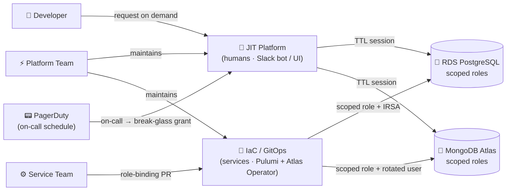

<!-- SLIDE: title icon=🔐 -->
# Least-Privilege
# DB Access — High Level
**Oren Sultan** | Senior DevOps & Platform Engineer | Tikal | CTO Brief · 2026

<!--
speaker: This deck is the CTO-scope framing for Epic #70383 — the least-privilege initiative across MongoDB Atlas and RDS. It deliberately stays above the implementation: existing state, why we have to fix it now, and the shape of the solution. No tool names, no ADR numbers — those belong in the engineering deep-dive. The audience is the CTO; the goal is alignment on problem severity and approach before resourcing decisions get made. Land the framing in one sentence: "We have one credential standing between any compromised pod and every customer's data — and we are going to fix that."
-->

<!-- SLIDE: problem -->
## 🚨 Where We Are Today

- **~25 services share 1 RDS master password**
- **5 services + CDC share 1 `atlasAdmin` user**
- **No per-service audit trail in either DB**
- **Rotation requires coordinating every service**

> One compromised pod → full admin on **all** customer data.

<!--
speaker: This is the current-state slide drawn straight from the Least-Privilege RFC's Problem Statement. On RDS, `postgresql_provision/provision.py` writes the master credential into every service's Secrets Manager entry — roughly 25 services across the `application`, `access-service`, and `dagster-v2` instances all authenticate as RDS master. On MongoDB Atlas, a single `admin` user with the built-in `atlasAdmin` role is shared by `connectors-service`, `luxus-service`, `classifications`, `galio`, and the Debezium CDC connector. The rejected status-quo alternative was "rotate the shared passwords quarterly" — rejected because it shrinks no blast radius and still fails SOC2 CC6.1 attributability. Land hard on the blockquote: this is not theoretical; this is the production posture right now.
-->

<!-- SLIDE: bullets title="🔥 Why This Has to Move — Now" -->
## 🔥 Why This Has to Move — Now

- **Prod-EU + every new DB = more shared-admin sprawl**
- **No per-user / per-process audit trail**
- **Service onboarding bottlenecked on platform team**
- **`.env.local` on every laptop → offboarding rotates all**

> And the shared passwords still get pasted into Slack.

<!--
speaker: This slide replaces theoretical risk framing with the operational pain the platform team feels every week. Prod-EU and future DB integrations are the most immediate trigger: every new region we stand up replicates the same shared-admin pattern across another ~25 services, and every new database type we add to the platform — Redis, Elasticsearch, whatever ships next — inherits the broken model by default unless we fix it now. This is a one-time investment with compounding returns; "fix it later" means fixing it three or four times. The audit-trail gap is not a future SOC2 problem; it is a today problem — when something breaks at 2 AM, we cannot answer "which service / which process ran this query" because every connection is the same principal, and any incident-response narrative is reconstructed from pod logs rather than database evidence. Service onboarding bottlenecks on the platform team because there is no safe self-service path: today, every new service that needs database access requires platform-team intervention to write the SM entry, mirror the K8s secret, and brief the service team on which credential to use — under the new model, a service team writes one role-binding PR against their own CODEOWNERS and is in production without us in the loop, which is what "smooth onboarding" actually means in practice. `.env.local` is the root-cause bullet: every engineer who has ever debugged prod has the prod MongoDB password sitting in a `.env.local.prod` file on their laptop — the AD lists `.env.local.prod` committed to git as a P1 credential-exposure incident scenario, and we have already had near-misses. Because the credential is shared, the second a laptop is lost, an engineer leaves, or a file is accidentally committed, the only safe response is rotate-and-ripple across every service that consumes it — typically a half-day of coordinated work, sometimes longer, every single time. The blockquote is the cultural tell — until each principal has its own credential, the shared one will keep ending up in Slack threads, ticket comments, and `.env.local.*` files because that is the path of least resistance. The point to land for the CTO: this is not security paranoia, it is the cost we are already paying every week — and prod-EU multiplies all of it.
-->

<!-- SLIDE: cards-3 -->
## 🎯 Three Perspectives — One Design

### 🔒 Security
Attributable identity · scoped roles · TTL sessions

### 🛠️ Maintainability
Git source of truth · auto rotation · group offboarding

### 🚀 Onboarding
One PR · CODEOWNERS · new DBs reuse pattern

<!--
speaker: This is the value-side slide — the same architectural design, viewed through the three lenses the CTO has to defend internally and externally. Security perspective: every database connection is attributable to either a specific Okta-authenticated person or a specific service via its IRSA / per-service Atlas user; scoped roles eliminate cluster-wide blast radius (`connectors_prod_rw` cannot drop collections, `debezium_prod_cdc` cannot rotate secrets); TTL sessions kill standing access — SOC2 CC6.1 and CC6.2 become properties the system enforces by design, not a narrative we defend in auditor interviews. Maintainability perspective: every role, grant, and group binding is a Git PR (peer-reviewed, audited, reversible by `git revert`); rotation is automatic — RDS IRSA tokens refresh every 15 minutes, Atlas users rotate on a 90-day cycle managed by the Atlas Operator; offboarding becomes a one-line action — remove the engineer from the Okta group, database access evaporates at the next reconcile; the platform team's job shifts from gatekeeper to toolsmith. Onboarding perspective: new service or new DB onboarding goes from a multi-day platform-team-blocked ticket to a single role-binding PR the service team owns themselves through CODEOWNERS; Pulumi provisions the RDS role and IRSA, Atlas Operator provisions the Atlas user — no platform intervention; when we add Redis, Elasticsearch, or any future store, we add one IaC module and the same pattern carries over. The rejected alternative was treating these as three separate initiatives — rejected because they are three views on one design; doing them piecemeal pays the integration cost three times. Land the close: same design, three wins, one delivery.
-->

<!-- SLIDE: cards-3 -->
## 🧭 High-Level Approach

### 🎯 Scoped Roles
Per-service — or shared per RDS / Atlas database

### 📜 Declarative as Code
Roles + grants in Git, peer-reviewed, full audit

### ⏱️ Ephemeral Identity
Okta group grants role; every session carries a TTL

> Four tiers: 🔍 read-only · ✍️ read-write · 🛠️ admin · 🚨 break-glass

<!--
speaker: Three moves, each one resolving a class of problem on the prior slide. "Scoped roles" replaces the two shared admin principals with named roles, each carrying only the grants its service actually exercises today — `connectors_prod_rw` on `organization_*` databases, `debezium_prod_cdc` with `read + changeStream`, and so on. We do not blindly mint one role per service: where multiple services share an identical access pattern on the same database — for example `luxus-service`, `classifications`, and `galio` all hitting the same org databases the same way — they share a role; where independent revocation matters (a CDC connector vs. an application service) they get separate roles. The grouping is a design call per database, not a mechanical rule. "Declarative as code" means every role, grant, and role-binding lands as a Git PR through CODEOWNERS — no out-of-band changes, full audit trail, and SOC2 CC6.2 evidence is produced as a byproduct. "Ephemeral identity" is the load-bearing one and applies to humans and workloads alike: access is never granted directly to a person or a service — it is granted to an Okta group, and group membership is what unlocks the database role. For humans this means SSO login → group claim → SAML session into Atlas or IAM Identity Center permission set into RDS, with the session itself carrying a hard TTL; for workloads on RDS this means IRSA-minted IAM tokens with a 15-minute TTL refreshed transparently by RDS Proxy, so no password ever lives in pod memory. On Atlas, where workload IAM-token auth is not yet on our path, per-service users rotate on a 90-day cycle managed by the Atlas Operator. The point for the CTO: no standing access exists in either database — every connection is a time-bound lease tied to a current Okta group membership. The blockquote names the four privilege tiers that every role falls into: 🔍 **read-only** for analytics, monitoring, and investigation (the human default via `human_analytics_ro`); ✍️ **read-write** for service runtime data planes, scoped to the specific databases the service owns; 🛠️ **admin** for schema migrations only — ships as `NOLOGIN` by default, enabled only during the deploy window so it does not sit in the steady-state attack surface; 🚨 **break-glass** is the bypass-JIT path for sub-hour incidents (paired approver, 24h follow-up PR, P1 PagerDuty alert on every grant). The rejected alternative was "scoped roles but keep the shared SM password" — rejected because it still leaves a long-lived secret on disk and gains nothing on rotation. Tell the CTO: same database surfaces, same developer workflow, dramatically smaller blast radius and attributable audit trail, with four well-defined privilege tiers that map cleanly to the actual jobs.
-->

<!-- SLIDE: diagram type=context -->
## 🗺️ How It Fits Together

> Humans go through JIT. Services go through IaC. Both land in scoped roles.

<!--
speaker: This is the Context-view picture of the target state at CTO altitude — two parallel paths converge on the same scoped-role databases, and the key insight the CTO needs is that humans and services do not share a path. The JIT Platform is the humans-only path: developers request scoped access on demand through a Slack bot or a self-service UI, the platform translates the request into a time-bounded Okta group membership, and SSO / SAML / IAM Identity Center carry that membership into Atlas or RDS as a TTL-bounded session. Service identities and service-role bindings never touch the JIT platform — they are managed entirely as IaC: Service Teams own the role-binding PR for their own service (or service-group, when multiple services share an access pattern), Pulumi provisions the RDS role + IRSA workload identity, and the Atlas Operator provisions the per-service Atlas user + 90-day-rotated credential. PagerDuty is the fourth input on the human side: the on-call schedule is the source of truth for break-glass admin eligibility — the JIT platform reconciles PD `prod-db-admin` against the Okta `sentra-db-admins` group hourly (per ADR-009), so on-call rotation automatically grants and revokes admin access without anyone running a script or filing a ticket. Platform Team maintains both rails — the JIT machinery (Okta manifests, reconcile cron, request UI, audit pipeline) and the IaC plumbing (Pulumi modules, Atlas Operator deployment, GitOps reconciliation) — but is not in the per-request or per-service approval critical path on either side. Both paths terminate at the same property: scoped roles on both databases, no shared admin, every connection attributable to a unique principal. The rejected alternative was a unified "everything through the JIT platform" model — rejected because services need declarative, durable bindings that an IaC pipeline gives cleanly and a JIT request flow does not. Land the caption: humans go through JIT, services go through IaC, both land in scoped roles — that is the entire least-privilege story in one frame.
-->

<!-- SLIDE: cards-3 -->
## 🎟️ JIT Access — Scoped, Approved, Time-Bound

### 📝 Request
Developer files scoped access request via PR or task

### ✅ Approve
Peer / security approver signs; group membership added

### ⏳ Auto-Expire
Session ends; role revokes on shift end or TTL

<!--
speaker: This slide expands the §4.2 Access Governance flow in the AD — the normal path a developer takes when they need privileged database access for a real task, distinct from the break-glass bypass shown on the prior slide. Step one: the developer files a scoped request — either a PR adding them to the appropriate Okta group manifest, or a `task` invocation that captures reason, target scope, and duration. Step two: a peer or security approver signs the request; on approval, the Identity-to-Role Mapper adds the developer to the workforce-identity group that carries the scoped role grant, and the Session Broker issues the time-bounded JIT Role. Step three: the session is time-bounded by design — group membership is removed at shift end or TTL expiry, in-flight statements finish naturally, and the next authentication attempt fails. The rejected alternative was "standing scoped roles for every developer who might need them" — rejected because it puts us back in the world of long-lived grants that drift from actual job function and fail CC6.2 (access by job function). The point to land: privileged access exists, but it is always requested, always approved, always logged, and always expires.
-->

<!-- SLIDE: thank-you -->
# Thank You
## Questions?

**Oren Sultan** · app.sultano.blog · linkedin.com/in/oren-sultan-0527bab6
