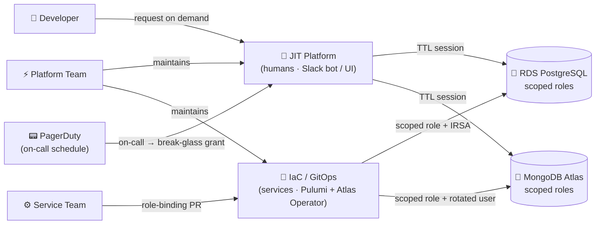

# Least-Privilege
# DB Access — High Level

**Oren Sultan** | Senior DevOps & Platform Engineer | Tikal | CTO Brief · 2026

<FloatingIcon icon="🔐" />

<!--

**Speaker Notes — Opening Hook**

תודה שמצאת זמן — זה brief של 15 דקות ב-altitude של CTO, בלי להיכנס ל-implementation.

**מה אני בא להציג היום:**
איך אנחנו עוברים מ"כל מי שיש לו את הסוד הוא admin על כל הלקוחות" ל-least-privilege אמיתי בשני ה-DBs שלנו — RDS Postgres ו-MongoDB Atlas — עם זהות נפרדת לכל שירות ולכל אדם, audit trail בר-זיהוי, ו-zero standing access.

**למה עכשיו:**
prod-eu בפתח, ה-shared-admin sprawl מכפיל את עצמו עם כל DB חדש, ו-SOC2 / ISO לא יחכו. כל רבעון שאנחנו דוחים את זה — אנחנו משלמים אותו מחדש.

**מה אני *לא* מבקש היום:**
לא תקציב, לא reorg, לא decision על כלים ספציפיים. ההכרעות הטכניות יושבות ב-ADRs ויחזרו בנפרד. היום — alignment על ה-direction.

**ה-structure של ה-15 דקות:**
2 דקות מצב נוכחי → 2 דקות למה זה חייב לזוז → 3 דקות עיצוב ברמה גבוהה → 5 דקות איך זה מתחבר → 3 דקות JIT ו-Q&A.

-->

---
layout: default
transition: fade-out
---

## 🚨 Where We Are Today

<GlassCard>

- **~25 services share 1 RDS master password**
- **5 services + CDC share 1 `atlasAdmin` user**
- **No per-service audit trail in either DB**
- **Rotation requires coordinating every service**
- **Users access granted by same identity**

</GlassCard>

> All developers (and coding agents) have full admin on control plane and customer data.

---
layout: default
transition: slide-left
---

## 🔥 Why This Has to Move — Now

### 🔒 Security

- service and users → all data by same identity 
- No per-process / user  audit trail
- SOC2 CC6.1 / CC6.2 unsatisfiable
- `.env.local.prod` on every laptop
- Passwords shared in Slack

### 🛠️ Maintainability

- platform team bottleneck - executers not authorities 
- password rotation is a project not a task

### 🚀 Onboarding

- onboarding and managing pattern
- Every new DB = repeat pattern

> Same cost paid every week — and it compounds.

<!--
Functional contain sub system 	

באונן בורדינג של ריגן אירופה שמנו לב שבקשות הגישה לדאטה בייס הפכו למרובות - 
אני נמצא בסנטרה משהו כמו חודש ואני לא יכול לספור על היד את מספר הפעמים שנתקלתי באירוע שנעשה בדאטה בייס ולא ידענו עי מי. 

מבחינת סקיוריטי : 
סוויס ויוזר חולקים אותה סיסמאות אמין : 
אין דרך לשחזר מה נעשה בדאטה בייס 
לא עומדים בדרישות soc2 
סיסמאות db בדפי נושן ובהודעות סלאק . 

תפעול : 
צוות הפלטפורמה אחראי על אותנטיקציה ועל סיסמאות הדאטה בייסים השונים 
חשיפה של סיקרטים דורשת אחת לרבעון ובאופן שנתי גלגול של הסיסמא אדמין  ומחייבת אתחול של הסרויסים . 
סרוויסים משתמשים באותנטיקצית יוזר וסיסמא במקום הזדהות by identity . 

התפתחות 
ברגע שנייצר סטנדרט  או לפחות תשתית של הקצאות פר קבוצה , נוכל להוסיף דאטאבייסים וסרוויסים חדשים בקלות
-->

---
layout: default
transition: zoom-out
---

## 🧭 High-Level Approach + JIT Lifecycle

<CardGrid :cols="3">

<Card3D title="🎯 Scoped Roles">
Per-service or shared per database
</Card3D>

<Card3D title="📜 Declarative as Code">
Roles + grants in Git, peer-reviewed
</Card3D>

<Card3D title="⏱️ Ephemeral Identity">
Okta group → role with TTL session
</Card3D>

<Card3D title="📝 Request">
Developer files scoped access PR
</Card3D>

<Card3D title="✅ Approve">
Peer / security signs; group added
</Card3D>

<Card3D title="⏳ Auto-Expire">
Session ends on shift end or TTL
</Card3D>

</CardGrid>

> Four tiers: 🔍 read-only · ✍️ read-write · 🛠️ admin · 🚨 break-glass

<GradientLine />

<!--
Functional contain sub system 	

באונן בורדינג של ריגן אירופה שמנו לב שבקשות הגישה לדאטה בייס הפכו למרובות - 
אני נמצא בסנטרה משהו כמו חודש ואני לא יכול לספור על היד את מספר הפעמים שנתקלתי באירוע שנעשה בדאטה בייס ולא ידענו עי מי. 

מבחינת סקיוריטי : 
סוויס ויוזר חולקים אותה סיסמאות אמין : 
אין דרך לשחזר מה נעשה בדאטה בייס 
לא עומדים בדרישות soc2 
סיסמאות db בדפי נושן ובהודעות סלאק . 

תפעול : 
צוות הפלטפורמה אחראי על אותנטיקציה ועל סיסמאות הדאטה בייסים השונים 
חשיפה של סיקרטים דורשת אחת לרבעון ובאופן שנתי גלגול של הסיסמא אדמין  ומחייבת אתחול של הסרויסים . 
סרוויסים משתמשים באותנטיקצית יוזר וסיסמא במקום הזדהות by identity . 

התפתחות 
ברגע שנייצר סטנדרט  או לפחות תשתית של הקצאות פר קבוצה , נוכל להוסיף דאטאבייסים וסרוויסים חדשים בקלות
-->

---
layout: two-cols-header
transition: slide-left
---

# 🧪 Build or Buy — What We're Testing

::left::

### 🔍 Under Evaluation

- 🔵 **Britive**
- 🟣 **BeyondTrust**
- 🟠 **Snyk**
- 🛠️ **Self-hosted**

::right::

### ✅ Must Support

- 🖥️ UI for access workflows
- ⏱️ TTL sessions — extendable
- 💬 Slack: requests + approvals
- 🔗 Okta · AWS · Atlas · PagerDuty

<!--

**Speaker Notes — Build or Buy — What We're Testing**

לפני שנעבור לאיך זה נראה בפועל — זו ההחלטה האסטרטגית שעומדת על השולחן: build-vs-buy, ומה הקריטריונים שיכריעו.

**🔍 ארבעה כיוונים בהערכה:**
- **Britive** — JIT Access Management platform; חזק על workflow-driven access, יש לו integrations מובנים עם Okta + AWS + Atlas.
- **BeyondTrust** — PAM ותיק; חזק על audit ו-session recording, פחות cloud-native אבל בוגר תפעולית.
- **Snyk** — לא בדיוק PAM, אבל יש להם access governance מתפתח; שווה לבחון אם המוצר מתקרב למה שאנחנו צריכים.
- **Self-hosted** — לבנות מודול JIT על-גבי GitHub Actions + Okta API + Slack API; הכי גמיש, הכי יקר בתחזוקה לטווח ארוך.

**✅ ארבע יכולות הכרחיות שכל פתרון חייב לספק:**
- **UI ל-access workflows** — engineers צריכים מסלול self-service בלי לפתוח tickets; UI שמאפשר בחירת scope ו-duration.
- **TTL sessions שניתנים להארכה** — לא רק מוגבל-זמן, אלא ש-engineer יכול לבקש extension במהלך המשמרת (paired approval) בלי לעבור flow מלא.
- **Slack integration** — בקשות + אישורים זורמים ב-Slack, לא במייל ולא ב-UI נפרד; חיכוך נמוך = יותר engineers משתמשים במסלול הנכון במקום ב-break-glass.
- **Integrations עמוקים** — Okta (group identity), AWS (IAM IC permission sets), Atlas (database users), PagerDuty (on-call → break-glass eligibility per ADR-009). כל פתרון שלא מכסה את ה-4 הוא non-starter.

**ההחלטה:** הקריטריונים לעיל הם ה-screening matrix; ה-trade-off המרכזי הוא ROI לעומת ownership — vendor חוסך 3-6 חודשי build, self-hosted נותן control מלא ו-no-vendor-lock. נחזיר decision בקצב של רבעון.

-->

---
layout: default
transition: fade
---

## 🗺️ How It Fits Together

> Humans go through JIT. Services go through IaC. Both land in scoped roles.

<!--

**Speaker Notes — How It Fits Together**

זו תמונת ה-Context-view של ה-target state ב-CTO altitude — שני מסלולים מקבילים שמתכנסים לאותם scoped-role databases. ה-insight המרכזי: בני-אדם ושירותים *לא* חולקים מסלול.

**JIT Platform — המסלול האנושי:**
מפתחים מבקשים גישה תחומה on-demand דרך Slack bot או UI של self-service. ה-platform מתרגם את הבקשה לחברות מוגבלת-זמן בקבוצת Okta, ו-SSO / SAML / IAM Identity Center נושאים את ה-membership ל-Atlas או RDS כ-session עם TTL.

**IaC — המסלול של השירותים:**
זהויות-שירות ו-role-bindings אף פעם לא נוגעים ב-JIT platform — מנוהלים לחלוטין כ-IaC. צוות השירות הוא ה-owner של ה-role-binding PR לשירות שלו (או קבוצת שירותים, כשמספר שירותים חולקים pattern). Pulumi מקצה את ה-role ב-RDS ואת ה-IRSA workload identity; Atlas Operator מקצה את משתמש Atlas per-service ואת ה-credential המסתובב כל 90 יום.

**PagerDuty — הכניסה הרביעית בצד האנושי:**
לוח ה-on-call הוא ה-source of truth ל-eligibility של break-glass admin. ה-JIT platform מבצע reconcile של PD `prod-db-admin` מול קבוצת Okta `sentra-db-admins` כל שעה (לפי ADR-009‎) — סיבוב on-call מעניק ומבטל גישת admin אוטומטית, בלי שמישהו ירוץ script או יפתח ticket.

**ה-Platform Team — toolsmith, לא gatekeeper:**
מתחזק את שני המסילות — ה-JIT machinery (Okta manifests, reconcile cron, request UI, audit pipeline) וה-IaC plumbing (Pulumi modules, Atlas Operator deployment, GitOps reconciliation) — אבל לא נמצא ב-critical path של אישור per-request או per-service באף אחד מהצדדים.

**שני המסלולים נופלים על אותה תכונה:**
scoped roles בשני ה-DBs, אין shared admin, כל connection בר-זיהוי ל-principal יחיד.

**ה-alternative שנדחה:**
מודל מאוחד של "הכל דרך ה-JIT platform" — נדחה כי שירותים צריכים bindings declarative ועמידים שצינור IaC נותן באלגנטיות, וזרימת JIT-request לא.

**ה-caption לנחות עליו:** Humans go through JIT. Services go through IaC. Both land in scoped roles — זה כל הסיפור של least-privilege בפריים אחד.

-->

---
layout: end
transition: fade
---

# Thank You
## Questions?

**Oren Sultan** · app.sultano.blog · linkedin.com/in/oren-sultan-0527bab6
