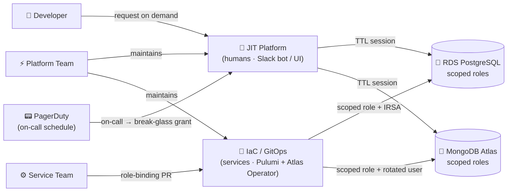

# Least-Privilege
# DB Access Platform — High Level

**Oren Sultan** | Senior DevOps & Platform Engineer | Tikal

<!-- image_prompt:archive index=1 id=lpa-title-hero b64=QSBtaW5pbWFsaXN0IGRhcmsgaGVybyBjb21wb3NpdGlvbiBmb3IgYSB0ZWNoIHByZXNlbnRhdGlvbiBjb3ZlciBzbGlkZS4gQSBzaW5nbGUgbHVtaW5vdXMgZ29sZGVuIGtleSBmbG9hdGluZyBjZW50cmFsbHkgb3ZlciBhIGRlZXAgbmF2eSAjMGQxMTE3IGJhY2tncm91bmQsIHN1cnJvdW5kZWQgYnkgYW4gb3JiaXQgb2YgdHJhbnNsdWNlbnQgdGVhbCBwYWRsb2NrIG91dGxpbmVzIGFycmFuZ2VkIGluIGEgY2lyY3VsYXIgcGF0dGVybi4gVGhlIGtleSBoYXMgc29mdCBnb2xkZW4gZ2xvdzsgdGhlIHBhZGxvY2tzIGVtaXQgZmFpbnQgIzdlZmZmNSB0ZWFsIGxpZ2h0LiBTdWJ0bGUgYWNjZW50cyBvZiBzb2Z0IHB1cnBsZSAjYTc4YmZhIGluIHRoZSBuZWdhdGl2ZSBzcGFjZS4gRmxhdCB2ZWN0b3IgYWVzdGhldGljIHdpdGggc3VidGxlIGRlcHRoLCBoaWdoIGNvbnRyYXN0LCBwcm9mZXNzaW9uYWwgZXhlY3V0aXZlLWJyaWVmaW5nIHF1YWxpdHkuIE5vIHRleHQgb3IgbGV0dGVycyBhbnl3aGVyZSBpbiB0aGUgaW1hZ2UuIFdpZGUgMTY6OSBhc3BlY3QgcmF0aW8u -->

<!--

**Speaker Notes — Opening Hook**

תודה שמצאת זמן — זה brief של 15 דקות ב-altitude של CTO, בלי להיכנס ל-implementation.

**מה אני בא להציג היום:**
איך אנחנו עוברים מ"כל מי שיש לו את הסוד הוא admin על כל הלקוחות" ל-least-privilege אמיתי בשני ה-DBs שלנו — RDS Postgres ו-MongoDB Atlas — עם זהות נפרדת לכל שירות ולכל אדם, audit trail בר-זיהוי, ו-zero standing access.

**למה עכשיו:**
prod-eu בפתח, ה-shared-admin sprawl מכפיל את עצמו עם כל DB חדש, ו-SOC2 / ISO לא יחכו. כל רבעון שאנחנו דוחים את זה — אנחנו משלמים אותו מחדש.

**מה אני *לא* מבקש היום:**
לא תקציב, לא reorg, לא decision על כלים ספציפיים. ההכרעות הטכניות יושבות ב-ADRs ויחזרו בנפרד. היום — alignment על ה-direction.

**ה-structure של ה-15 דקות:**
2 דקות מצב נוכחי → 2 דקות למה זה חייב לזוז → 3 דקות עיצוב ברמה גבוהה → 5 דקות איך זה מתחבר → 3 דקות JIT ו-Q&A.

-->

---
layout: default
transition: fade-out
class: about-me-slide
title: About Me — Oren Sultan
---

<h1 class="about-title">About Me</h1>

<h2 class="about-name">Oren Sultan</h2>

Senior DevOps &amp; Platform Engineer

Electrical engineer 
Intelligence unit graduate 
Father to Dror and Peleg and a <strong>wind</strong> chaser.

Since 2021 at Tikal &mdash; Fullstack as a Service 
Client engagements 
Running Tikal's DevOps group roadmap and knowledge-sharing.

Embedded within product R&amp;D teams. Focused on the gap between "works in staging" and "holds up in production."

<h3 class="about-section">SPECIALTIES</h3>

<ul class="about-list">
  <li>Cloud infrastructure</li>
  <li>GitOps Methodologies</li>
  <li>IAC</li>
  <li>Platform Engineering</li>
  <li>CICD</li>
  <li>Least Privileges</li>
</ul>

<h3 class="about-section about-section-projects">projects</h3>

<ul class="about-list about-list-projects">
  <li>Gigaspaces &middot; Capitolis &middot; ZoomInfo &middot; TerraSecurity &middot; LinearB &middot; Sentra</li>
</ul>

  
  

<!--
Speaker notes:
About me. Electrical engineer by training, intelligence-unit alum, father of two, chaser of wind. Senior platform engineer — currently at Sentra owning the full infra stack; before that 4 years at Tikal consulting across multiple R&D teams (Gigaspaces, Capitolis, ZoomInfo, TerraSecurity, LinearB, Sentra). Common thread across everything: GitOps, least-privilege, and turning infrastructure into self-service for product teams.
-->

---
layout: two-cols-header
transition: fade-out
---

# 🚨 Where We Are Today

::left::

<GlassCard>

- **authentication method is usr/pass**
- **~25 services share 1 RDS master password**
- **5 services + CDC share 1 `atlasAdmin` user**
- **users granted to atlas cloud and aws by okta saml**
- **No per-service audit trail in either DB**
- **Rotation requires coordinating every service**
- **Users access granted by same identity**

</GlassCard>

> All developers (and coding agents) have full admin on control plane and customer data.

::right::

<!-- image_prompt:archive index=1 id=lpa-shared-admin-tree b64=QSBzeW1ib2xpYyBmbGF0LXZlY3RvciBpbGx1c3RyYXRpb24gb24gYSBkZWVwIG5hdnkgIzBkMTExNyBiYWNrZ3JvdW5kLiBDZW50cmFsIGNvbXBvc2l0aW9uOiBhIHN0eWxpemVkIGx1bWlub3VzIHRyZWUgcmVwcmVzZW50aW5nIGEgcHJvZHVjdGlvbiBkYXRhYmFzZSDigJQgaXRzIGJyYW5jaGVzIGhvbGRpbmcgZ2xvd2luZyB0ZWFsIGRhdGEgbm9kZXMgKCM3ZWZmZjUpIGxpa2UgZnJ1aXQsIHdpdGggYSBzb2Z0IGFtYmVyIHdhcm5pbmcgZ2xvdyBzdWdnZXN0aW5nIHZhbHVhYmxlIGN1c3RvbWVyIGRhdGEuIFN1cnJvdW5kaW5nIHRoZSB0cmVlOiA2LTggZGl2ZXJzZSBzaWxob3VldHRlZCBmaWd1cmVzIChhIGRldmVsb3BlciB3aXRoIGEgaG9vZGllLCBhbiBlbmdpbmVlciB3aXRoIGdsYXNzZXMsIGEgc21hbGwgcm9ib3QvQUkgY29kaW5nLWFnZW50IGZpZ3VyZSwgYSBkYXRhIGFuYWx5c3QsIGEgc2VjdXJpdHkgZW5naW5lZXIpIGFsbCBxdWV1ZWQgdXAgYW5kIHJlYWNoaW5nIHRvd2FyZCB0aGUgdHJlZS4gRWFjaCBmaWd1cmUgaXMgaW4gbWlkLW1vdGlvbiBvZiBwdXR0aW5nIG9uIG9yIHdlYXJpbmcgdGhlIFNBTUUgaWRlbnRpY2FsIGZlYXR1cmVsZXNzIG1ldGFsbGljIGFkbWluIG1hc2sg4oCUIGJsYW5rLCBnb2xkLXJpbW1lZCwgd2l0aCBhIHNpbmdsZSBrZXktc2hhcGVkIGVtYmxlbSBldGNoZWQgb24gdGhlIGZvcmVoZWFkLiBPbmNlIG1hc2tlZCwgdGhlIGZpZ3VyZXMgYmVjb21lIHZpc3VhbGx5IGluZGlzdGluZ3Vpc2hhYmxlIGZyb20gZWFjaCBvdGhlciwgZW1waGFzaXppbmcgdGhhdCB0aGV5IGFsbCBzaGFyZSB0aGUgc2FtZSBpZGVudGl0eS4gU3VidGxlIGFjY2VudHMgb2Ygc29mdCBwdXJwbGUgI2E3OGJmYSBpbiB0aGUgbmVnYXRpdmUtc3BhY2UgZ3JhZGllbnRzLiBGbGF0IHZlY3RvciBhZXN0aGV0aWMgd2l0aCBzdWJ0bGUgaXNvbWV0cmljIGRlcHRoLCBwcm9mZXNzaW9uYWwgZXhlY3V0aXZlLWJyaWVmaW5nIHF1YWxpdHksIHNsaWdodGx5IG9taW5vdXMgdW5kZXJ0b25lLiBObyB0ZXh0IG9yIGxldHRlcnMgYW55d2hlcmUgaW4gdGhlIGltYWdlLiBXaWRlIDE2OjkgYXNwZWN0IHJhdGlvLg -->

<!--
מה המצב נכון להיום ? 

שיטת האותנטיקציה לדאטא בייסים גם לסרויסים וגם למשתמשים היא יוזר סיסמא 

25 סרויסים חולקים סיסמאת רדס אחת לשלושה דיביז

5 סרויסים וסידיסי אחד חולקים מונגו אדמין פאסוורד

יוזרים מקבלים גישה לדאטאבייסים עי אוקטה סאמל 

אין אודיט טרייל על פעולות שבוצעו  ולא ניתן לתחקר  מי ביצע את הפעולה 

רוטציה היא עניין מורכב הדורש אתחול של כל הסרויסים 

יוזרים סוכני קוד פועלים בשם זהות אחת
-->

---
layout: default
transition: slide-left
---

## 🔥 Why This Has to Move — Now

### 🔒 Security

- service and users → all data by same identity 
- No per-process / user  audit trail
- SOC2 CC6.1 / CC6.2 unsatisfiable
- `.env.local.prod` on every laptop
- Passwords shared in Slack

### 🛠️ Maintainability

- platform team bottleneck - executers not authorities 
- password rotation is a project not a task

### 🚀 Evaluation

- onboarding and managing pattern
- Every new DB = repeat pattern

> Same cost paid every week — and it compounds.

<!--
Functional contain sub system 	

באונן בורדינג של ריגן אירופה שמנו לב שבקשות הגישה לדאטה בייס הפכו למרובות -

 אני נמצא בסנטרה משהו כמו חודש ואני לא יכול לספור על היד את מספר הפעמים שנתקלתי באירוע שנעשה בדאטה בייס ולא ידענו עי מי.
 
  מבחינת סקיוריטי : 
  סוויס ויוזר חולקים אותה סיסמאות אמין : אין דרך לשחזר מה נעשה בדאטה בייס 
לא עומדים בדרישות soc2 
סיסמאות db בדפי נושן
 ובהודעות סלאק . 

תפעול :
-  צוות הפלטפורמה אחראי על אותנטיקציה ניהול הסיסמFunctional contain sub system 	

באונן בורדינג של ריגן אירופה שמנו לב שבקשות הגישה לדאטה בייס הפכו למרובות -

 אני נמצא בסנטרה משהו כמו חודש ואני לא יכול לספור על היד את מספר הפעמים שנתקלתי באירוע שנעשה בדאטה בייס ולא ידענו עי מי.
 
  מבחינת סקיוריטי : 
  סוויס ויוזר חולקים אותה סיסמאות אמין : אין דרך לשחזר מה נעשה בדאטה בייס 
לא עומדים בדרישות soc2 
סיסמאות db בדפי נושן
 ובהודעות סלאק . 
 סיסמאות נמצאות בקבצי .env 

תפעול :
-  צוות הפלטפורמה אחראי על אותנטיקציה ניהול הסיסמא ומתן הרשאה גם לעמוס בתקני אבטחה 
תפקיד הצוות הוא לספק גישה עפי חוקים שנקבעו ברמה ארגונית ומתודה קבועה לשנות ולהוסיף הרשאות 
סרוויסים משתמשים באותנטיקצית יוזר וסיסמא במקום הזדהות by identity . 
כל עוד לא קיים הסטנדרט הזה יש טרייד אוף משמעותי בין תפוקה לסקיוריטי .

התפתחות 
כאשר היה לנו רק את פרוד יואסאיי המצב היה סביל והסקופ של הפעולות היה בר שליטה - ריגן נוסף ודאטאבייסים עתידיים מחייבים אותנו ליישר קו עם סטנדרטים של אבטחה ותפעול בריאיםא ומתן הרשאה גם לעמוס בתקני אבטחה 
תפקיד הצוות הוא לספק גישה עפי חוקים שנקבעו ברמה ארגונית ומתודה קבועה לשנות ולהוסיף הרשאות 
סרוויסים משתמשים באותנטיקצית יוזר וסיסמא במקום הזדהות by identity . 
כל עוד לא קיים הסטנדרט הזה יש טרייד אוף משמעותי בין תפוקה לסקיוריטי .

התפתחות 
כאשר היה לנו רק את פרוד יואסאיי המצב היה סביל והסקופ של הפעולות היה בר שליטה - ריגן נוסף ודאטאבייסים עתידיים מחייבים אותנו ליישר קו עם סטנדרטים של אבטחה ותפעול בריאים
-->

---
layout: default
transition: zoom-out
---

## 🧭 High-Level Approach + JIT Lifecycle

<CardGrid :cols="3">

<Card3D title="🎯 Scoped Roles">
Per-service or shared per database
</Card3D>

<Card3D title="📜 Declarative as Code">
Roles + grants in Git, peer-reviewed
</Card3D>

<Card3D title="⏱️ Ephemeral Identity">
Okta group → role with TTL session
</Card3D>

<Card3D title="📝 Request">
Developer files scoped access PR
</Card3D>

<Card3D title="✅ Approve">
Peer / security signs; group added
</Card3D>

<Card3D title="⏳ Auto-Expire">
Session ends on shift end or TTL
</Card3D>

</CardGrid>

> Four tiers: 🔍 read-only · ✍️ read-write · 🛠️ admin · 🚨 break-glass

<GradientLine />

<!--
הפרדת אותנטיקציה בין משתמשים לסרויסים שאני אומר משתמשים מדובר גם על סוכני קוד 

רולים והרשאות מנוהלים בקוד דקלרטיבי 

הזדהות נעשית באמצעות שייכות לקבוצת אוקטה אכיפה באמצעות מערכת גיט

לקבוצות משתמשים יש הרשאה קבועה הרחבת ההרשאות בבבקשה ואישור ממונים

גישה מוגבלת בזמן
-->

---
layout: two-cols-header
transition: slide-left
---

# 🧪 Build or Buy — What We're Testing

::left::

### 🔍 Under Evaluation

- 🔵 **Britive**
- 🟣 **BeyondTrust**
- 🟠 **Snyk**
- 🛠️ **Self-hosted**

::right::

### ✅ Must Support

- 🖥️ UI for access workflows
- ⏱️ TTL sessions — extendable
- 💬 Slack: requests + approvals
- 🔗 Okta · AWS · Atlas · PagerDuty

<!--

**Speaker Notes — Build or Buy — What We're Testing**

לפני שנעבור לאיך זה נראה בפועל — זו ההחלטה האסטרטגית שעומדת על השולחן: build-vs-buy, ומה הקריטריונים שיכריעו.

**🔍 ארבעה כיוונים בהערכה:**
- **Britive** — JIT Access Management platform; חזק על workflow-driven access, יש לו integrations מובנים עם Okta + AWS + Atlas.
- **BeyondTrust** — PAM ותיק; חזק על audit ו-session recording, פחות cloud-native אבל בוגר תפעולית.
- **Snyk** — לא בדיוק PAM, אבל יש להם access governance מתפתח; שווה לבחון אם המוצר מתקרב למה שאנחנו צריכים.
- **Self-hosted** — לבנות מודול JIT על-גבי GitHub Actions + Okta API + Slack API; הכי גמיש, הכי יקר בתחזוקה לטווח ארוך.

**✅ ארבע יכולות הכרחיות שכל פתרון חייב לספק:**
- **UI ל-access workflows** — engineers צריכים מסלול self-service בלי לפתוח tickets; UI שמאפשר בחירת scope ו-duration.
- **TTL sessions שניתנים להארכה** — לא רק מוגבל-זמן, אלא ש-engineer יכול לבקש extension במהלך המשמרת (paired approval) בלי לעבור flow מלא.
- **Slack integration** — בקשות + אישורים זורמים ב-Slack, לא במייל ולא ב-UI נפרד; חיכוך נמוך = יותר engineers משתמשים במסלול הנכון במקום ב-break-glass.
- **Integrations עמוקים** — Okta (group identity), AWS (IAM IC permission sets), Atlas (database users), PagerDuty (on-call → break-glass eligibility per ADR-009). כל פתרון שלא מכסה את ה-4 הוא non-starter.

**ההחלטה:** הקריטריונים לעיל הם ה-screening matrix; ה-trade-off המרכזי הוא ROI לעומת ownership — vendor חוסך 3-6 חודשי build, self-hosted נותן control מלא ו-no-vendor-lock. נחזיר decision בקצב של רבעון.

-->

---
layout: default
transition: fade
---

## 🗺️ How It Fits Together

> Humans go through JIT. Services go through IaC. Both land in scoped roles.

<!--

**Speaker Notes — How It Fits Together**

זו תמונת ה-Context-view של ה-target state ב-CTO altitude — שני מסלולים מקבילים שמתכנסים לאותם scoped-role databases. ה-insight המרכזי: בני-אדם ושירותים *לא* חולקים מסלול.

**JIT Platform — המסלול האנושי:**
מפתחים מבקשים גישה תחומה on-demand דרך Slack bot או UI של self-service. ה-platform מתרגם את הבקשה לחברות מוגבלת-זמן בקבוצת Okta, ו-SSO / SAML / IAM Identity Center נושאים את ה-membership ל-Atlas או RDS כ-session עם TTL.

**IaC — המסלול של השירותים:**
זהויות-שירות ו-role-bindings אף פעם לא נוגעים ב-JIT platform — מנוהלים לחלוטין כ-IaC. צוות השירות הוא ה-owner של ה-role-binding PR לשירות שלו (או קבוצת שירותים, כשמספר שירותים חולקים pattern). Pulumi מקצה את ה-role ב-RDS ואת ה-IRSA workload identity; Atlas Operator מקצה את משתמש Atlas per-service ואת ה-credential המסתובב כל 90 יום.

**PagerDuty — הכניסה הרביעית בצד האנושי:**
לוח ה-on-call הוא ה-source of truth ל-eligibility של break-glass admin. ה-JIT platform מבצע reconcile של PD `prod-db-admin` מול קבוצת Okta `sentra-db-admins` כל שעה (לפי ADR-009‎) — סיבוב on-call מעניק ומבטל גישת admin אוטומטית, בלי שמישהו ירוץ script או יפתח ticket.

**ה-Platform Team — toolsmith, לא gatekeeper:**
מתחזק את שני המסילות — ה-JIT machinery (Okta manifests, reconcile cron, request UI, audit pipeline) וה-IaC plumbing (Pulumi modules, Atlas Operator deployment, GitOps reconciliation) — אבל לא נמצא ב-critical path של אישור per-request או per-service באף אחד מהצדדים.

**שני המסלולים נופלים על אותה תכונה:**
scoped roles בשני ה-DBs, אין shared admin, כל connection בר-זיהוי ל-principal יחיד.

**ה-alternative שנדחה:**
מודל מאוחד של "הכל דרך ה-JIT platform" — נדחה כי שירותים צריכים bindings declarative ועמידים שצינור IaC נותן באלגנטיות, וזרימת JIT-request לא.

**ה-caption לנחות עליו:** Humans go through JIT. Services go through IaC. Both land in scoped roles — זה כל הסיפור של least-privilege בפריים אחד.

-->

---
layout: end
transition: fade
---

# Thank You
## Questions?

<!-- image_prompt:archive index=2 id=lpa-thanks-closure b64=QSBjbGVhbiBjbG9zaW5nIHZpc3VhbCBmb3IgYSB0ZWNoIHByZXNlbnRhdGlvbjogYSBzaW5nbGUgbGFyZ2UgcGFkbG9jayB2aWV3ZWQgZmFjZS1vbiwgZGl2aWRlZCBpbnRvIG11bHRpcGxlIHNtYWxsZXIgY29tcGFydG1lbnRhbGl6ZWQgc2VnbWVudHMgbGlrZSBzdGFpbmVkIGdsYXNzIOKAlCBlYWNoIHNlZ21lbnQgZ2xvd2luZyBhIGRpZmZlcmVudCBzb2Z0IGFjY2VudCBjb2xvciAodGVhbCAjN2VmZmY1LCBzb2Z0IHB1cnBsZSAjYTc4YmZhLCBtdXRlZCB3YXJtIG9yYW5nZSkuIFRoZSBsb2NrIGxvb2tzIGZyYWdtZW50ZWQgeWV0IHdob2xlLCBzeW1ib2xpemluZyBzY29wZWQgYWNjZXNzIHJhdGhlciB0aGFuIG1vbm9saXRoaWMgYWRtaW4uIERlZXAgbmF2eSAjMGQxMTE3IGJhY2tncm91bmQgd2l0aCBzdWJ0bGUgYW1iaWVudCBnbG93IGZyb20gZWFjaCBzZWdtZW50LiBNaW5pbWFsaXN0IGZsYXQgdmVjdG9yIHN0eWxlIHdpdGggc29mdCBpbm5lciBzaGFkb3dzLiBObyB0ZXh0IG9yIGxldHRlcnMgaW4gdGhlIGltYWdlLiBXaWRlIDE2OjkgYXNwZWN0Lg -->

**Oren Sultan** · app.sultano.blog · linkedin.com/in/oren-sultan-0527bab6
